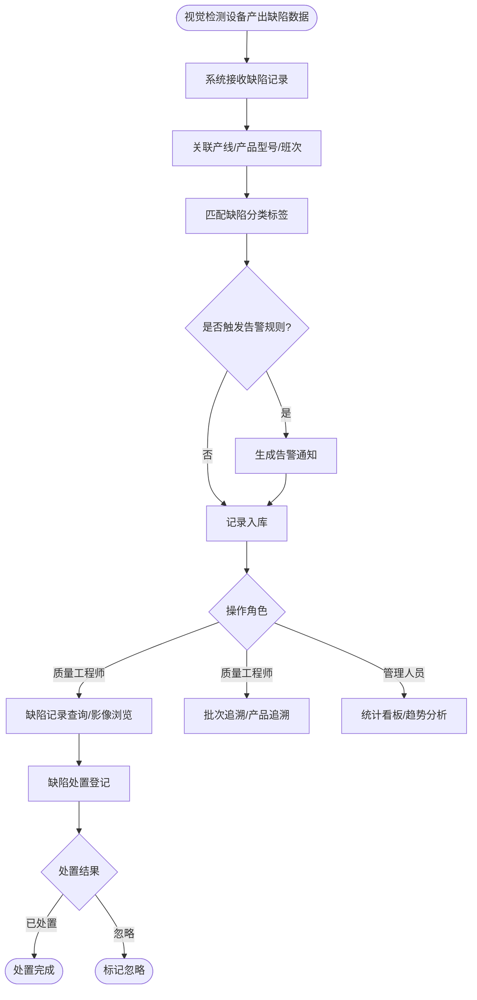

# 产线智能视觉缺陷分类与追溯管理系统 · 系统概述

| 属性 | 内容 |
|------|------|
| 文档版本 | V1.0 |
| 创建日期 | 2026-05-26 |
| 作者 | SurSoft PM |
| 评审状态 | 待评审 |
| 技术栈 | Spring Boot 4.x + MySQL 9.x |

## 修订记录

| 版本 | 修改日期 | 修改人 | 修改内容 |
|------|----------|--------|----------|
| V1.0 | 2026-05-26 | SurSoft PM | 初稿 |

---

## 一、背景与目标

### 1.1 背景

在工业制造领域，产品外观质量直接影响品牌形象与客户满意度。传统人工目检方式存在以下痛点：

- 人工目检效率低、漏检率高（行业平均漏检率 10%~15%），难以满足高速产线需求
- 缺陷记录依靠纸质报表，信息孤岛严重，跨班次、跨产线汇总费时费力
- 缺陷问题无全链路追溯，出现批次质量事故时无法快速定位根因
- 缺乏标准化缺陷分类体系，各产线叫法不一，统计维度混乱
- 管理人员缺乏实时质量可视化看板，依靠次日报告决策滞后

### 1.2 目标

**功能目标**：
- 对产线视觉检测设备输出的缺陷影像数据进行统一结构化管理与分类记录
- 支持按产线、产品型号、班次、时间维度进行缺陷多条件组合追溯
- 提供实时缺陷统计看板与趋势分析图表，辅助质量管理决策
- 构建标准化缺陷标签体系，支持自定义缺陷分类与等级
- 集成 RBAC 权限管理，实现超管/质量工程师/产线操作员/管理人员分级访问

**业务目标（上线后）**：
- 缺陷记录实时化，消除纸质报表手工汇总环节，节省人力不低于 60%
- 批次/产品级追溯响应时间从平均 2 小时缩短至不超过 5 分钟
- 告警规则覆盖主要质量异常场景，问题响应及时率提升至不低于 90%

**非目标（本期不涉及）**：
- 视觉检测算法模型训练与部署（本系统仅消费检测结果数据）
- 与 ERP/MES 系统的双向数据集成
- 移动端 App

### 1.3 系统定位

- **类型：** PC 端 Web 应用（质量管理前端系统）
- **前端仓库名：** vision-defect-traceability-web
- **后端仓库名：** vision-defect-traceability
- **开发库名：** vision_defect_traceability_dev

---

## 二、用户角色

| 角色 | 描述 | 核心诉求 |
|------|------|----------|
| 超级管理员 | 平台最高权限，负责用户与权限配置 | 灵活配置权限、快速开通账号 |
| 质量工程师 | 负责缺陷分类配置、全产线数据查询分析 | 标准化管理缺陷分类，快速生成质量报告 |
| 产线操作员 | 专属查看本产线缺陷数据，上报异常 | 实时掌握本产线缺陷情况 |
| 管理人员 | 只读权限，查看统计看板与导出报告 | 实时掌握整体质量动态，无需操作细节 |

**Persona（主要用户画像）**：
- 姓名：李工
- 职业/场景：质量工程师，负责 3 条产线的缺陷管理与每周质量报告
- 核心需求：快速配置新缺陷类型 + 一键导出本周产线缺陷明细
- 痛点：每次出质量问题要翻多个系统和纸质记录才能追溯到根因

---

## 三、功能清单

| 功能点 | 优先级 | 说明 | 涉及角色 |
|--------|--------|------|----------|
| 用户/角色/权限/菜单管理 | P0 | 基础账号与权限体系 | 超级管理员 |
| 产线信息维护 | P0 | 维护产线基础档案 | 超级管理员、质量工程师 |
| 产品型号管理 | P0 | 管理产品型号与产线关联 | 超级管理员、质量工程师 |
| 缺陷分类配置 | P0 | 自定义缺陷标签体系 | 质量工程师 |
| 缺陷记录查询 | P0 | 多条件组合筛选缺陷记录 | 质量工程师、产线操作员 |
| 缺陷影像浏览 | P0 | 查看缺陷关联影像与标注 | 质量工程师、产线操作员 |
| 批次追溯 | P0 | 按批次号查询质量全貌 | 质量工程师、管理人员 |
| 产品追溯 | P0 | 按序列号查询单品检测历史 | 质量工程师 |
| 缺陷统计看板 | P0 | 实时质量核心指标可视化 | 全角色 |
| 趋势分析 | P1 | 按时间/产线/缺陷类型多维趋势 | 质量工程师、管理人员 |
| 报表导出 | P1 | 导出 Excel 明细 / PDF 报告 | 质量工程师、管理人员 |
| 告警规则配置 | P1 | 设置缺陷率超标触发规则 | 质量工程师 |
| 告警记录查询 | P1 | 查看告警历史与处理状态 | 质量工程师、产线操作员 |

优先级：P0=必须上线 P1=强烈建议 P2=有条件实现 P3=后续迭代

---

## 四、主流程图

---

## 五、业务边界

**In Scope（本期做）**

- 用户/角色/权限/菜单基础管理
- 产线信息与产品型号维护
- 缺陷分类标签体系（含示例图片）
- 缺陷记录多条件查询与详情查看
- 缺陷影像浏览与矩形框标注展示
- 批次追溯与产品序列号追溯
- 缺陷统计看板与趋势分析
- Excel 明细导出 + PDF 质量报告导出
- 告警规则配置与告警记录查询

**Out of Scope（本期不做）**

- 视觉检测算法模型集成：本系统仅消费检测结果，不涉及模型推理
- ERP/MES 集成：下期迭代通过标准接口对接
- 移动端应用：仅 PC Web
- 短信/邮件告警通知：本期仅支持系统内消息

**前置依赖**

- 视觉检测设备侧需提供标准格式的检测结果数据推送接口（产品序列号、缺陷类型、影像路径、标注坐标）
- 影像文件存储服务（本地 NAS 或对象存储）需提前规划
