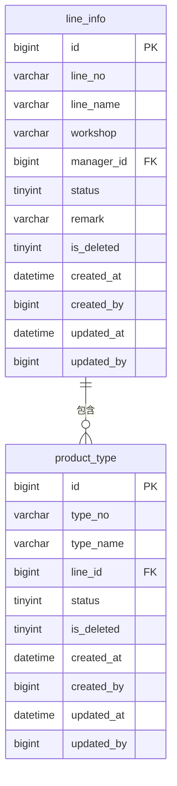

# 产线智能视觉缺陷分类与追溯管理系统 · 产线管理模块 PRD

> 所属系统：产线智能视觉缺陷分类与追溯管理系统
> 文档版本：V1.0 | 创建日期：2026-05-26

---

## 一、模块概述

产线管理模块维护产线基础档案与产品型号信息，是缺陷记录关联的核心基础数据，决定缺陷数据的归属维度。

---

## 二、功能清单

| 功能点 | 优先级 | 说明 | 涉及角色 |
|--------|--------|------|----------|
| 产线列表查询 | P0 | 支持名称/状态筛选 | 超级管理员、质量工程师 |
| 新增/编辑产线 | P0 | 维护产线信息 | 超级管理员、质量工程师 |
| 停用产线 | P0 | 停用后不可接收新缺陷记录 | 超级管理员 |
| 产品型号列表 | P0 | 查看产品型号与产线关联 | 超级管理员、质量工程师 |
| 新增/编辑产品型号 | P0 | 维护产品型号信息 | 超级管理员、质量工程师 |

---

## 三、产线信息维护

### 3.1 字段说明

| 字段 | 类型 | 必填 | 校验规则 | 说明 |
|------|------|------|----------|------|
| lineNo | string | 是 | 全局唯一，如 LINE-001 | 产线编号 |
| lineName | string | 是 | 2~50字符 | 产线名称 |
| workshop | string | 是 | 2~50字符 | 所属车间 |
| managerId | long | 是 | 关联系统用户 | 产线负责人 |
| status | int | 是 | 1-运行中 2-停产 3-维护中 | 状态 |
| remark | string | 否 | 不超过500字符 | 备注 |

### 3.2 接口

| 接口名称 | 方法 | 路径 | 权限标识 |
|----------|------|------|----------|
| 查询产线列表 | GET | /api/v1/lines | line:list |
| 产线详情 | GET | /api/v1/lines/{id} | line:list |
| 新增产线 | POST | /api/v1/lines | line:add |
| 编辑产线 | PUT | /api/v1/lines/{id} | line:edit |
| 修改产线状态 | PATCH | /api/v1/lines/{id}/status | line:edit |
| 删除产线 | DELETE | /api/v1/lines/{id} | line:delete |

---

## 四、产品型号管理

### 4.1 字段说明

| 字段 | 类型 | 必填 | 校验规则 | 说明 |
|------|------|------|----------|------|
| typeNo | string | 是 | 全局唯一 | 型号编号 |
| typeName | string | 是 | 2~50字符 | 产品显示名称 |
| lineId | long | 是 | 关联已启用产线 | 所属产线 |
| status | int | 是 | 0-停用 1-启用 | 状态 |

### 4.2 接口

| 接口名称 | 方法 | 路径 | 权限标识 |
|----------|------|------|----------|
| 查询产品型号列表 | GET | /api/v1/products | product:list |
| 新增产品型号 | POST | /api/v1/products | product:add |
| 编辑产品型号 | PUT | /api/v1/products/{id} | product:edit |
| 修改型号状态 | PATCH | /api/v1/products/{id}/status | product:edit |
| 删除产品型号 | DELETE | /api/v1/products/{id} | product:delete |

---

## 五、数据模型

---

## 六、验收标准

**AC-001 产线新增**
- Given：超级管理员登录
- When：填写产线编号 LINE-003、名称精加工线、车间C，保存
- Then：产线列表新增该记录，状态默认为运行中

**AC-002 产线状态影响**
- Given：产线 LINE-001 被停用
- When：尝试为该产线新增缺陷记录
- Then：系统拒绝，提示该产线已停用
