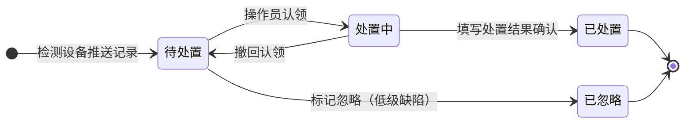
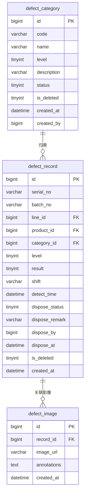

# 产线智能视觉缺陷分类与追溯管理系统 · 缺陷管理模块 PRD

> 所属系统：产线智能视觉缺陷分类与追溯管理系统
> 文档版本：V1.0 | 创建日期：2026-05-26

---

## 一、模块概述

缺陷管理模块是系统的核心业务模块，覆盖缺陷分类标签体系的配置、缺陷检测记录的查询与处置、以及缺陷影像的浏览与标注查看。

---

## 二、功能清单

| 功能点 | 优先级 | 说明 | 涉及角色 |
|--------|--------|------|----------|
| 缺陷分类配置 | P0 | 自定义缺陷标签体系 | 质量工程师 |
| 缺陷记录查询 | P0 | 多条件组合筛选查询 | 质量工程师、产线操作员 |
| 缺陷记录详情 | P0 | 查看单条记录详情 | 质量工程师、产线操作员 |
| 缺陷处置 | P0 | 更新处置状态与说明 | 质量工程师、产线操作员 |
| 缺陷影像浏览 | P0 | 查看影像及矩形框标注 | 质量工程师、产线操作员 |
| 导出缺陷记录 | P1 | 导出 Excel | 质量工程师、管理人员 |

---

## 三、缺陷分类配置

### 3.1 字段说明

| 字段 | 类型 | 必填 | 校验规则 | 说明 |
|------|------|------|----------|------|
| code | string | 是 | 全局唯一，格式 DEF-XXX | 缺陷编码 |
| name | string | 是 | 2~50字符 | 缺陷名称（如：划痕、凹坑）|
| level | int | 是 | 1-致命 2-严重 3-一般 | 缺陷级别 |
| description | string | 否 | 不超过500字符 | 文字说明 |
| sampleImages | array | 否 | 最多5张，单张不超过5MB，JPEG/PNG | 示例图片 |
| status | int | 是 | 0-停用 1-启用 | 状态 |

### 3.2 接口

| 接口名称 | 方法 | 路径 | 权限标识 |
|----------|------|------|----------|
| 查询缺陷分类列表 | GET | /api/v1/defect/categories | defect:category:list |
| 新增缺陷分类 | POST | /api/v1/defect/categories | defect:category:add |
| 编辑缺陷分类 | PUT | /api/v1/defect/categories/{id} | defect:category:edit |
| 修改分类状态 | PATCH | /api/v1/defect/categories/{id}/status | defect:category:edit |
| 删除缺陷分类 | DELETE | /api/v1/defect/categories/{id} | defect:category:delete |

---

## 四、缺陷记录查询

### 4.1 筛选字段

| 字段 | 类型 | 必填 | 说明 |
|------|------|------|------|
| lineId | long | 否 | 产线 ID |
| productId | long | 否 | 产品型号 ID |
| categoryId | long | 否 | 缺陷分类 ID |
| level | int | 否 | 缺陷级别：1-致命 2-严重 3-一般 |
| result | int | 否 | 检测结果：0-不合格 1-合格 |
| shift | string | 否 | 班次：morning/afternoon/night |
| startTime | string | 否 | 检测时间起始（yyyy-MM-dd HH:mm:ss）|
| endTime | string | 否 | 检测时间结束 |
| page | int | 是 | 页码，默认1 |
| pageSize | int | 是 | 每页数量，默认10，最大100 |

### 4.2 处置状态说明

| 状态值 | 含义 |
|--------|------|
| 0 | 待处置 |
| 1 | 处置中 |
| 2 | 已处置 |
| -1 | 已忽略 |

### 4.3 处置状态机



### 4.4 接口

| 接口名称 | 方法 | 路径 | 权限标识 |
|----------|------|------|----------|
| 查询缺陷记录列表 | GET | /api/v1/defect/records | defect:record:list |
| 缺陷记录详情 | GET | /api/v1/defect/records/{id} | defect:record:list |
| 更新处置状态 | PATCH | /api/v1/defect/records/{id}/dispose | defect:record:dispose |
| 导出缺陷记录 | GET | /api/v1/defect/records/export | defect:record:export |

#### 分页查询 Response 示例

```json
{
  "code": 200,
  "data": {
    "total": 238,
    "page": 1,
    "pageSize": 10,
    "records": [
      {
        "id": 1001,
        "serialNo": "SN20260526001",
        "batchNo": "BATCH-2026052601",
        "lineName": "产线A",
        "productTypeName": "MODEL-X1",
        "categoryName": "划痕",
        "level": 2,
        "levelLabel": "严重",
        "result": 0,
        "resultLabel": "不合格",
        "shift": "morning",
        "detectTime": "2026-05-26 08:32:15",
        "disposeStatus": 0,
        "disposeStatusLabel": "待处置"
      }
    ]
  }
}
```

---

## 五、缺陷影像浏览

### 5.1 功能说明

- 点击缺陷记录列表中的【查看影像】，弹出影像预览弹窗
- 影像上叠加矩形框标注（来自检测设备输出），框颜色区分缺陷级别（红=致命，橙=严重，黄=一般）
- 支持鼠标滚轮缩放（50%~400%）与拖拽平移
- 批量浏览：按日期+产线筛选后支持翻页浏览全部影像

### 5.2 接口

```
GET /api/v1/defect/records/{id}/images
Authorization: Bearer {token}

Response:
{
  "code": 200,
  "data": [
    {
      "imageId": 2001,
      "imageUrl": "/files/defect/2026/05/26/img_1001_1.jpg",
      "annotations": [
        {
          "x": 120, "y": 80, "width": 60, "height": 40,
          "label": "划痕", "level": 2
        }
      ]
    }
  ]
}
```

---

## 六、数据模型



---

## 七、异常流程

| 异常场景 | 触发条件 | 处理方式 | 用户提示 |
|----------|----------|----------|----------|
| 删除被引用的缺陷分类 | 分类有关联的缺陷记录 | 拒绝删除 | 该缺陷分类已有关联记录，无法删除，可停用 |
| 影像文件不存在 | 文件已被清理或路径失效 | 显示占位图 | 影像文件暂不可用 |
| 导出数据量过大 | 查询结果超过50000条 | 异步生成文件 | 数据量较大，正在后台生成，请稍后在下载中心获取 |

---

## 八、验收标准

**AC-001 缺陷分类新增**
- Given：以质量工程师身份登录
- When：填写编码 DEF-010、名称气泡、级别一般，保存
- Then：列表新增该分类，状态为启用

**AC-002 缺陷记录多条件筛选**
- Given：系统已有 1000 条缺陷记录
- When：选择产线A + 缺陷级别严重 + 日期范围2026-05-01到2026-05-26
- Then：列表展示满足所有条件的记录，响应时间不超过 2 秒

**AC-003 删除被引用分类**
- Given：缺陷分类划痕（DEF-001）已有 200 条关联缺陷记录
- When：尝试删除该分类
- Then：系统提示该分类已有关联记录，无法删除，可将其停用

**AC-004 导出大数据量**
- Given：查询结果有 60000 条记录
- When：点击导出 Excel
- Then：系统提示异步生成，文件完成后收到通知可下载
