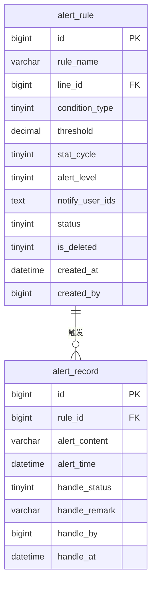

# 产线智能视觉缺陷分类与追溯管理系统 · 告警管理模块 PRD

> 所属系统：产线智能视觉缺陷分类与追溯管理系统
> 文档版本：V1.0 | 创建日期：2026-05-26

---

## 一、模块概述

告警管理模块支持质量工程师配置缺陷率/缺陷数量超标告警规则，规则触发时自动在系统内生成告警记录并通知相关人员，实现质量问题的及时预警。

---

## 二、功能清单

| 功能点 | 优先级 | 说明 | 涉及角色 |
|--------|--------|------|----------|
| 告警规则列表 | P1 | 查看所有规则 | 质量工程师 |
| 新增/编辑告警规则 | P1 | 配置告警条件与参数 | 质量工程师 |
| 启用/停用规则 | P1 | 控制规则是否生效 | 质量工程师 |
| 告警记录查询 | P1 | 查看告警历史 | 质量工程师、产线操作员 |
| 处理告警记录 | P1 | 标记已处理或已忽略 | 质量工程师、产线操作员 |

---

## 三、告警规则配置

### 3.1 字段说明

| 字段 | 类型 | 必填 | 校验规则 | 说明 |
|------|------|------|----------|------|
| ruleName | string | 是 | 2~100字符 | 规则名称 |
| lineId | long | 否 | | 作用产线（空=全产线）|
| conditionType | int | 是 | 1-缺陷率超过 2-缺陷数量超过 | 触发条件类型 |
| threshold | decimal | 是 | 率：0.01~1.00；数量：正整数 | 阈值 |
| statCycle | int | 是 | 1-实时 2-每小时 3-每班次 | 统计周期 |
| alertLevel | int | 是 | 1-高 2-中 3-低 | 告警级别 |
| notifyUserIds | array | 否 | 关联系统用户 | 通知用户列表 |
| status | int | 是 | 0-停用 1-启用 | 状态 |

### 3.2 接口

| 接口名称 | 方法 | 路径 | 权限标识 |
|----------|------|------|----------|
| 查询告警规则列表 | GET | /api/v1/alerts/rules | alert:rule:list |
| 新增告警规则 | POST | /api/v1/alerts/rules | alert:rule:add |
| 编辑告警规则 | PUT | /api/v1/alerts/rules/{id} | alert:rule:edit |
| 修改规则状态 | PATCH | /api/v1/alerts/rules/{id}/status | alert:rule:edit |
| 删除告警规则 | DELETE | /api/v1/alerts/rules/{id} | alert:rule:delete |

---

## 四、告警记录查询

### 4.1 处理状态说明

| 状态值 | 含义 |
|--------|------|
| 0 | 未处理 |
| 1 | 已处理 |
| -1 | 已忽略 |

### 4.2 接口

| 接口名称 | 方法 | 路径 | 权限标识 |
|----------|------|------|----------|
| 查询告警记录列表 | GET | /api/v1/alerts/records | alert:record:list |
| 处理告警记录 | PATCH | /api/v1/alerts/records/{id}/handle | alert:record:handle |

#### 处理告警 Request

```json
PATCH /api/v1/alerts/records/{id}/handle
Authorization: Bearer {token}
Content-Type: application/json

{
  "handleStatus": 1,
  "handleRemark": "已通知产线主管排查"
}
```

---

## 五、数据模型



---

## 六、验收标准

**AC-001 告警规则触发**
- Given：已配置规则产线A缺陷率超过5%时触发告警
- When：产线A在统计周期内缺陷率达到 6%
- Then：系统生成一条告警记录，状态为未处理，相关人员收到系统内消息通知

**AC-002 告警处理**
- Given：存在一条未处理告警记录
- When：质量工程师点击处理，填写处理说明并确认
- Then：告警状态更新为已处理，记录处理人和处理时间
