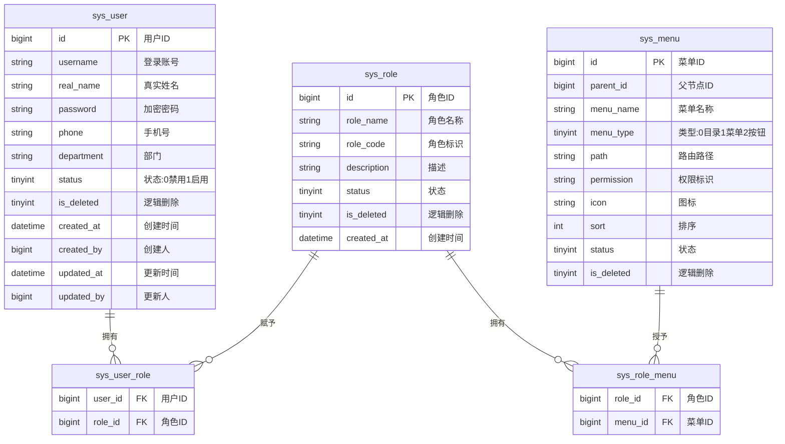

# 基础管理模块 产品需求文档

> 所属系统：多场景影像传感设备资源协同调度系统
> 文档版本：V1.0 | 创建日期：2026-05-26

---

## 一、背景与目标

基础管理模块为整个系统提供用户身份认证、角色权限管理、菜单配置等基础能力。所有业务模块均依赖本模块提供的认证与权限服务。

**功能目标**：
- 支持系统管理员对用户账号进行全生命周期管理
- 实现基于 RBAC 的角色与菜单权限配置
- 提供登录认证与 Token 刷新机制

---

## 二、功能清单

| 功能点 | 优先级 | 说明 | 涉及角色 |
|--------|--------|------|----------|
| 用户登录 | P0 | JWT 认证，返回 AccessToken + RefreshToken | 全部 |
| 用户列表 | P0 | 分页查询，支持多条件筛选 | SUPER_ADMIN |
| 新增用户 | P0 | 填写基本信息并绑定角色 | SUPER_ADMIN |
| 编辑用户 | P0 | 修改用户信息和角色 | SUPER_ADMIN |
| 禁用/启用用户 | P0 | 切换账号状态 | SUPER_ADMIN |
| 重置密码 | P0 | 重置为系统默认密码 | SUPER_ADMIN |
| 删除用户 | P1 | 逻辑删除，保留操作日志 | SUPER_ADMIN |
| 角色列表 | P0 | 展示角色及关联用户数 | SUPER_ADMIN |
| 新增角色 | P0 | 填写角色名称和标识 | SUPER_ADMIN |
| 角色授权 | P0 | 为角色分配菜单和按钮权限 | SUPER_ADMIN |
| 删除角色 | P1 | 仅允许删除无绑定用户的角色 | SUPER_ADMIN |
| 菜单树展示 | P0 | 树形展示目录、菜单、按钮节点 | SUPER_ADMIN |
| 新增菜单 | P0 | 选择节点类型，填写名称路径图标 | SUPER_ADMIN |
| 编辑菜单 | P0 | 修改菜单配置信息 | SUPER_ADMIN |
| 删除菜单 | P1 | 仅允许删除无子节点的叶子菜单 | SUPER_ADMIN |

---

## 三、功能详细说明

### 3.1 用户登录

**功能描述**：系统用户通过账号密码完成身份认证，获取访问令牌。

**操作步骤**：
1. 用户访问系统登录页，输入账号和密码
2. 点击登录，系统校验账号密码
3. 校验通过返回 AccessToken（有效期 2 小时）和 RefreshToken（有效期 7 天）
4. 前端存储 Token，后续请求携带 Authorization 头

**字段说明**：
| 字段 | 类型 | 必填 | 校验规则 | 说明 |
|------|------|------|----------|------|
| username | string | ✓ | 6~20 位字母数字 | 登录账号 |
| password | string | ✓ | 8~20 位，含大小写字母和数字 | 登录密码 |

**交互说明**：
- 密码连续错误 5 次，账号锁定 30 分钟
- 账号被禁用时提示"账号已禁用，请联系管理员"

---

### 3.2 用户管理

**功能描述**：系统管理员对平台所有用户账号进行全生命周期管理。

**字段说明**：
| 字段 | 类型 | 必填 | 校验规则 | 说明 |
|------|------|------|----------|------|
| username | string | ✓ | 6~20 位字母数字，全局唯一 | 登录账号 |
| realName | string | ✓ | 最长 20 字 | 真实姓名 |
| phone | string | ✓ | 11 位国内手机号 | 手机号 |
| department | string | ✗ | 最长 50 字 | 所属部门 |
| password | string | ✓（新增时） | 8~20 位，含大小写字母和数字 | 初始密码 |
| roleIds | array | ✓ | 角色 ID 列表 | 绑定角色 |
| status | int | ✓ | 0-禁用 1-启用 | 账号状态 |

**数据权限说明**：
- 运维人员仅能管理本人注册的设备，不涉及用户管理操作

---

### 3.3 角色管理

**内置角色**：

| 角色名称 | 标识 | 权限范围 |
|---------|------|---------|
| 超级管理员 | SUPER_ADMIN | 全部权限 |
| 调度管理员 | DISPATCH_ADMIN | 场景、设备、任务、调度全权限 |
| 设备运维 | DEVICE_OPS | 设备管理读写权限（本人注册设备） |
| 业务操作员 | OPERATOR | 任务查询、调度记录只读 |

**字段说明**：
| 字段 | 类型 | 必填 | 校验规则 | 说明 |
|------|------|------|----------|------|
| roleName | string | ✓ | 最长 30 字，全局唯一 | 角色名称 |
| roleCode | string | ✓ | 大写字母和下划线，全局唯一 | 角色标识 |
| description | string | ✗ | 最长 200 字 | 角色描述 |
| status | int | ✓ | 0-禁用 1-启用 | 状态 |

---

### 3.4 权限管理

采用 RBAC 模型，支持菜单级、按钮级权限控制。

| 权限层级 | 说明 |
|---------|------|
| 菜单权限 | 控制导航菜单的可见性，未授权菜单不展示 |
| 按钮权限 | 控制新增、编辑、删除、导出按钮的可见性 |
| 数据权限 | 设备运维人员只能管理本人注册的设备 |

---

### 3.5 菜单管理

**菜单节点类型**：

| 节点类型 | 说明 |
|---------|------|
| 目录 | 导航分组，不对应实际页面 |
| 菜单 | 对应一个实际页面路由 |
| 按钮 | 页面内的操作按钮（新增/编辑/删除/导出等） |

**字段说明**：
| 字段 | 类型 | 必填 | 校验规则 | 说明 |
|------|------|------|----------|------|
| menuName | string | ✓ | 最长 30 字 | 菜单名称 |
| menuType | int | ✓ | 0-目录 1-菜单 2-按钮 | 节点类型 |
| path | string | ✗ | 路由路径（菜单类型必填） | 前端路由 |
| permission | string | ✗ | 如：system:user:list | 权限标识（按钮类型必填） |
| icon | string | ✗ | 图标名称 | 菜单图标 |
| sort | int | ✓ | 数值型 | 排序号，越小越靠前 |
| parentId | bigint | ✓ | 0 表示根节点 | 父节点 ID |

---

## 四、数据模型



---

## 五、接口设计

### 接口清单

| 接口名称 | 方法 | 路径 | 权限标识 |
|----------|------|------|---------|
| 用户登录 | POST | /api/v1/auth/login | 公开 |
| 刷新 Token | POST | /api/v1/auth/refresh | 公开 |
| 退出登录 | POST | /api/v1/auth/logout | 已登录 |
| 用户列表 | GET | /api/v1/system/users | system:user:list |
| 新增用户 | POST | /api/v1/system/users | system:user:add |
| 用户详情 | GET | /api/v1/system/users/{id} | system:user:list |
| 编辑用户 | PUT | /api/v1/system/users/{id} | system:user:edit |
| 切换用户状态 | PATCH | /api/v1/system/users/{id}/status | system:user:edit |
| 重置密码 | POST | /api/v1/system/users/{id}/reset-password | system:user:edit |
| 删除用户 | DELETE | /api/v1/system/users/{id} | system:user:delete |
| 角色列表 | GET | /api/v1/system/roles | system:role:list |
| 新增角色 | POST | /api/v1/system/roles | system:role:add |
| 编辑角色 | PUT | /api/v1/system/roles/{id} | system:role:edit |
| 角色授权 | PUT | /api/v1/system/roles/{id}/menus | system:role:edit |
| 删除角色 | DELETE | /api/v1/system/roles/{id} | system:role:delete |
| 菜单树 | GET | /api/v1/system/menus/tree | system:menu:list |
| 新增菜单 | POST | /api/v1/system/menus | system:menu:add |
| 编辑菜单 | PUT | /api/v1/system/menus/{id} | system:menu:edit |
| 删除菜单 | DELETE | /api/v1/system/menus/{id} | system:menu:delete |

---

#### 用户登录

**说明**：账号密码登录，返回 JWT Token

**鉴权**：不需要

```
POST /api/v1/auth/login
Content-Type: application/json

请求体：
{
  "username": "admin",          // 登录账号
  "password": "Abc123456"       // 登录密码
}

响应（成功）：
{
  "code": 200,
  "message": "登录成功",
  "data": {
    "accessToken": "eyJhbGci...",
    "refreshToken": "eyJhbGci...",
    "expiresIn": 7200,
    "userInfo": {
      "id": 1,
      "username": "admin",
      "realName": "张三",
      "roles": ["SUPER_ADMIN"]
    }
  }
}

响应（失败）：
{ "code": 400, "message": "账号或密码错误，还有 N 次机会" }
{ "code": 423, "message": "账号已锁定，请 30 分钟后重试" }
{ "code": 400, "message": "账号已禁用，请联系管理员" }
```

---

#### 刷新 Token

**说明**：使用 RefreshToken 换取新的 AccessToken

**鉴权**：不需要

```
POST /api/v1/auth/refresh
Content-Type: application/json

请求体：
{
  "refreshToken": "eyJhbGci..."
}

响应（成功）：
{
  "code": 200,
  "data": {
    "accessToken": "eyJhbGci...",
    "expiresIn": 7200
  }
}

响应（失败）：
{ "code": 401, "message": "RefreshToken 已过期，请重新登录" }
```

---

#### 用户分页列表

**说明**：分页查询用户列表，支持多条件筛选

**鉴权**：需要 | **权限标识**：`system:user:list`

```
GET /api/v1/system/users?page=1&pageSize=10&keyword=张三&roleId=1&status=1
Authorization: Bearer {accessToken}

Query 参数：
- page      int     否   当前页，默认 1
- pageSize  int     否   每页数量，默认 10，最大 100
- keyword   string  否   姓名/账号模糊搜索
- roleId    long    否   角色 ID 筛选
- status    int     否   状态筛选：0-禁用 1-启用

响应：
{
  "code": 200,
  "data": {
    "total": 100,
    "page": 1,
    "pageSize": 10,
    "records": [
      {
        "id": 1,
        "username": "admin",
        "realName": "张三",
        "phone": "13800138000",
        "department": "技术部",
        "status": 1,
        "roles": [{ "id": 1, "roleName": "超级管理员" }],
        "createdAt": "2026-05-01 10:00:00"
      }
    ]
  }
}
```

---

#### 新增用户

**说明**：创建新用户账号并绑定角色

**鉴权**：需要 | **权限标识**：`system:user:add`

```
POST /api/v1/system/users
Authorization: Bearer {accessToken}
Content-Type: application/json

请求体：
{
  "username": "user001",        // 必填，6~20位字母数字，唯一
  "realName": "李四",            // 必填
  "phone": "13900139000",       // 必填，11位手机号
  "department": "运维部",        // 可选
  "password": "Init@123456",    // 必填，8~20位含大小写和数字
  "roleIds": [2, 3]             // 必填，角色ID数组
}

响应：
{ "code": 200, "message": "创建成功", "data": { "id": 1001 } }

错误：
{ "code": 409, "message": "账号已存在" }
{ "code": 400, "message": "手机号格式不正确" }
```

---

## 六、权限设计

| 操作 | 权限标识 | 可见角色 |
|------|---------|---------|
| 查看用户列表 | system:user:list | SUPER_ADMIN |
| 新增用户 | system:user:add | SUPER_ADMIN |
| 编辑用户 | system:user:edit | SUPER_ADMIN |
| 删除用户 | system:user:delete | SUPER_ADMIN |
| 查看角色列表 | system:role:list | SUPER_ADMIN |
| 新增角色 | system:role:add | SUPER_ADMIN |
| 编辑角色 | system:role:edit | SUPER_ADMIN |
| 删除角色 | system:role:delete | SUPER_ADMIN |
| 查看菜单树 | system:menu:list | SUPER_ADMIN |
| 新增菜单 | system:menu:add | SUPER_ADMIN |
| 编辑菜单 | system:menu:edit | SUPER_ADMIN |
| 删除菜单 | system:menu:delete | SUPER_ADMIN |

---

## 七、异常流程

| 异常场景 | 触发条件 | 处理方式 | 用户提示 |
|----------|----------|----------|----------|
| 账号不存在 | 登录时账号不存在 | 返回 400 | "账号或密码错误" |
| 密码错误（< 5 次） | 输入错误密码 | 记录错误次数 | "密码错误，还有 N 次机会" |
| 密码连续错误 5 次 | 累计失败 5 次 | 锁定账号 30 分钟 | "账号已锁定，请 30 分钟后重试" |
| 账号被禁用 | 账号 status=0 | 拒绝登录 | "账号已禁用，请联系管理员" |
| Token 过期 | AccessToken 超时 | 前端自动刷新 | 用户无感知 |
| 删除有用户的角色 | 角色下仍有绑定用户 | 返回 422 | "该角色下有 N 个用户，无法删除" |
| 删除有子节点的菜单 | 菜单有子节点 | 返回 422 | "请先删除子菜单" |
| 账号重复 | 新增时账号已存在 | 返回 409 | "账号已存在，请换一个" |

---

## 八、验收标准

**AC-001 正常登录**
- Given：用户已注册，账号状态为启用
- When：输入正确账号和密码，点击登录
- Then：跳转至系统首页，导航栏显示用户姓名
  - And：后端生成登录日志（状态：成功）

**AC-002 密码错误第 5 次锁定**
- Given：用户在登录页，已连续输入错误密码 4 次
- When：第 5 次输入错误密码，点击登录
- Then：提示"账号已锁定，请 30 分钟后重试"
  - And：账号锁定 30 分钟，期间无法登录

**AC-003 Token 自动刷新**
- Given：用户已登录，AccessToken 过期，RefreshToken 有效
- When：用户发起任意接口请求
- Then：前端自动使用 RefreshToken 换取新 AccessToken
  - And：原请求自动重试，用户无感知

**AC-004 新增用户账号重复**
- Given：系统已存在账号 user001
- When：管理员尝试创建相同账号的用户
- Then：提示"账号已存在，请换一个"
  - And：用户未被创建

**AC-005 删除绑定用户的角色**
- Given：角色"设备运维"下有 3 个绑定用户
- When：管理员尝试删除该角色
- Then：提示"该角色下有 3 个用户，无法删除"
  - And：角色未被删除

**AC-006 菜单权限控制**
- Given：用户角色为 OPERATOR，未授权基础管理菜单
- When：用户登录系统
- Then：导航栏中不显示"基础管理"菜单
  - And：直接访问管理页面 URL 返回 403

### 性能验收

| 指标 | 要求 | 测试方式 |
|------|------|----------|
| 登录接口响应 | P99 < 500ms | 压测 |
| 用户列表加载 | < 2s | 前端监控 |
| 并发登录 | 50 QPS | 压测 |
