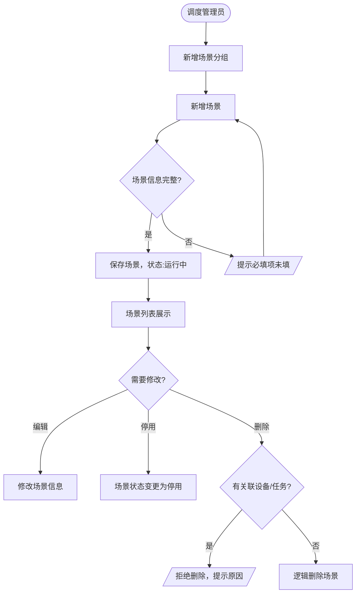
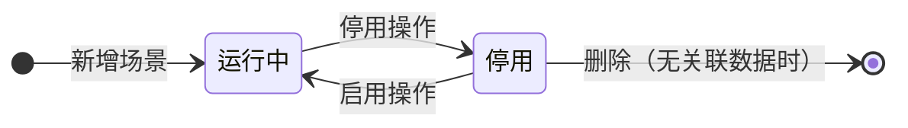
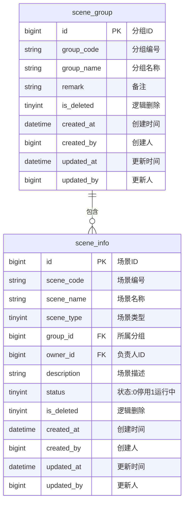

# 场景管理模块 产品需求文档

> 所属系统：多场景影像传感设备资源协同调度系统
> 文档版本：V1.0 | 创建日期：2026-05-26

---

## 一、背景与目标

场景管理模块为设备与任务提供分类归属基础，通过场景的定义和分组管理，支撑多应用场景下的设备调度与任务管理。

**功能目标**：
- 支持调度管理员创建和维护应用场景信息
- 支持对场景进行分组归类，便于批量管理与授权
- 为设备注册和任务创建提供场景关联支撑

---

## 二、功能清单

| 功能点 | 优先级 | 说明 | 涉及角色 |
|--------|--------|------|----------|
| 场景列表查询 | P0 | 分页展示，支持名称/类型/状态筛选 | DISPATCH_ADMIN |
| 新增场景 | P0 | 填写场景基本信息 | DISPATCH_ADMIN |
| 编辑场景 | P0 | 修改场景信息 | DISPATCH_ADMIN |
| 停用场景 | P0 | 切换场景状态 | DISPATCH_ADMIN |
| 删除场景 | P1 | 仅允许删除无关联设备和任务的场景 | DISPATCH_ADMIN |
| 分组列表查询 | P1 | 展示分组及包含场景数 | DISPATCH_ADMIN |
| 新增分组 | P1 | 填写分组名称和备注 | DISPATCH_ADMIN |
| 编辑分组 | P1 | 修改分组信息 | DISPATCH_ADMIN |
| 删除分组 | P1 | 仅允许删除无绑定场景的分组 | DISPATCH_ADMIN |

---

## 三、主流程图



---

## 四、功能详细说明

### 4.1 场景信息维护

**功能描述**：管理系统内各应用场景的基本信息，为设备与任务提供分类归属。

**字段说明**：
| 字段 | 类型 | 必填 | 校验规则 | 说明 |
|------|------|------|----------|------|
| sceneCode | string | — | 系统自动生成，唯一 | 场景编号，如 SCENE-001 |
| sceneName | string | ✓ | 最长 50 字 | 场景名称，如：产线 A 质检 |
| sceneType | int | ✓ | 枚举值 | 1-质量检测 2-安防监控 3-物料识别 4-其他 |
| groupId | long | ✗ | 分组 ID | 所属分组 |
| ownerId | long | ✓ | 系统用户 ID | 负责人 |
| description | string | ✗ | 最长 500 字 | 场景描述 |
| status | int | ✓ | 1-运行中 0-停用 | 场景状态 |

**场景状态机**：



**交互说明**：
- 场景编号由系统自动生成，格式：SCENE-{6位序号}
- 停用场景后，该场景下的设备不受影响，但新任务无法选择停用场景
- 删除场景前检查是否有关联设备或任务，有则拒绝并提示

---

### 4.2 场景分组管理

**功能描述**：对场景进行分组归类，便于批量管理与授权。

**字段说明**：
| 字段 | 类型 | 必填 | 校验规则 | 说明 |
|------|------|------|----------|------|
| groupCode | string | — | 系统自动生成 | 分组编号 |
| groupName | string | ✓ | 最长 30 字，唯一 | 分组名称，如：产线组 |
| sceneCount | int | — | 系统自动统计（只读） | 包含场景数 |
| remark | string | ✗ | 最长 200 字 | 备注说明 |

---

## 五、数据模型



---

## 六、接口设计

### 接口清单

| 接口名称 | 方法 | 路径 | 权限标识 |
|----------|------|------|---------|
| 场景分页列表 | GET | /api/v1/scenes | scene:list |
| 新增场景 | POST | /api/v1/scenes | scene:add |
| 场景详情 | GET | /api/v1/scenes/{id} | scene:list |
| 编辑场景 | PUT | /api/v1/scenes/{id} | scene:edit |
| 切换场景状态 | PATCH | /api/v1/scenes/{id}/status | scene:edit |
| 删除场景 | DELETE | /api/v1/scenes/{id} | scene:delete |
| 场景下拉列表 | GET | /api/v1/scenes/options | 已登录 |
| 分组列表 | GET | /api/v1/scene-groups | scene:list |
| 新增分组 | POST | /api/v1/scene-groups | scene:add |
| 编辑分组 | PUT | /api/v1/scene-groups/{id} | scene:edit |
| 删除分组 | DELETE | /api/v1/scene-groups/{id} | scene:delete |

---

#### 场景分页列表

**说明**：分页查询场景列表，支持名称/类型/状态筛选

**鉴权**：需要 | **权限标识**：`scene:list`

```
GET /api/v1/scenes?page=1&pageSize=10&keyword=&sceneType=1&status=1&groupId=
Authorization: Bearer {accessToken}

Query 参数：
- page        int     否   当前页，默认 1
- pageSize    int     否   每页数量，默认 10
- keyword     string  否   场景名称模糊搜索
- sceneType   int     否   场景类型筛选
- status      int     否   状态筛选：0-停用 1-运行中
- groupId     long    否   分组 ID 筛选

响应：
{
  "code": 200,
  "data": {
    "total": 50,
    "page": 1,
    "pageSize": 10,
    "records": [
      {
        "id": 1,
        "sceneCode": "SCENE-000001",
        "sceneName": "产线A质检",
        "sceneType": 1,
        "sceneTypeLabel": "质量检测",
        "groupId": 1,
        "groupName": "产线组",
        "ownerName": "张三",
        "status": 1,
        "deviceCount": 5,
        "createdAt": "2026-05-01 10:00:00"
      }
    ]
  }
}
```

---

#### 新增场景

**说明**：创建新的应用场景

**鉴权**：需要 | **权限标识**：`scene:add`

```
POST /api/v1/scenes
Authorization: Bearer {accessToken}
Content-Type: application/json

请求体：
{
  "sceneName": "产线A质检",        // 必填
  "sceneType": 1,                  // 必填：1-质量检测 2-安防监控 3-物料识别 4-其他
  "groupId": 1,                    // 可选
  "ownerId": 101,                  // 必填
  "description": "负责产线A的质量检测工作"  // 可选
}

响应：
{ "code": 200, "message": "创建成功", "data": { "id": 1, "sceneCode": "SCENE-000001" } }

错误：
{ "code": 409, "message": "场景名称已存在" }
```

---

#### 场景下拉列表

**说明**：获取运行中的场景列表，用于设备注册、任务创建等处的下拉选项

**鉴权**：需要（已登录即可）

```
GET /api/v1/scenes/options
Authorization: Bearer {accessToken}

响应：
{
  "code": 200,
  "data": [
    { "id": 1, "sceneName": "产线A质检", "sceneCode": "SCENE-000001" },
    { "id": 2, "sceneName": "仓库入库检验", "sceneCode": "SCENE-000002" }
  ]
}
```

---

## 七、业务边界

### In Scope（本期做）
- ✅ 场景的新增、编辑、停用/启用、删除
- ✅ 场景分组的新增、编辑、删除
- ✅ 场景与分组的关联管理
- ✅ 场景列表多条件筛选查询

### Out of Scope（本期不做）
- ❌ 场景模板复制功能（下期迭代）
- ❌ 场景级别的数据权限隔离（超级管理员统一管理）

---

## 八、权限设计

| 操作 | 权限标识 | 可见角色 |
|------|---------|---------|
| 查看场景列表 | scene:list | DISPATCH_ADMIN, DEVICE_OPS, OPERATOR |
| 新增场景 | scene:add | DISPATCH_ADMIN |
| 编辑场景 | scene:edit | DISPATCH_ADMIN |
| 删除场景 | scene:delete | DISPATCH_ADMIN |

---

## 九、异常流程

| 异常场景 | 触发条件 | 处理方式 | 用户提示 |
|----------|----------|----------|----------|
| 场景名称重复 | 新增/编辑时名称已存在 | 返回 409 | "场景名称已存在" |
| 删除有关联设备的场景 | 场景下有已注册设备 | 返回 422 | "该场景下有 N 台设备，请先解绑设备" |
| 删除有关联任务的场景 | 场景下有进行中任务 | 返回 422 | "该场景下有进行中的任务，无法删除" |
| 删除有绑定场景的分组 | 分组下有场景 | 返回 422 | "该分组下有 N 个场景，请先移出场景" |

---

## 十、验收标准

**AC-001 新增场景成功**
- Given：调度管理员已登录，场景名称在系统中不存在
- When：填写完整场景信息，点击保存
- Then：场景创建成功，列表中出现该场景，状态为"运行中"
  - And：场景编号由系统自动生成（格式：SCENE-XXXXXX）

**AC-002 停用场景**
- Given：场景"产线A质检"状态为运行中
- When：调度管理员点击停用
- Then：场景状态变更为"停用"
  - And：新任务创建时，该场景不出现在可选场景列表中

**AC-003 删除有关联设备的场景**
- Given：场景下有 3 台已注册设备
- When：调度管理员尝试删除该场景
- Then：提示"该场景下有 3 台设备，请先解绑设备"
  - And：场景未被删除

**AC-004 场景列表筛选**
- Given：系统中有 10 个场景，其中 3 个类型为"安防监控"
- When：选择场景类型筛选条件为"安防监控"，点击查询
- Then：列表仅展示 3 条安防监控类型的场景
