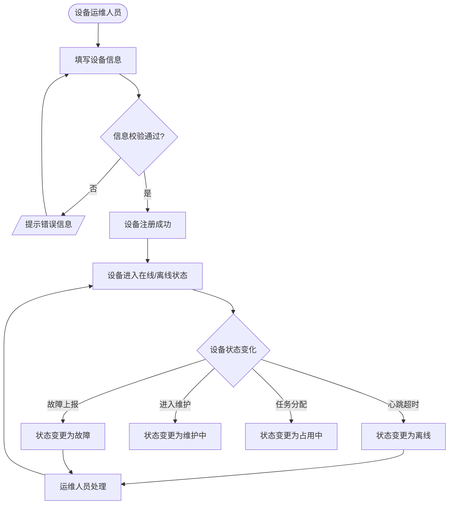
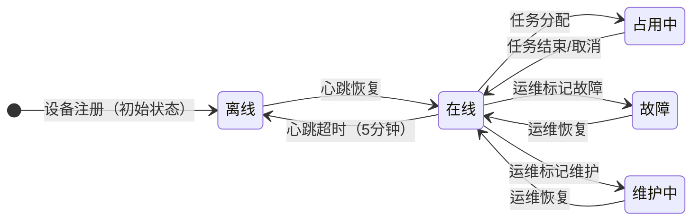
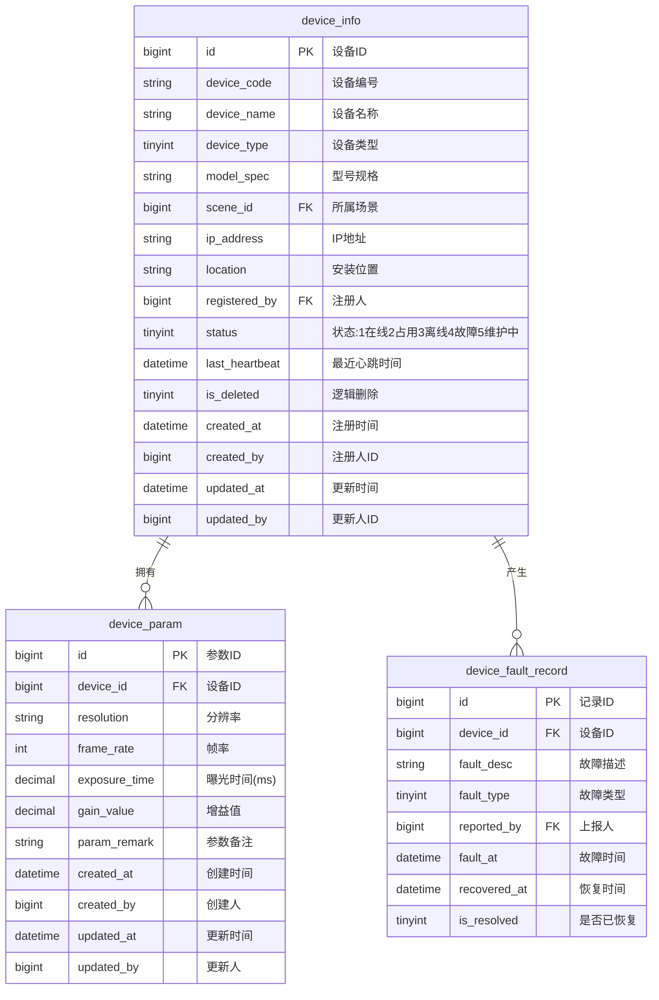

# 设备管理模块 产品需求文档

> 所属系统：多场景影像传感设备资源协同调度系统
> 文档版本：V1.0 | 创建日期：2026-05-26

---

## 一、背景与目标

设备管理模块负责影像传感设备的注册录入、实时状态监控和运行参数配置，是整个调度系统的基础资源管理层。

**功能目标**：
- 支持设备运维人员将影像传感设备录入系统，建立设备档案
- 实时展示所有设备的在线状态和运行情况
- 为设备配置运行参数模板，供任务调度时引用

---

## 二、功能清单

| 功能点 | 优先级 | 说明 | 涉及角色 |
|--------|--------|------|----------|
| 设备列表查询 | P0 | 分页展示，支持场景/类型/状态筛选 | DISPATCH_ADMIN, DEVICE_OPS |
| 新增设备 | P0 | 填写设备基本信息，录入系统 | DEVICE_OPS |
| 编辑设备 | P0 | 修改设备信息 | DEVICE_OPS |
| 注销设备 | P0 | 逻辑删除设备 | DEVICE_OPS |
| 设备状态总览 | P0 | 展示在线/离线/故障/维护中数量卡片 | DISPATCH_ADMIN, DEVICE_OPS |
| 设备详情 | P0 | 查看心跳时间、当前任务、故障历史 | DISPATCH_ADMIN, DEVICE_OPS |
| 手动刷新状态 | P1 | 手动触发状态刷新 | DISPATCH_ADMIN, DEVICE_OPS |
| 定时刷新配置 | P1 | 配置自动刷新间隔 | DISPATCH_ADMIN |
| 设备参数配置 | P1 | 为设备配置运行参数模板 | DEVICE_OPS |
| 查看参数配置 | P1 | 查看设备的参数配置记录 | DISPATCH_ADMIN, DEVICE_OPS |

---

## 三、主流程图



---

## 四、功能详细说明

### 4.1 设备注册

**功能描述**：将影像传感设备录入系统，建立设备档案。

**字段说明**：
| 字段 | 类型 | 必填 | 校验规则 | 说明 |
|------|------|------|----------|------|
| deviceCode | string | — | 系统自动生成，唯一 | 设备编号，如 DEV-CAM-001 |
| deviceName | string | ✓ | 最长 50 字 | 设备显示名称 |
| deviceType | int | ✓ | 枚举值 | 1-工业相机 2-深度相机 3-线扫相机 4-其他 |
| modelSpec | string | ✓ | 最长 100 字 | 型号规格 |
| sceneId | long | ✓ | 场景 ID（运行中状态） | 所属场景 |
| ipAddress | string | ✓ | IPv4 格式校验 | 设备 IP 地址 |
| location | string | ✓ | 最长 200 字 | 安装位置描述 |
| status | int | — | 系统维护 | 在线/离线/故障/维护中 |

**数据权限**：设备运维人员只能编辑和注销自己注册的设备。

---

### 4.2 设备状态监控

**设备状态定义**：

| 状态 | 说明 | 触发条件 |
|------|------|---------|
| 在线 | 设备正常运行且空闲 | 心跳正常且未被任务占用 |
| 占用中 | 设备已被任务分配 | 任务分配后自动变更 |
| 离线 | 设备无心跳 | 超过心跳超时阈值（默认 5 分钟） |
| 故障 | 设备异常 | 运维人员手动标记 |
| 维护中 | 设备维护停机 | 运维人员手动标记 |

**设备状态机**：



**状态总览卡片**：展示实时统计数量：
- 在线设备数（含占用中）
- 离线设备数
- 故障设备数
- 维护中设备数

**设备详情信息**：
| 字段 | 说明 |
|------|------|
| 最近心跳时间 | 最后一次收到心跳的时间 |
| 当前任务 | 正在执行的任务编号和名称（若有） |
| 历史故障记录 | 近 10 条故障记录（时间、描述） |

---

### 4.3 设备参数配置

**功能描述**：为设备配置运行参数模板，供任务调度时引用。

**字段说明**：
| 字段 | 类型 | 必填 | 校验规则 | 说明 |
|------|------|------|----------|------|
| deviceId | long | ✓ | 设备 ID | 关联设备 |
| resolution | string | ✗ | 如 1920x1080 | 分辨率 |
| frameRate | int | ✗ | 正整数，单位 fps | 帧率 |
| exposureTime | decimal | ✗ | 正数，单位毫秒 | 曝光时间 |
| gainValue | decimal | ✗ | 数值型 | 增益值 |
| paramRemark | string | ✗ | 最长 200 字 | 适用场景说明 |

---

## 五、数据模型



---

## 六、接口设计

### 接口清单

| 接口名称 | 方法 | 路径 | 权限标识 |
|----------|------|------|---------|
| 设备分页列表 | GET | /api/v1/devices | device:list |
| 新增设备 | POST | /api/v1/devices | device:add |
| 设备详情 | GET | /api/v1/devices/{id} | device:list |
| 编辑设备 | PUT | /api/v1/devices/{id} | device:edit |
| 注销设备 | DELETE | /api/v1/devices/{id} | device:delete |
| 变更设备状态 | PATCH | /api/v1/devices/{id}/status | device:edit |
| 设备状态总览 | GET | /api/v1/devices/overview | device:list |
| 可用设备列表 | GET | /api/v1/devices/available | task:edit |
| 设备参数列表 | GET | /api/v1/devices/{id}/params | device:list |
| 保存设备参数 | POST | /api/v1/devices/{id}/params | device:edit |
| 故障记录列表 | GET | /api/v1/devices/{id}/fault-records | device:list |

---

#### 设备分页列表

**说明**：分页查询设备列表，支持多条件筛选

**鉴权**：需要 | **权限标识**：`device:list`

```
GET /api/v1/devices?page=1&pageSize=10&keyword=&sceneId=&deviceType=&status=
Authorization: Bearer {accessToken}

Query 参数：
- page        int     否   当前页，默认 1
- pageSize    int     否   每页数量，默认 10
- keyword     string  否   设备编号/名称模糊搜索
- sceneId     long    否   所属场景筛选
- deviceType  int     否   设备类型筛选
- status      int     否   状态筛选：1-在线 2-占用中 3-离线 4-故障 5-维护中

响应：
{
  "code": 200,
  "data": {
    "total": 50,
    "page": 1,
    "pageSize": 10,
    "records": [
      {
        "id": 1,
        "deviceCode": "DEV-CAM-001",
        "deviceName": "产线A-主摄像头",
        "deviceType": 1,
        "deviceTypeLabel": "工业相机",
        "modelSpec": "MV-CA050-10GM",
        "sceneId": 1,
        "sceneName": "产线A质检",
        "ipAddress": "192.168.1.101",
        "location": "产线A入口上方2米",
        "status": 1,
        "statusLabel": "在线",
        "lastHeartbeat": "2026-05-26 10:30:00",
        "registeredByName": "李四",
        "createdAt": "2026-05-01 09:00:00"
      }
    ]
  }
}
```

---

#### 设备状态总览

**说明**：获取设备状态统计卡片数据

**鉴权**：需要 | **权限标识**：`device:list`

```
GET /api/v1/devices/overview
Authorization: Bearer {accessToken}

响应：
{
  "code": 200,
  "data": {
    "totalCount": 50,
    "onlineCount": 30,
    "busyCount": 10,
    "offlineCount": 5,
    "faultCount": 3,
    "maintenanceCount": 2
  }
}
```

---

#### 可用设备列表

**说明**：查询满足任务条件的可用设备（供任务分配使用）

**鉴权**：需要 | **权限标识**：`task:edit`

```
GET /api/v1/devices/available?sceneId=1&deviceType=1
Authorization: Bearer {accessToken}

Query 参数：
- sceneId     long    否   场景 ID（任务所属场景）
- deviceType  int     否   设备类型要求

响应：
{
  "code": 200,
  "data": [
    {
      "id": 1,
      "deviceCode": "DEV-CAM-001",
      "deviceName": "产线A-主摄像头",
      "deviceType": 1,
      "deviceTypeLabel": "工业相机",
      "status": 1,
      "statusLabel": "在线"
    }
  ]
}
```

---

#### 新增设备

**说明**：注册新设备到系统

**鉴权**：需要 | **权限标识**：`device:add`

```
POST /api/v1/devices
Authorization: Bearer {accessToken}
Content-Type: application/json

请求体：
{
  "deviceName": "产线A-主摄像头",    // 必填
  "deviceType": 1,                   // 必填：1-工业相机 2-深度相机 3-线扫相机 4-其他
  "modelSpec": "MV-CA050-10GM",      // 必填
  "sceneId": 1,                      // 必填
  "ipAddress": "192.168.1.101",      // 必填，IPv4格式
  "location": "产线A入口上方2米"      // 必填
}

响应：
{ "code": 200, "message": "设备注册成功", "data": { "id": 1, "deviceCode": "DEV-CAM-001" } }

错误：
{ "code": 409, "message": "IP地址 192.168.1.101 已被其他设备使用" }
{ "code": 400, "message": "IP地址格式不正确" }
```

---

#### 变更设备状态

**说明**：运维人员手动变更设备状态（故障标记/进入维护/恢复在线）

**鉴权**：需要 | **权限标识**：`device:edit`

```
PATCH /api/v1/devices/{id}/status
Authorization: Bearer {accessToken}
Content-Type: application/json

请求体：
{
  "status": 4,             // 4-故障 5-维护中（运维人员可手动设置）
  "remark": "摄像头镜头污染，待清洁"  // 可选，变更原因
}

响应：
{ "code": 200, "message": "状态已更新" }

错误：
{ "code": 422, "message": "设备当前有正在执行的任务，请先处理任务再变更状态" }
```

---

## 七、业务边界

### In Scope（本期做）
- ✅ 设备的注册、编辑、注销（逻辑删除）
- ✅ 设备状态实时监控和手动刷新
- ✅ 设备参数模板配置
- ✅ 设备故障记录查询

### Out of Scope（本期不做）
- ❌ 设备自动心跳上报（需要设备端 SDK 配合，另行设计）
- ❌ 设备远程配置下发（下期迭代）
- ❌ 设备批量导入（下期迭代）

### 前置依赖
- 场景管理模块已完成，场景下拉列表可用
- 设备心跳数据由设备端 SDK 定时上报（HTTP POST /api/v1/devices/{id}/heartbeat）

---

## 八、权限设计

| 操作 | 权限标识 | 可见角色 | 数据范围 |
|------|---------|---------|---------|
| 查看设备列表 | device:list | DISPATCH_ADMIN, DEVICE_OPS | 全部 |
| 新增设备 | device:add | DEVICE_OPS | — |
| 编辑设备 | device:edit | DEVICE_OPS | 本人注册的设备 |
| 注销设备 | device:delete | DEVICE_OPS | 本人注册的设备 |

---

## 九、异常流程

| 异常场景 | 触发条件 | 处理方式 | 用户提示 |
|----------|----------|----------|----------|
| IP 地址重复 | 新增/编辑时 IP 已存在 | 返回 409 | "该IP地址已被设备 DEV-CAM-XXX 使用" |
| 注销有进行中任务的设备 | 设备当前被任务占用 | 返回 422 | "设备当前有正在执行的任务，请先结束任务" |
| 故障设备被任务分配 | 状态为故障/维护中 | 不出现在可用列表 | — |
| 设备长时间离线 | 心跳超时 > 5 分钟 | 状态自动变更为离线 | 调度看板显示告警 |

---

## 十、验收标准

**AC-001 设备注册成功**
- Given：设备运维人员已登录，填写了所有必填信息，IP 地址未被占用
- When：点击保存
- Then：设备注册成功，列表中显示该设备，状态为"离线"（等待心跳）
  - And：设备编号由系统自动生成（格式：DEV-{类型前缀}-{序号}）

**AC-002 IP 地址重复注册**
- Given：系统中已有设备使用 IP 192.168.1.101
- When：运维人员尝试注册相同 IP 的新设备
- Then：提示"该IP地址已被设备 DEV-CAM-001 使用"
  - And：设备未被注册

**AC-003 设备状态总览实时性**
- Given：系统中有设备心跳超时（超过 5 分钟未收到心跳）
- When：打开设备状态监控页面，或手动刷新
- Then：该设备状态显示为"离线"，离线数量统计卡片数值正确更新

**AC-004 数据权限控制**
- Given：运维人员 A 注册了设备 DEV-001，运维人员 B 注册了设备 DEV-002
- When：运维人员 A 尝试编辑 DEV-002
- Then：操作被拒绝，提示"无权限操作他人注册的设备"

**AC-005 可用设备筛选**
- Given：任务要求场景1下的工业相机，系统中有 3 台场景1工业相机（2台在线、1台故障）
- When：任务分配页面加载可用设备列表
- Then：列表显示 2 台在线设备，故障设备不在列表中

### 性能验收

| 指标 | 要求 | 测试方式 |
|------|------|----------|
| 设备列表加载 | < 2s | 前端监控 |
| 状态刷新延迟 | ≤ 5s | 监控 |
| 状态总览接口 | P99 < 200ms | 压测 |
