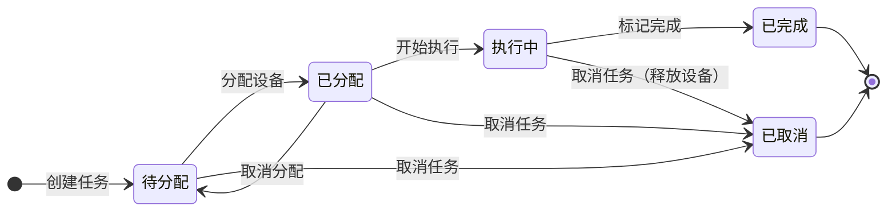
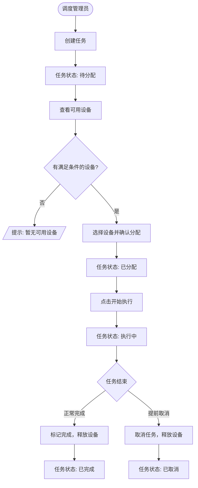
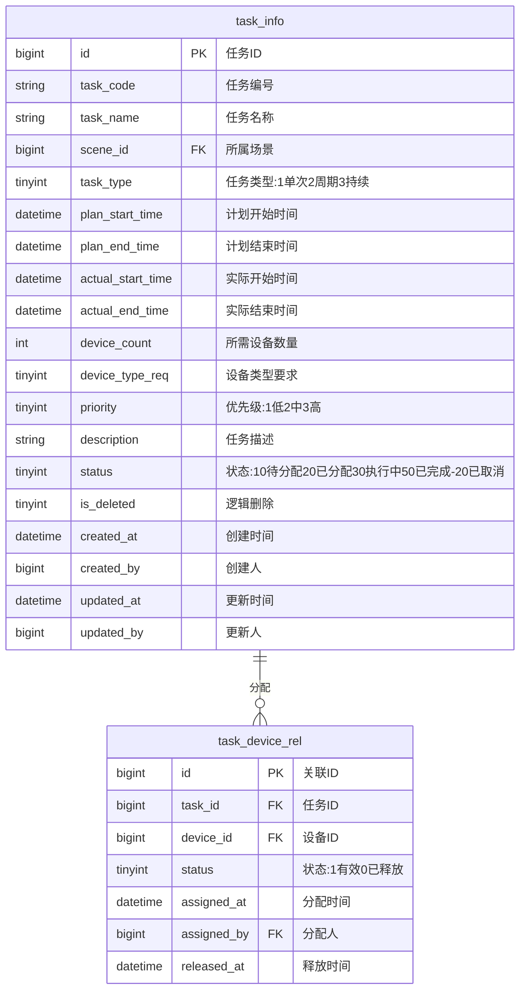

# 任务管理模块 产品需求文档

> 所属系统：多场景影像传感设备资源协同调度系统
> 文档版本：V1.0 | 创建日期：2026-05-26

---

## 一、背景与目标

任务管理模块支持调度管理员创建影像采集或检测任务，并为任务分配合适的设备资源，同时提供全流程的任务进度查询能力。

**功能目标**：
- 支持创建多种类型的影像任务，定义任务执行要求
- 支持手动为任务分配设备资源
- 提供多维度任务进度查询

---

## 二、功能清单

| 功能点 | 优先级 | 说明 | 涉及角色 |
|--------|--------|------|----------|
| 任务列表查询 | P0 | 分页查询，支持多条件筛选 | 全部角色 |
| 新增任务 | P0 | 创建影像采集/检测任务 | DISPATCH_ADMIN |
| 编辑任务 | P0 | 修改待分配状态的任务 | DISPATCH_ADMIN |
| 取消任务 | P0 | 取消待分配或执行中的任务 | DISPATCH_ADMIN |
| 任务详情 | P0 | 查看任务完整信息 | 全部角色 |
| 查看可用设备 | P0 | 按任务条件筛选可用设备 | DISPATCH_ADMIN |
| 分配设备 | P0 | 手动为任务选择设备 | DISPATCH_ADMIN |
| 取消分配 | P0 | 释放任务占用的设备资源 | DISPATCH_ADMIN |
| 开始执行 | P0 | 标记任务开始执行 | DISPATCH_ADMIN |
| 完成任务 | P0 | 标记任务完成，释放设备 | DISPATCH_ADMIN |

---

## 三、任务状态机



**状态枚举**：

| 状态 | 值 | 说明 |
|------|---|------|
| 待分配 | 10 | 任务已创建，等待分配设备 |
| 已分配 | 20 | 设备已分配，等待开始执行 |
| 执行中 | 30 | 任务正在执行 |
| 已完成 | 50 | 任务执行完成 |
| 已取消 | -20 | 任务已取消，设备已释放 |

---

## 四、主流程图



---

## 五、功能详细说明

### 5.1 任务创建

**功能描述**：创建影像采集或检测任务，定义任务执行要求。

**字段说明**：
| 字段 | 类型 | 必填 | 校验规则 | 说明 |
|------|------|------|----------|------|
| taskCode | string | — | 系统自动生成 | 任务编号，格式：TASK-YYYYMMDD-001 |
| taskName | string | ✓ | 最长 100 字 | 任务名称 |
| sceneId | long | ✓ | 运行中场景 ID | 所属场景 |
| taskType | int | ✓ | 枚举值 | 1-单次采集 2-周期采集 3-持续监控 |
| planStartTime | datetime | ✓ | 不得早于当前时间 | 计划开始时间 |
| planEndTime | datetime | ✗ | 晚于开始时间（持续监控可不填） | 计划结束时间 |
| deviceCount | int | ✓ | 正整数，≥1 | 所需设备数量 |
| deviceTypeReq | int | ✗ | 枚举值（同设备类型） | 限定设备类型要求 |
| priority | int | ✓ | 1-低 2-中 3-高 | 任务优先级 |
| description | string | ✗ | 最长 500 字 | 任务详细说明 |

**交互说明**：
- 持续监控类型任务不要求填写计划结束时间
- 任务编号由系统自动生成，格式：TASK-{YYYYMMDD}-{3位序号}
- 任务创建后状态自动为"待分配"

---

### 5.2 任务分配

**功能描述**：调度管理员从满足条件的设备列表中手动选择设备分配给任务。

**操作步骤**：
1. 调度管理员进入任务详情或任务列表，点击"分配设备"
2. 系统自动过滤出满足条件的可用设备（同场景、匹配类型、在线且空闲状态）
3. 管理员从列表中选择设备（可多选，数量不超过任务所需设备数）
4. 确认分配，任务状态变更为"已分配"，被选设备状态变更为"占用中"
5. 若需取消分配，点击"取消分配"，设备状态恢复为"在线"，任务状态回到"待分配"

**分配规则**：
- 可用设备过滤条件：与任务同场景 + 满足设备类型要求 + 当前状态为"在线"
- 选择设备数量必须等于任务所需设备数量才能完成分配
- 已分配的任务若要更换设备，需先取消分配再重新分配

---

### 5.3 任务进度查询

**筛选条件**：
| 条件 | 类型 | 说明 |
|------|------|------|
| 任务名称 | string | 模糊搜索 |
| 所属场景 | long | 下拉选择 |
| 任务状态 | int | 多选筛选 |
| 优先级 | int | 高/中/低筛选 |
| 计划开始时间范围 | datetime | 起止时间范围 |

---

## 六、数据模型



---

## 七、接口设计

### 接口清单

| 接口名称 | 方法 | 路径 | 权限标识 |
|----------|------|------|---------|
| 任务分页列表 | GET | /api/v1/tasks | task:list |
| 新增任务 | POST | /api/v1/tasks | task:add |
| 任务详情 | GET | /api/v1/tasks/{id} | task:list |
| 编辑任务 | PUT | /api/v1/tasks/{id} | task:edit |
| 分配设备 | POST | /api/v1/tasks/{id}/assign | task:edit |
| 取消分配 | POST | /api/v1/tasks/{id}/unassign | task:edit |
| 开始执行 | POST | /api/v1/tasks/{id}/start | task:edit |
| 完成任务 | POST | /api/v1/tasks/{id}/complete | task:edit |
| 取消任务 | POST | /api/v1/tasks/{id}/cancel | task:edit |
| 已分配设备列表 | GET | /api/v1/tasks/{id}/devices | task:list |

---

#### 任务分页列表

**说明**：分页查询任务列表，支持多条件筛选

**鉴权**：需要 | **权限标识**：`task:list`

```
GET /api/v1/tasks?page=1&pageSize=10&keyword=&sceneId=&status=10,20&priority=3&startTimeBegin=&startTimeEnd=
Authorization: Bearer {accessToken}

Query 参数：
- page            int     否   当前页，默认 1
- pageSize        int     否   每页数量，默认 10
- keyword         string  否   任务名称模糊搜索
- sceneId         long    否   所属场景筛选
- status          string  否   状态筛选（多值用逗号分隔，如 10,20,30）
- priority        int     否   优先级筛选：1-低 2-中 3-高
- startTimeBegin  string  否   计划开始时间起始（yyyy-MM-dd HH:mm:ss）
- startTimeEnd    string  否   计划开始时间结束

响应：
{
  "code": 200,
  "data": {
    "total": 100,
    "page": 1,
    "pageSize": 10,
    "records": [
      {
        "id": 1,
        "taskCode": "TASK-20260526-001",
        "taskName": "产线A上午质检",
        "sceneName": "产线A质检",
        "taskType": 1,
        "taskTypeLabel": "单次采集",
        "planStartTime": "2026-05-26 08:00:00",
        "planEndTime": "2026-05-26 12:00:00",
        "deviceCount": 2,
        "assignedDeviceCount": 2,
        "priority": 3,
        "priorityLabel": "高",
        "status": 30,
        "statusLabel": "执行中",
        "createdByName": "张三",
        "createdAt": "2026-05-25 17:00:00"
      }
    ]
  }
}
```

---

#### 新增任务

**说明**：创建新的影像采集/检测任务

**鉴权**：需要 | **权限标识**：`task:add`

```
POST /api/v1/tasks
Authorization: Bearer {accessToken}
Content-Type: application/json

请求体：
{
  "taskName": "产线A上午质检",          // 必填
  "sceneId": 1,                          // 必填
  "taskType": 1,                         // 必填：1-单次采集 2-周期采集 3-持续监控
  "planStartTime": "2026-05-26 08:00:00", // 必填
  "planEndTime": "2026-05-26 12:00:00",   // 可选（持续监控可不填）
  "deviceCount": 2,                       // 必填，≥1
  "deviceTypeReq": 1,                     // 可选：限定设备类型
  "priority": 3,                          // 必填：1-低 2-中 3-高
  "description": "负责上午班次产品质检"  // 可选
}

响应：
{ "code": 200, "message": "创建成功", "data": { "id": 1, "taskCode": "TASK-20260526-001" } }

错误：
{ "code": 400, "message": "计划开始时间不能早于当前时间" }
{ "code": 400, "message": "计划结束时间必须晚于开始时间" }
{ "code": 422, "message": "场景已停用，无法创建任务" }
```

---

#### 分配设备

**说明**：为任务分配设备资源

**鉴权**：需要 | **权限标识**：`task:edit`

```
POST /api/v1/tasks/{id}/assign
Authorization: Bearer {accessToken}
Content-Type: application/json

请求体：
{
  "deviceIds": [1, 3]   // 必填，选择的设备 ID 数组
}

响应：
{ "code": 200, "message": "设备分配成功" }

错误：
{ "code": 422, "message": "所选设备数量（1）不满足任务要求（2）" }
{ "code": 422, "message": "设备 DEV-CAM-003 当前不可用" }
{ "code": 422, "message": "任务状态不允许分配设备" }
```

---

#### 取消任务

**说明**：取消任务，若已分配设备则同步释放

**鉴权**：需要 | **权限标识**：`task:edit`

```
POST /api/v1/tasks/{id}/cancel
Authorization: Bearer {accessToken}
Content-Type: application/json

请求体：
{
  "cancelReason": "计划变更，无需执行"  // 可选
}

响应：
{ "code": 200, "message": "任务已取消" }

错误：
{ "code": 422, "message": "任务已完成，无法取消" }
```

---

## 八、业务边界

### In Scope（本期做）
- ✅ 任务的创建、编辑、取消
- ✅ 设备手动分配与取消分配
- ✅ 任务状态流转（待分配→已分配→执行中→已完成/已取消）
- ✅ 任务多条件分页查询

### Out of Scope（本期不做）
- ❌ 自动调度（系统自动匹配最优设备）：下期迭代
- ❌ 周期任务自动创建：下期迭代
- ❌ 任务进度实时推送（WebSocket）：下期迭代

---

## 九、权限设计

| 操作 | 权限标识 | 可见角色 |
|------|---------|---------|
| 查看任务列表 | task:list | 全部角色 |
| 新增任务 | task:add | DISPATCH_ADMIN |
| 编辑任务 | task:edit | DISPATCH_ADMIN |
| 分配/取消分配设备 | task:edit | DISPATCH_ADMIN |
| 取消任务 | task:edit | DISPATCH_ADMIN |

---

## 十、异常流程

| 异常场景 | 触发条件 | 处理方式 | 用户提示 |
|----------|----------|----------|----------|
| 场景已停用 | 选择已停用场景创建任务 | 返回 422 | "场景已停用，无法创建任务" |
| 无可用设备 | 分配时无满足条件的设备 | 前端提示 | "暂无满足条件的可用设备" |
| 设备数量不足 | 选择设备数少于所需数量 | 返回 422 | "所选设备数量不满足任务要求" |
| 编辑非待分配任务 | 任务不在待分配状态 | 返回 422 | "仅待分配状态的任务可以编辑" |
| 已完成任务取消 | 任务已完成后尝试取消 | 返回 422 | "任务已完成，无法取消" |
| 设备被抢占 | 分配时设备刚被其他任务占用 | 返回 422 | "设备 DEV-CAM-XXX 当前不可用，请重新选择" |

---

## 十一、验收标准

**AC-001 创建任务成功**
- Given：调度管理员已登录，所选场景为运行中状态
- When：填写完整任务信息，点击保存
- Then：任务创建成功，状态为"待分配"
  - And：任务编号自动生成（格式：TASK-YYYYMMDD-XXX）

**AC-002 分配设备后状态变更**
- Given：任务状态为"待分配"，系统中有 2 台满足条件的在线设备
- When：调度管理员选择 2 台设备并确认分配
- Then：任务状态变更为"已分配"
  - And：被选 2 台设备状态变更为"占用中"
  - And：调度日志记录一条"分配"操作

**AC-003 取消任务释放设备**
- Given：任务状态为"执行中"，已占用 2 台设备
- When：调度管理员点击取消任务，输入取消原因
- Then：任务状态变更为"已取消"
  - And：2 台设备状态恢复为"在线"
  - And：调度日志记录一条"取消"操作

**AC-004 任务列表多条件筛选**
- Given：系统中有 20 条任务，其中 5 条为高优先级执行中
- When：筛选优先级=高、状态=执行中
- Then：列表展示 5 条匹配的任务

**AC-005 持续监控任务不强制结束时间**
- Given：调度管理员选择任务类型为"持续监控"
- When：不填写计划结束时间，点击保存
- Then：任务创建成功，计划结束时间显示为"—"

### 性能验收

| 指标 | 要求 | 测试方式 |
|------|------|----------|
| 任务列表接口 | P99 < 500ms | 压测 |
| 分配设备接口 | P99 < 300ms | 压测 |
