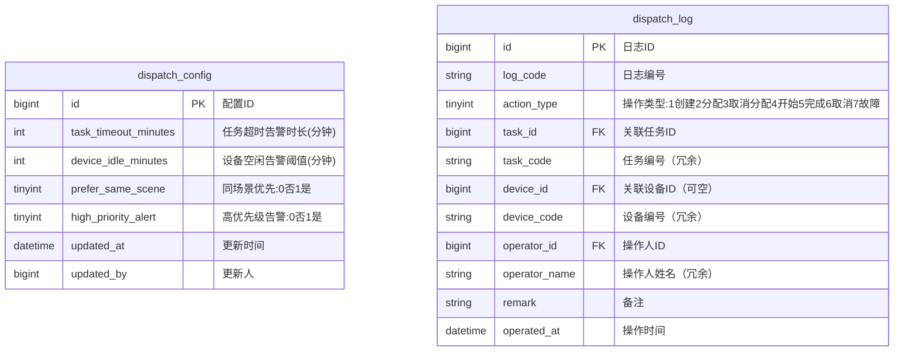

# 调度管理模块 产品需求文档

> 所属系统：多场景影像传感设备资源协同调度系统
> 文档版本：V1.0 | 创建日期：2026-05-26

---

## 一、背景与目标

调度管理模块提供可视化调度看板、调度规则配置和完整的调度日志查询能力，是系统运营监控和问题溯源的核心模块。

**功能目标**：
- 可视化展示当前所有任务与设备的调度状态
- 提供调度规则配置，辅助分配决策
- 完整记录每次调度操作，支持历史回溯和导出

---

## 二、功能清单

| 功能点 | 优先级 | 说明 | 涉及角色 |
|--------|--------|------|----------|
| 任务状态概览卡片 | P0 | 待分配/执行中/已完成数量 | DISPATCH_ADMIN, OPERATOR |
| 设备占用情况 | P0 | 在线设备空闲/占用比例 | DISPATCH_ADMIN |
| 任务时间轴（甘特图） | P0 | 当日设备任务安排可视化 | DISPATCH_ADMIN |
| 实时告警提示 | P0 | 设备离线、任务超时异常提醒 | DISPATCH_ADMIN |
| 调度规则配置 | P1 | 配置优先级规则/超时阈值等 | DISPATCH_ADMIN |
| 调度日志查询 | P0 | 多条件筛选查询调度操作记录 | 全部角色（只读） |
| 调度日志导出 | P1 | 导出 Excel 格式调度记录 | DISPATCH_ADMIN |

---

## 三、调度看板功能说明

### 3.1 任务状态概览卡片

展示以下实时统计数据：

| 卡片 | 内容 |
|------|------|
| 待分配任务数 | 当前状态为"待分配"的任务数量 |
| 执行中任务数 | 当前状态为"执行中"的任务数量 |
| 今日已完成任务数 | 当日完成的任务数量 |
| 今日已取消任务数 | 当日取消的任务数量 |

### 3.2 设备占用情况

展示在线设备（状态为在线+占用中）的空闲/占用比例，以环形图或进度条形式展示：

| 指标 | 说明 |
|------|------|
| 在线设备总数 | 在线 + 占用中数量之和 |
| 空闲设备数 | 状态为"在线"（空闲）的设备数 |
| 占用中设备数 | 状态为"占用中"的设备数 |
| 占用率 | 占用中 / 在线设备总数 × 100% |

### 3.3 任务时间轴（甘特图）

以甘特图形式展示**当日**各设备的任务安排：

- **X 轴**：时间（0:00 ~ 24:00，支持按小时缩放）
- **Y 轴**：设备列表（按场景分组展示）
- **色块**：每个任务在设备上的时间段，不同状态用不同颜色区分
  - 待执行（计划时间）：灰色
  - 执行中：绿色
  - 超时（超过计划结束时间仍未完成）：红色
  - 已完成：蓝色
- 点击色块可查看任务详情

### 3.4 实时告警提示

| 告警类型 | 触发条件 | 展示方式 |
|---------|---------|---------|
| 设备离线 | 设备心跳超时，状态变为离线 | 看板右上角红色 Badge，点击查看设备列表 |
| 任务超时 | 任务超过计划结束时间未完成 | 甘特图色块变红 + 告警列表提示 |
| 设备长时间空闲 | 设备空闲时间超过配置阈值 | 黄色提示（仅提示，不强制处理） |

---

## 四、调度规则配置

**功能描述**：配置设备调度的基本规则参数，辅助任务分配决策。

**字段说明**：
| 规则项 | 字段名 | 类型 | 默认值 | 说明 |
|--------|--------|------|--------|------|
| 任务超时告警时长 | taskTimeoutMinutes | int | 30 | 超出计划结束时间多少分钟触发告警 |
| 设备空闲告警阈值 | deviceIdleMinutes | int | 60 | 设备空闲超过 N 分钟触发提醒 |
| 同场景优先 | preferSameScene | boolean | true | 任务优先分配同场景下的设备 |
| 高优先级抢占提示 | highPriorityAlert | boolean | true | 高优先级任务等待时发出提示 |

> **注意**：本期调度规则仅用于前端展示建议和告警，不触发自动调度。

---

## 五、调度日志

**日志触发时机**：

| 操作类型 | 触发场景 |
|---------|---------|
| 创建 | 任务被创建 |
| 分配 | 设备被分配给任务 |
| 取消分配 | 设备从任务中释放 |
| 开始执行 | 任务状态变更为执行中 |
| 完成 | 任务状态变更为已完成 |
| 取消 | 任务被取消 |
| 故障中断 | 设备故障导致任务异常中断 |

---

## 六、数据模型



---

## 七、接口设计

### 接口清单

| 接口名称 | 方法 | 路径 | 权限标识 |
|----------|------|------|---------|
| 调度看板概览 | GET | /api/v1/dispatch/overview | dispatch:view |
| 甘特图数据 | GET | /api/v1/dispatch/gantt | dispatch:view |
| 告警列表 | GET | /api/v1/dispatch/alerts | dispatch:view |
| 获取调度规则配置 | GET | /api/v1/dispatch/config | dispatch:config:view |
| 更新调度规则配置 | PUT | /api/v1/dispatch/config | dispatch:config:edit |
| 调度日志分页列表 | GET | /api/v1/dispatch/logs | dispatch:log:list |
| 调度日志导出 | GET | /api/v1/dispatch/logs/export | dispatch:log:export |

---

#### 调度看板概览

**说明**：获取看板所有概览统计数据

**鉴权**：需要 | **权限标识**：`dispatch:view`

```
GET /api/v1/dispatch/overview
Authorization: Bearer {accessToken}

响应：
{
  "code": 200,
  "data": {
    "taskStats": {
      "pendingCount": 5,       // 待分配
      "runningCount": 12,      // 执行中
      "todayCompletedCount": 8, // 今日已完成
      "todayCancelledCount": 1  // 今日已取消
    },
    "deviceStats": {
      "onlineTotalCount": 30,  // 在线设备总数（在线+占用中）
      "idleCount": 18,         // 空闲设备数
      "busyCount": 12,         // 占用中设备数
      "busyRate": 40.0         // 占用率(%)
    },
    "alertCount": 3            // 当前未处理告警数量
  }
}
```

---

#### 甘特图数据

**说明**：获取当日设备任务时间轴数据

**鉴权**：需要 | **权限标识**：`dispatch:view`

```
GET /api/v1/dispatch/gantt?date=2026-05-26&sceneId=
Authorization: Bearer {accessToken}

Query 参数：
- date     string  否   查询日期，默认今日（yyyy-MM-dd）
- sceneId  long    否   按场景筛选设备

响应：
{
  "code": 200,
  "data": {
    "date": "2026-05-26",
    "devices": [
      {
        "deviceId": 1,
        "deviceCode": "DEV-CAM-001",
        "deviceName": "产线A-主摄像头",
        "sceneName": "产线A质检",
        "tasks": [
          {
            "taskId": 1,
            "taskCode": "TASK-20260526-001",
            "taskName": "上午班次质检",
            "planStartTime": "2026-05-26 08:00:00",
            "planEndTime": "2026-05-26 12:00:00",
            "actualStartTime": "2026-05-26 08:05:00",
            "actualEndTime": null,
            "status": 30,
            "statusLabel": "执行中",
            "isTimeout": false
          }
        ]
      }
    ]
  }
}
```

---

#### 调度日志分页列表

**说明**：查询调度操作日志，支持多条件筛选

**鉴权**：需要 | **权限标识**：`dispatch:log:list`

```
GET /api/v1/dispatch/logs?page=1&pageSize=10&taskCode=&deviceCode=&actionType=&operatorId=&startTime=&endTime=
Authorization: Bearer {accessToken}

Query 参数：
- page        int     否   当前页，默认 1
- pageSize    int     否   每页数量，默认 10
- taskCode    string  否   任务编号（精确/模糊）
- deviceCode  string  否   设备编号（精确/模糊）
- actionType  int     否   操作类型筛选
- operatorId  long    否   操作人 ID 筛选
- startTime   string  否   操作时间起始（yyyy-MM-dd HH:mm:ss）
- endTime     string  否   操作时间结束

响应：
{
  "code": 200,
  "data": {
    "total": 200,
    "page": 1,
    "pageSize": 10,
    "records": [
      {
        "id": 1,
        "logCode": "LOG-20260526-001",
        "actionType": 2,
        "actionTypeLabel": "分配",
        "taskCode": "TASK-20260526-001",
        "taskName": "上午班次质检",
        "deviceCode": "DEV-CAM-001",
        "deviceName": "产线A-主摄像头",
        "operatorName": "张三",
        "remark": "手动分配",
        "operatedAt": "2026-05-26 07:50:00"
      }
    ]
  }
}
```

---

#### 调度日志导出

**说明**：导出筛选条件下的调度日志为 Excel

**鉴权**：需要 | **权限标识**：`dispatch:log:export`

```
GET /api/v1/dispatch/logs/export?taskCode=&deviceCode=&actionType=&startTime=&endTime=
Authorization: Bearer {accessToken}

响应：Content-Type: application/vnd.openxmlformats-officedocument.spreadsheetml.sheet
文件名：dispatch_logs_{YYYYMMDD}.xlsx

导出字段：日志编号、操作类型、任务编号、任务名称、设备编号、设备名称、操作人、操作时间、备注
```

---

#### 更新调度规则配置

**说明**：更新系统调度规则参数

**鉴权**：需要 | **权限标识**：`dispatch:config:edit`

```
PUT /api/v1/dispatch/config
Authorization: Bearer {accessToken}
Content-Type: application/json

请求体：
{
  "taskTimeoutMinutes": 30,     // 任务超时告警时长（分钟）
  "deviceIdleMinutes": 60,      // 设备空闲告警阈值（分钟）
  "preferSameScene": true,      // 同场景优先
  "highPriorityAlert": true     // 高优先级告警
}

响应：{ "code": 200, "message": "配置已保存" }
```

---

## 八、业务边界

### In Scope（本期做）
- ✅ 调度看板可视化（概览卡片、甘特图、告警提示）
- ✅ 调度规则参数配置
- ✅ 调度日志的完整记录和查询
- ✅ 调度日志 Excel 导出

### Out of Scope（本期不做）
- ❌ 告警消息推送（短信/邮件）：下期迭代
- ❌ 基于规则的自动调度：下期迭代
- ❌ 历史甘特图回溯（仅支持当日）：下期迭代

### 前置依赖
- 任务管理模块已完成（调度日志由任务操作自动触发）
- 设备管理模块已完成（心跳状态变更触发告警）

---

## 九、权限设计

| 操作 | 权限标识 | 可见角色 |
|------|---------|---------|
| 查看调度看板 | dispatch:view | DISPATCH_ADMIN, OPERATOR |
| 查看/修改调度规则配置 | dispatch:config:edit | DISPATCH_ADMIN |
| 查看调度日志 | dispatch:log:list | 全部角色 |
| 导出调度日志 | dispatch:log:export | DISPATCH_ADMIN |

---

## 十、异常流程

| 异常场景 | 触发条件 | 处理方式 | 用户提示 |
|----------|----------|----------|----------|
| 任务超时 | 超过计划结束时间仍执行中 | 甘特图标红，告警计数+1 | 看板显示"N 条超时任务" |
| 设备离线 | 心跳超时 | 告警计数+1 | 看板显示"N 台设备离线" |
| 导出数据量过大 | 导出记录超过 50000 条 | 返回 422 | "数据量过大，请缩小时间范围后导出" |

---

## 十一、验收标准

**AC-001 看板数据实时性**
- Given：系统中有任务完成，设备状态发生变化
- When：打开调度看板（或刷新页面）
- Then：概览卡片中的数据与数据库实际数据一致
  - And：告警数量准确反映当前异常数

**AC-002 甘特图展示**
- Given：当日有 3 台设备各执行 2 个任务
- When：打开调度看板甘特图（当日视图）
- Then：甘特图展示 3 行设备，每行有对应任务色块
  - And：色块时间范围与任务计划时间一致

**AC-003 任务超时告警**
- Given：任务计划结束时间为 12:00，当前时间为 12:31（超时30分钟以上）
- When：打开调度看板
- Then：该任务甘特图色块变红
  - And：告警列表中显示该任务超时提示

**AC-004 调度日志完整性**
- Given：调度管理员完成了分配→开始→完成一系列操作
- When：查询该任务的调度日志
- Then：日志列表包含"分配"、"开始执行"、"完成"3 条记录
  - And：每条记录包含操作人、操作时间、关联任务和设备信息

**AC-005 日志导出**
- Given：调度管理员筛选了近 7 天的调度日志
- When：点击导出按钮
- Then：下载到 Excel 文件，包含所有筛选结果字段

### 性能验收

| 指标 | 要求 | 测试方式 |
|------|------|----------|
| 看板概览接口 | P99 < 300ms | 压测 |
| 甘特图数据接口 | P99 < 1000ms | 压测 |
| 日志列表接口 | P99 < 500ms | 压测 |
| 日志页面加载 | < 3s | 前端监控 |
