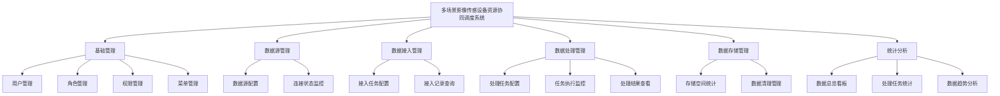

# 多场景影像传感设备资源协同调度系统 · 系统总览 PRD

| 属性 | 内容 |
|------|------|
| 文档版本 | V1.0 |
| 创建日期 | 2026-05-26 |
| 作者 | — |
| 评审状态 | 待评审 |
| 迭代版本 | Sprint 1 |

## 修订记录

| 版本 | 修改日期 | 修改人 | 修改内容 |
|------|----------|--------|----------|
| V1.0 | 2026-05-26 | — | 初稿 |

---

## 一、背景与目标

### 1.1 背景

工业生产环境中，影像传感设备持续产生海量图像与视频数据，涵盖质量检测、设备监控、流程记录等多个场景。这些数据体量庞大、格式多样，单靠人工或传统工具难以高效处理。

**核心痛点**：
- 多类型影像传感设备数据分散，缺乏统一接入管理入口
- 数据处理依赖手工操作，效率低、错误率高
- 存储资源无感知管理，存在数据丢失和空间耗尽风险
- 无可视化数据看板，管理层无法掌握数据资产全貌

### 1.2 目标

**功能目标**：
- 统一接入和管理来自多类型影像传感设备的数据
- 支持数据处理任务的配置、执行与结果管理
- 提供数据存储空间管理，掌握数据资产规模
- 提供数据统计分析功能，可视化数据全貌
- 集成用户权限管理，实现多角色分级访问控制

**业务目标（上线后）**：
- 影像数据接入效率提升 80%，替代人工手动收集
- 数据处理任务执行错误率降低至 1% 以下
- 存储空间使用率实时可见，避免意外耗尽

**非目标（本期不涉及）**：
- AI 图像识别与分析能力
- 移动端（App/小程序）支持
- 多租户 SaaS 化部署

### 1.3 系统定位

- **类型：** PC 端 Web 应用（数据处理前端系统）
- **前端仓库名：** industrial-imaging-data-platform-web
- **后端仓库名：** industrial-imaging-data-platform
- **开发库名：** industrial_imaging_data_platform_dev

---

## 二、用户角色

| 角色 | 描述 | 核心诉求 |
|------|------|----------|
| 系统管理员 | 负责平台用户账号、权限与系统参数管理 | 安全可控地管理用户访问权限 |
| 数据工程师 | 负责数据源配置、接入任务与处理任务管理 | 高效完成数据管道的配置与监控 |
| 业务分析师 | 负责数据查询、报表查看与数据导出 | 快速获取所需数据，支持业务决策 |
| 管理人员 | 查看数据统计看板，掌握数据资产概况 | 直观了解数据规模与处理效率 |

**主要用户画像**：
- 姓名：王工（数据工程师代表）
- 职业/场景：工业企业数据团队，日常需要配置多个影像设备的数据接入任务、监控处理进度
- 核心需求：一站式管理所有数据管道，出现异常时能快速定位问题
- 痛点：设备多、格式杂，每次新接入设备都要重复写脚本，耗时费力

---

## 三、功能模块总览

### 功能清单

| 功能点 | 优先级 | 说明 | 涉及角色 |
|--------|--------|------|----------|
| 用户/角色/权限/菜单管理 | P0 | 基础安全体系 | 系统管理员 |
| 数据源配置与监控 | P0 | 影像设备接入的前提条件 | 数据工程师 |
| 接入任务配置与执行 | P0 | 核心数据采集能力 | 数据工程师 |
| 数据处理任务管理 | P0 | 核心数据加工能力 | 数据工程师 |
| 存储空间统计 | P1 | 数据资产感知 | 数据工程师、管理人员 |
| 数据清理管理 | P1 | 防止存储耗尽 | 数据工程师 |
| 数据总览看板 | P1 | 管理决策支撑 | 管理人员、业务分析师 |
| 统计分析（趋势/分布） | P2 | 深度数据洞察 | 业务分析师 |

优先级：P0=必须上线 P1=强烈建议 P2=有条件实现

---

## 四、业务边界

### In Scope（本期做）

- ✅ 用户账号全生命周期管理（含角色、权限、菜单）
- ✅ 多类型影像传感数据源的配置与连通性检测
- ✅ 实时与定时两种接入模式的任务配置与执行
- ✅ 五种数据处理类型（压缩/格式转换/分辨率调整/批量重命名/质量过滤）
- ✅ 存储空间统计与数据清理策略管理
- ✅ 数据总览看板与趋势分析图表

### Out of Scope（本期不做）

- ❌ AI 图像质量智能分析：本期只做基于规则的质量过滤，AI 分析后续迭代
- ❌ 影像数据预览与在线查看：本期仅管理元数据，不涉及文件内容展示
- ❌ 多数据中心跨站点同步：本期单站点部署
- ❌ 移动端访问：PC Web 端优先

### 前置依赖

- 服务器存储环境已准备就绪（NAS/对象存储挂载完成）
- 基础网络连通性已验证（各传感设备与服务器可互通）

---

## 五、系统接口前缀总览

| 模块 | 接口前缀 | PRD 文件 |
|------|---------|---------|
| 认证 | `/api/auth` | 01-baseline-system-prd.md |
| 用户管理 | `/api/system/users` | 01-baseline-system-prd.md |
| 角色管理 | `/api/system/roles` | 01-baseline-system-prd.md |
| 菜单管理 | `/api/system/menus` | 01-baseline-system-prd.md |
| 操作日志 | `/api/logs/operation` | 01-baseline-system-prd.md |
| 数据源管理 | `/api/datasource` | 02-datasource-prd.md |
| 数据接入管理 | `/api/ingest` | 03-data-ingest-prd.md |
| 数据处理管理 | `/api/process` | 04-data-process-prd.md |
| 存储管理 | `/api/storage` | 05-data-storage-prd.md |
| 统计分析 | `/api/stats` | 06-statistics-prd.md |

---

## 六、非功能性需求

| 类别 | 要求 |
|------|------|
| 性能 | 页面加载 ≤ 3 秒；列表查询（万级数据）≤ 3 秒 |
| 安全 | JWT 认证；操作日志全量记录；敏感配置（密码/密钥）加密存储（AES-256） |
| 可用性 | 系统可用率 ≥ 99%；批量操作前提供操作确认弹窗 |
| 兼容性 | Chrome 90+、Edge 90+ |
| 数据保留 | 接入与处理记录保留 1 年；存储数据保留策略由用户自定义 |
| 分辨率 | 1920×1080 及以上 |

---

## 七、技术栈

| 层次 | 技术选型 |
|------|---------|
| 后端框架 | Spring Boot 4.x |
| 数据库 | MySQL 9.x |
| 认证方案 | JWT（Access Token 2h + Refresh Token 7d） |
| 权限模型 | RBAC（菜单级 + 按钮级） |
| 客户端 | PC Web（Chrome/Edge 90+） |

