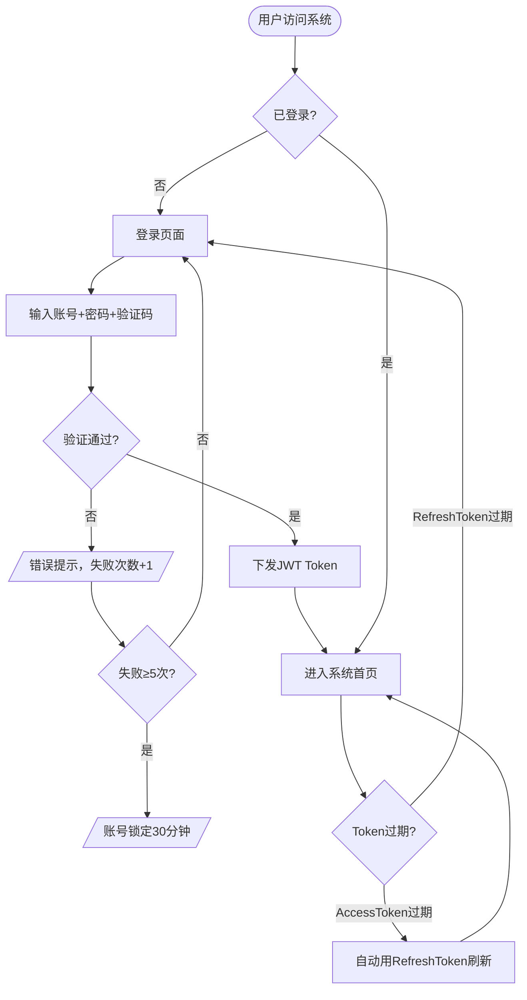
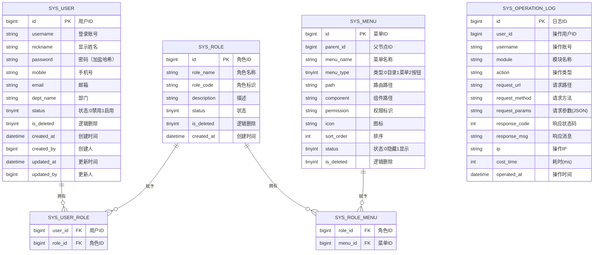

# 多场景影像传感设备资源协同调度系统 · 基础管理模块 PRD

| 属性 | 内容 |
|------|------|
| 文档版本 | V1.0 |
| 创建日期 | 2026-05-26 |
| 作者 | — |
| 评审状态 | 待评审 |
| 所属系统 | 多场景影像传感设备资源协同调度系统 |

## 修订记录

| 版本 | 修改日期 | 修改人 | 修改内容 |
|------|----------|--------|----------|
| V1.0 | 2026-05-26 | — | 初稿 |

---

## 一、背景与目标

### 1.1 背景

基础管理模块是系统安全运行的基础底座，涵盖身份认证、用户账号、角色权限和菜单管理。所有业务功能的访问控制均依赖本模块。

### 1.2 目标

- 提供安全的登录/登出机制，防止暴力破解
- 实现系统管理员对用户账号的全生命周期管理
- 支持 RBAC 权限模型，精细化控制菜单与按钮权限
- 记录所有用户操作日志，满足审计要求

---

## 二、用户角色

| 角色 | 描述 | 核心诉求 |
|------|------|----------|
| 系统管理员 | 负责用户/角色/菜单/权限的全量管理 | 安全、高效地维护访问控制体系 |
| 所有登录用户 | 需通过身份验证后访问系统 | 登录流畅、权限明确 |

---

## 三、功能说明

### 3.1 功能清单

| 功能点 | 优先级 | 说明 | 涉及角色 |
|--------|--------|------|----------|
| 用户登录/登出 | P0 | JWT 鉴权，防暴力破解 | 所有用户 |
| 用户管理（CRUD） | P0 | 账号全生命周期管理 | 系统管理员 |
| 角色管理 | P0 | 角色定义与授权 | 系统管理员 |
| 权限管理（RBAC） | P0 | 菜单级+按钮级权限控制 | 系统管理员 |
| 菜单管理 | P0 | 系统导航树管理 | 系统管理员 |
| 重置密码 | P1 | 管理员重置用户密码 | 系统管理员 |
| 操作日志 | P1 | 全量操作记录，支持审计 | 系统管理员 |

### 3.2 主流程图



### 3.3 功能详细说明

#### 3.3.1 用户登录

**功能描述**：用户通过账号+密码+图形验证码完成身份认证，成功后下发 JWT Token。

**字段说明**：

| 字段 | 类型 | 必填 | 校验规则 | 说明 |
|------|------|------|----------|------|
| username | string | ✓ | 6~20位字母数字 | 登录账号 |
| password | string | ✓ | 8~20位含大小写字母与数字，SHA256哈希后传输 | 登录密码 |
| captchaKey | string | ✓ | UUID格式 | 验证码唯一标识 |
| captchaCode | string | ✓ | 4位字符 | 图形验证码 |

**业务规则**：
- 连续错误 5 次，账号锁定 30 分钟
- 同账号同时仅允许一个有效 Session（后登录踢掉前登录）
- 密码前端 SHA256 哈希后传输，后端再次加盐存储

#### 3.3.2 用户管理

**功能描述**：系统管理员对平台用户账号进行全生命周期管理，包括增删改查及状态控制。

**字段说明**：

| 字段 | 类型 | 必填 | 校验规则 | 说明 |
|------|------|------|----------|------|
| username | string | ✓ | 6~20位字母数字，全局唯一 | 登录账号 |
| nickname | string | ✓ | 最长20字 | 显示姓名 |
| mobile | string | ✓ | 11位国内手机号 | 手机号 |
| email | string | ✗ | 邮箱格式 | 邮箱 |
| deptName | string | ✗ | 最长50字 | 所属部门 |
| password | string | ✓ | 8~20位含大小写字母与数字（新增时填写） | 初始密码 |
| roleIds | array | ✓ | 至少绑定一个角色 | 关联角色ID列表 |
| status | int | ✓ | 0-禁用 1-启用 | 账号状态 |

**操作列表**：
- 用户列表：分页展示，支持按姓名、账号、角色、状态筛选
- 新增用户：填写基本信息并绑定角色
- 编辑用户：修改基本信息及关联角色（密码不可通过编辑修改）
- 禁用/启用：切换账号状态，禁用后立即失效
- 重置密码：重置为系统默认初始密码（`Sursoft@123`），强制下次登录时修改
- 删除用户：逻辑删除，操作日志保留

#### 3.3.3 角色管理

**功能描述**：定义系统角色，为角色分配菜单与按钮权限。

**内置角色**：

| 角色名称 | 标识 | 权限范围 |
|---------|------|---------|
| 超级管理员 | SUPER_ADMIN | 全部权限（不可删除、不可编辑权限） |
| 数据工程师 | DATA_ENG | 数据源、接入、处理任务全权限 |
| 业务分析师 | ANALYST | 数据查询、报表查看、导出 |
| 管理人员 | MANAGER | 看板只读权限 |

**字段说明**：

| 字段 | 类型 | 必填 | 校验规则 | 说明 |
|------|------|------|----------|------|
| roleName | string | ✓ | 最长30字，不可重复 | 角色名称 |
| roleCode | string | ✓ | 大写字母+下划线，全局唯一 | 角色标识 |
| description | string | ✗ | 最长200字 | 描述 |
| status | int | ✓ | 0-禁用 1-启用 | 状态 |

**业务规则**：
- 仅允许删除无绑定用户的角色
- 超级管理员角色不可删除、不可修改权限范围

#### 3.3.4 权限管理（RBAC）

**功能描述**：采用 RBAC 模型，支持菜单级、按钮级两层权限控制。为角色分配权限树，用户通过角色继承权限。

| 权限层级 | 说明 | 示例 |
|---------|------|------|
| 菜单权限 | 控制导航菜单的可见性 | 数据处理管理菜单是否显示 |
| 按钮权限 | 控制操作按钮（新增/编辑/删除/导出）的可见性 | 处理任务的"新增"按钮 |

#### 3.3.5 菜单管理

**功能描述**：维护系统导航树，支持目录、菜单、按钮三类节点。

**字段说明**：

| 字段 | 类型 | 必填 | 说明 |
|------|------|------|------|
| menuName | string | ✓ | 菜单名称 |
| menuType | int | ✓ | 0-目录 1-菜单 2-按钮 |
| parentId | bigint | ✗ | 父节点ID，顶级为0 |
| path | string | ✗ | 菜单路由路径（菜单类型必填） |
| component | string | ✗ | 前端组件路径 |
| permission | string | ✗ | 权限标识，如 `datasource:config:list` |
| icon | string | ✗ | 图标名称 |
| sortOrder | int | ✓ | 排序号，升序排列 |
| status | int | ✓ | 0-隐藏 1-显示 |

**业务规则**：
- 仅允许删除无子节点的叶子菜单
- 按钮类型节点不可有子节点

---

## 四、业务边界

### In Scope（本期做）

- ✅ 账号密码登录 + 图形验证码
- ✅ JWT Token 鉴权（Access Token 2h + Refresh Token 7d）
- ✅ 用户 CRUD + 禁用/启用 + 重置密码
- ✅ 角色 CRUD + 菜单权限/按钮权限分配
- ✅ 菜单树 CRUD
- ✅ 操作日志全量记录

### Out of Scope（本期不做）

- ❌ 单点登录（SSO）：后续需求评估
- ❌ 邮箱/手机号注册：本系统由管理员统一创建账号
- ❌ 用户自助找回密码：由管理员重置

---

## 五、数据模型



---

## 六、接口设计

### 6.1 接口清单

| 接口名称 | 方法 | 路径 | 权限标识 |
|----------|------|------|---------|
| 获取图形验证码 | GET | `/api/auth/captcha` | 公开 |
| 用户登录 | POST | `/api/auth/login` | 公开 |
| 刷新 Token | POST | `/api/auth/refresh` | 公开 |
| 用户登出 | POST | `/api/auth/logout` | 需鉴权 |
| 获取当前用户信息 | GET | `/api/user/profile` | 需鉴权 |
| 修改当前用户密码 | PUT | `/api/user/password` | 需鉴权 |
| 用户列表 | GET | `/api/system/users` | system:user:list |
| 新增用户 | POST | `/api/system/users` | system:user:add |
| 用户详情 | GET | `/api/system/users/{id}` | system:user:list |
| 修改用户 | PUT | `/api/system/users/{id}` | system:user:edit |
| 修改用户状态 | PATCH | `/api/system/users/{id}/status` | system:user:edit |
| 重置用户密码 | POST | `/api/system/users/{id}/reset-password` | system:user:edit |
| 删除用户 | DELETE | `/api/system/users/{id}` | system:user:delete |
| 角色列表 | GET | `/api/system/roles` | system:role:list |
| 新增角色 | POST | `/api/system/roles` | system:role:add |
| 角色详情 | GET | `/api/system/roles/{id}` | system:role:list |
| 修改角色 | PUT | `/api/system/roles/{id}` | system:role:edit |
| 删除角色 | DELETE | `/api/system/roles/{id}` | system:role:delete |
| 角色授权（分配菜单） | PUT | `/api/system/roles/{id}/menus` | system:role:edit |
| 菜单树 | GET | `/api/system/menus/tree` | system:menu:list |
| 新增菜单 | POST | `/api/system/menus` | system:menu:add |
| 修改菜单 | PUT | `/api/system/menus/{id}` | system:menu:edit |
| 删除菜单 | DELETE | `/api/system/menus/{id}` | system:menu:delete |
| 操作日志列表 | GET | `/api/logs/operation` | system:log:list |

### 6.2 核心接口定义

#### 获取图形验证码

```
GET /api/auth/captcha

响应（成功）：
{
  "code": 200,
  "data": {
    "captchaKey": "uuid-xxx",
    "captchaBase64": "data:image/png;base64,..."
  }
}
```

#### 用户登录

```
POST /api/auth/login
Content-Type: application/json

请求体：
{
  "username": "admin",
  "password": "sha256_hashed_password",
  "captchaKey": "uuid-xxx",
  "captchaCode": "AB3K"
}

响应（成功）：
{
  "code": 200,
  "data": {
    "accessToken": "eyJhbGci...",
    "refreshToken": "eyJhbGci...",
    "expiresIn": 7200,
    "userInfo": {
      "userId": 1001,
      "username": "admin",
      "nickname": "管理员",
      "roles": ["SUPER_ADMIN"],
      "permissions": ["system:user:list", "system:user:add", "..."]
    }
  }
}

响应（失败）：
{ "code": 401, "message": "账号或密码错误，还有 2 次机会" }
{ "code": 400, "message": "验证码错误或已过期" }
{ "code": 423, "message": "账号已锁定，请 30 分钟后再试" }
```

#### 用户列表（分页）

```
GET /api/system/users?page=1&pageSize=10&keyword=&roleId=&status=
Authorization: Bearer {accessToken}

Query 参数：
- page       当前页码，默认 1
- pageSize   每页数量，默认 10，最大 100
- keyword    模糊搜索（匹配姓名、账号）
- roleId     角色ID筛选
- status     状态筛选：0-禁用 1-启用

响应：
{
  "code": 200,
  "data": {
    "total": 50,
    "page": 1,
    "pageSize": 10,
    "records": [
      {
        "id": 1001,
        "username": "zhangsan",
        "nickname": "张三",
        "mobile": "13800138000",
        "deptName": "数据团队",
        "roles": [{"roleId": 2, "roleName": "数据工程师"}],
        "status": 1,
        "createdAt": "2026-01-01 10:00:00"
      }
    ]
  }
}
```

#### 新增用户

```
POST /api/system/users
Authorization: Bearer {accessToken}
Content-Type: application/json

{
  "username": "zhangsan",
  "nickname": "张三",
  "password": "sha256_hashed_password",
  "mobile": "13800138000",
  "email": "zhangsan@example.com",
  "deptName": "数据团队",
  "roleIds": [2],
  "status": 1
}

响应：{ "code": 200, "message": "创建成功", "data": { "id": 1002 } }
错误：{ "code": 409, "message": "登录账号已存在" }
```

#### 角色授权（分配菜单）

```
PUT /api/system/roles/{id}/menus
Authorization: Bearer {accessToken}
Content-Type: application/json

{ "menuIds": [1, 2, 3, 10, 11, 12] }

响应：{ "code": 200, "message": "授权成功" }
```

#### 菜单树

```
GET /api/system/menus/tree
Authorization: Bearer {accessToken}

响应：
{
  "code": 200,
  "data": [
    {
      "id": 1,
      "menuName": "系统管理",
      "menuType": 0,
      "icon": "setting",
      "sortOrder": 1,
      "children": [
        {
          "id": 10,
          "menuName": "用户管理",
          "menuType": 1,
          "path": "/system/users",
          "sortOrder": 1,
          "children": [
            { "id": 100, "menuName": "新增", "menuType": 2, "permission": "system:user:add" },
            { "id": 101, "menuName": "编辑", "menuType": 2, "permission": "system:user:edit" },
            { "id": 102, "menuName": "删除", "menuType": 2, "permission": "system:user:delete" }
          ]
        }
      ]
    }
  ]
}
```

#### 操作日志列表

```
GET /api/logs/operation?page=1&pageSize=20&username=&module=&startTime=&endTime=
Authorization: Bearer {accessToken}

响应：
{
  "code": 200,
  "data": {
    "total": 1000,
    "page": 1,
    "pageSize": 20,
    "records": [
      {
        "id": 1,
        "username": "admin",
        "module": "用户管理",
        "action": "新增用户",
        "requestUrl": "POST /api/system/users",
        "ip": "192.168.1.100",
        "responseCode": 200,
        "costTime": 120,
        "operatedAt": "2026-05-26 10:00:00"
      }
    ]
  }
}
```

---

## 七、异常流程

| 异常场景 | 触发条件 | 处理方式 | 用户提示 |
|----------|----------|----------|----------|
| 密码错误 | 输入密码与存储不匹配 | 记录失败次数，返回401 | "账号或密码错误，还有 N 次机会" |
| 账号锁定 | 失败次数 ≥ 5 | 锁定30分钟，返回423 | "账号已锁定，请30分钟后再试" |
| 验证码错误 | 验证码不匹配或已过期 | 返回400，刷新验证码 | "验证码错误或已过期，请刷新后重试" |
| Token过期 | accessToken超过2小时 | 前端自动用refreshToken刷新 | 无感知，自动刷新 |
| 无权限访问 | 用户访问无权限的资源 | 返回403 | "暂无权限，请联系管理员" |
| 删除有绑定用户的角色 | 角色下有关联用户 | 返回422拒绝删除 | "该角色下存在用户，无法删除" |
| 删除有子节点的菜单 | 菜单有子菜单/按钮 | 返回422拒绝删除 | "请先删除子节点后再删除此菜单" |

---

## 八、权限设计

| 操作 | 权限标识 | 可见角色 |
|------|---------|---------|
| 查看用户列表 | system:user:list | SUPER_ADMIN |
| 新增用户 | system:user:add | SUPER_ADMIN |
| 编辑用户 | system:user:edit | SUPER_ADMIN |
| 删除用户 | system:user:delete | SUPER_ADMIN |
| 查看角色列表 | system:role:list | SUPER_ADMIN |
| 新增角色 | system:role:add | SUPER_ADMIN |
| 编辑/授权角色 | system:role:edit | SUPER_ADMIN |
| 删除角色 | system:role:delete | SUPER_ADMIN |
| 查看菜单树 | system:menu:list | SUPER_ADMIN |
| 新增/编辑/删除菜单 | system:menu:add/edit/delete | SUPER_ADMIN |
| 查看操作日志 | system:log:list | SUPER_ADMIN |

---

## 九、验收标准

**AC-001 正常登录**
- Given：用户已注册，账号状态为启用，在登录页面
- When：输入正确账号、密码，填写正确验证码，点击登录
- Then：页面跳转至系统首页，导航栏显示用户昵称
  - And：后端生成一条状态为成功的登录日志

**AC-002 密码错误**
- Given：用户在登录页面，已累计失败 4 次
- When：再次输入错误密码，点击登录
- Then：提示"账号或密码错误，还有 1 次机会"，并刷新验证码

**AC-003 账号锁定**
- Given：用户连续登录失败 5 次
- When：再次尝试登录（密码正确或错误）
- Then：提示"账号已锁定，请30分钟后再试"，按钮置灰

**AC-004 新增用户**
- Given：管理员在用户管理页面，点击"新增"
- When：填写完整且合法的信息，点击"确认"
- Then：用户列表新增一条记录，状态为启用

**AC-005 账号重复**
- Given：管理员新增用户时
- When：输入的登录账号与已有账号重复
- Then：提示"登录账号已存在"，表单不提交

**AC-006 删除有绑定用户的角色**
- Given：某角色下有 3 个绑定用户
- When：管理员点击该角色的"删除"按钮
- Then：弹出提示"该角色下存在用户，无法删除"，操作被拒绝

**AC-007 操作日志记录**
- Given：用户执行了任意写操作（新增/编辑/删除）
- When：操作成功或失败
- Then：操作日志中自动生成对应记录，包含操作人、时间、IP、操作内容
