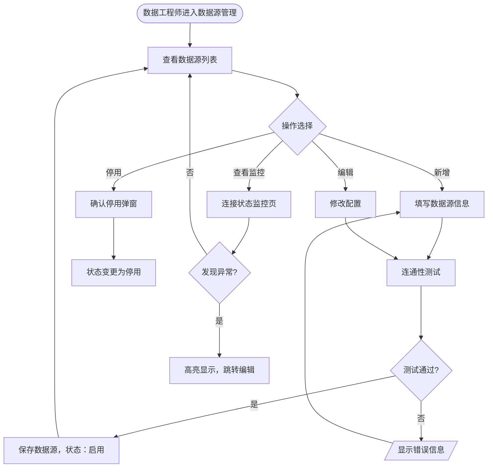
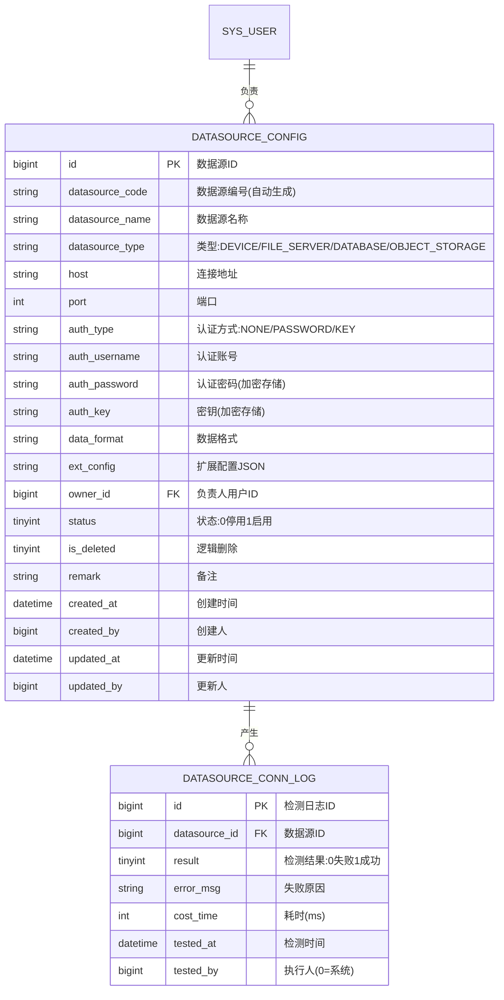

# 多场景影像传感设备资源协同调度系统 · 数据源管理模块 PRD

| 属性 | 内容 |
|------|------|
| 文档版本 | V1.0 |
| 创建日期 | 2026-05-26 |
| 作者 | — |
| 评审状态 | 待评审 |
| 所属系统 | 多场景影像传感设备资源协同调度系统 |

## 修订记录

| 版本 | 修改日期 | 修改人 | 修改内容 |
|------|----------|--------|----------|
| V1.0 | 2026-05-26 | — | 初稿 |

---

## 一、背景与目标

### 1.1 背景

工业现场存在多种类型的影像传感设备（摄像头、工业相机）及存储系统（文件服务器、对象存储、数据库），数据接入前必须先完成数据源的统一配置与管理。

**核心痛点**：
- 各设备连接参数分散管理，缺少统一视图
- 无法实时掌握数据源的连通状态，异常发现滞后

### 1.2 目标

- 提供数据源的统一配置管理入口，支持4种接入类型
- 实时展示各数据源的连接状态，异常高亮提醒
- 提供连通性测试功能，验证配置有效性

---

## 二、用户角色

| 角色 | 描述 | 核心诉求 |
|------|------|----------|
| 数据工程师 | 负责数据源配置与维护 | 快速配置、准确验证连通性 |
| 系统管理员 | 可查看数据源配置 | 了解系统接入全貌 |

---

## 三、功能说明

### 3.1 功能清单

| 功能点 | 优先级 | 说明 | 涉及角色 |
|--------|--------|------|----------|
| 数据源列表 | P0 | 分页展示，支持多条件筛选 | 数据工程师 |
| 新增数据源 | P0 | 支持4种类型，配置连接参数 | 数据工程师 |
| 编辑数据源 | P0 | 修改配置信息 | 数据工程师 |
| 停用/启用数据源 | P0 | 控制数据源可用状态 | 数据工程师 |
| 连通性测试 | P0 | 即时验证连接是否成功 | 数据工程师 |
| 连接状态监控 | P1 | 实时展示所有数据源连接状态 | 数据工程师、系统管理员 |

### 3.2 主流程图



### 3.3 功能详细说明

#### 3.3.1 数据源配置

**功能描述**：配置影像传感设备或存储系统作为数据来源，支持设备直连、文件服务器、数据库、对象存储四种类型。

**字段说明**：

| 字段 | 类型 | 必填 | 校验规则 | 说明 |
|------|------|------|----------|------|
| datasourceName | string | ✓ | 最长100字，系统唯一 | 数据源名称 |
| datasourceType | string | ✓ | 枚举值 | 类型：DEVICE/FILE_SERVER/DATABASE/OBJECT_STORAGE |
| host | string | ✓ | IP地址或域名格式 | 连接地址 |
| port | int | ✓ | 1~65535 | 连接端口 |
| authType | string | ✓ | 枚举值 | 认证方式：NONE/PASSWORD/KEY |
| authUsername | string | 条件必填 | authType=PASSWORD时必填 | 认证账号 |
| authPassword | string | 条件必填 | authType=PASSWORD时必填，加密存储 | 认证密码 |
| authKey | string | 条件必填 | authType=KEY时必填，加密存储 | 密钥内容 |
| dataFormat | string | ✓ | 枚举值 | 数据格式：JPEG/PNG/RAW/MP4/OTHER |
| ownerId | bigint | ✓ | 关联系统用户 | 负责人 |
| status | int | ✓ | 0-停用 1-启用 | 状态 |
| remark | string | ✗ | 最长500字 | 备注 |

**各类型特定参数**：

| 数据源类型 | 额外参数 | 说明 |
|-----------|---------|------|
| DEVICE（设备直连） | protocol（RTSP/HTTP/FTP） | 设备接入协议 |
| FILE_SERVER（文件服务器） | basePath（基础目录路径） | 文件服务器根目录 |
| DATABASE | databaseName、driverType（MySQL/PostgreSQL） | 数据库名称和驱动 |
| OBJECT_STORAGE | bucket、region、accessKeyId | 对象存储桶信息 |

**业务规则**：
- 认证密码/密钥在前端传输时使用 AES 加密，后端解密后二次加密存储，列表/详情接口脱敏返回（`****`）
- 数据源停用后，关联的接入任务自动暂停，恢复启用后需手动重新开启任务

#### 3.3.2 连接状态监控

**功能描述**：实时展示所有数据源的连接状态，支持快速定位异常数据源。

| 指标 | 说明 |
|------|------|
| 连接状态 | NORMAL（正常）/ ABNORMAL（异常）/ UNKNOWN（未知） |
| 最近测试时间 | 最近一次连通性测试的执行时间 |
| 最近测试结果 | 成功/失败及错误原因 |
| 异常持续时长 | 连续异常的持续时间 |

---

## 四、业务边界

### In Scope（本期做）

- ✅ 数据源 CRUD
- ✅ 四种数据源类型支持
- ✅ 连通性测试（手动触发）
- ✅ 连接状态监控视图
- ✅ 密码/密钥加密存储与脱敏展示

### Out of Scope（本期不做）

- ❌ 数据源连接状态自动探活（定时心跳检测）：P2，后续迭代
- ❌ 数据源异常时自动告警（邮件/短信）：后续结合通知模块实现

---

## 五、数据模型



---

## 六、接口设计

### 6.1 接口清单

| 接口名称 | 方法 | 路径 | 权限标识 |
|----------|------|------|---------|
| 数据源列表 | GET | `/api/datasource` | datasource:config:list |
| 新增数据源 | POST | `/api/datasource` | datasource:config:add |
| 数据源详情 | GET | `/api/datasource/{id}` | datasource:config:list |
| 修改数据源 | PUT | `/api/datasource/{id}` | datasource:config:edit |
| 修改数据源状态 | PATCH | `/api/datasource/{id}/status` | datasource:config:edit |
| 删除数据源 | DELETE | `/api/datasource/{id}` | datasource:config:delete |
| 连通性测试 | POST | `/api/datasource/{id}/test` | datasource:config:edit |
| 连接状态监控列表 | GET | `/api/datasource/monitor` | datasource:config:list |

### 6.2 核心接口定义

#### 数据源列表（分页）

```
GET /api/datasource?page=1&pageSize=10&keyword=&datasourceType=&status=
Authorization: Bearer {accessToken}

响应：
{
  "code": 200,
  "data": {
    "total": 12,
    "page": 1,
    "pageSize": 10,
    "records": [
      {
        "id": 1,
        "datasourceCode": "DS-20260101-001",
        "datasourceName": "产线1号相机",
        "datasourceType": "DEVICE",
        "host": "192.168.10.101",
        "port": 554,
        "dataFormat": "JPEG",
        "ownerName": "王工",
        "status": 1,
        "connStatus": "NORMAL",
        "lastTestTime": "2026-05-26 09:00:00",
        "createdAt": "2026-01-15 10:00:00"
      }
    ]
  }
}
```

#### 新增数据源

```
POST /api/datasource
Authorization: Bearer {accessToken}
Content-Type: application/json

{
  "datasourceName": "产线1号相机",
  "datasourceType": "DEVICE",
  "host": "192.168.10.101",
  "port": 554,
  "authType": "PASSWORD",
  "authUsername": "admin",
  "authPassword": "aes_encrypted_password",
  "dataFormat": "JPEG",
  "ownerId": 1001,
  "status": 1,
  "extConfig": { "protocol": "RTSP" },
  "remark": "产线1号区域监控相机"
}

响应：{ "code": 200, "message": "创建成功", "data": { "id": 1 } }
错误：{ "code": 409, "message": "数据源名称已存在" }
```

#### 连通性测试

```
POST /api/datasource/{id}/test
Authorization: Bearer {accessToken}

响应（成功）：
{
  "code": 200,
  "data": {
    "result": "SUCCESS",
    "costTime": 230,
    "testedAt": "2026-05-26 10:00:00"
  }
}

响应（失败）：
{
  "code": 200,
  "data": {
    "result": "FAILED",
    "errorMsg": "连接超时：目标主机 192.168.10.101:554 无响应",
    "costTime": 5000,
    "testedAt": "2026-05-26 10:00:00"
  }
}
```

#### 连接状态监控列表

```
GET /api/datasource/monitor?status=ABNORMAL
Authorization: Bearer {accessToken}

响应：
{
  "code": 200,
  "data": {
    "total": 2,
    "records": [
      {
        "id": 3,
        "datasourceName": "备用文件服务器",
        "host": "192.168.10.50",
        "connStatus": "ABNORMAL",
        "lastTestTime": "2026-05-26 08:30:00",
        "lastErrorMsg": "认证失败：密码错误",
        "abnormalDuration": "1小时30分钟"
      }
    ]
  }
}
```

---

## 七、异常流程

| 异常场景 | 触发条件 | 处理方式 | 用户提示 |
|----------|----------|----------|----------|
| 连通性测试超时 | 连接目标主机超过5秒无响应 | 返回测试失败结果 | "连接超时：目标主机无响应，请检查地址和端口" |
| 认证失败 | 账号或密码/密钥错误 | 返回测试失败结果 | "认证失败：账号或密码错误" |
| 数据源名称重复 | 提交时名称与已有数据源相同 | 返回409拒绝 | "数据源名称已存在，请修改后重试" |
| 停用有运行任务的数据源 | 关联接入任务正在执行 | 返回422，弹出确认框 | "该数据源存在正在执行的接入任务，停用将暂停这些任务，确认继续？" |
| 删除有关联任务的数据源 | 关联了接入任务 | 返回422拒绝 | "该数据源已关联接入任务，请先删除关联任务后再删除数据源" |

---

## 八、权限设计

| 操作 | 权限标识 | 可见角色 |
|------|---------|---------|
| 查看数据源列表/详情 | datasource:config:list | DATA_ENG, SUPER_ADMIN |
| 新增数据源 | datasource:config:add | DATA_ENG, SUPER_ADMIN |
| 编辑数据源/测试连通性 | datasource:config:edit | DATA_ENG, SUPER_ADMIN |
| 删除数据源 | datasource:config:delete | SUPER_ADMIN |

---

## 九、验收标准

**AC-001 新增数据源成功**
- Given：数据工程师在数据源管理页面
- When：填写完整且合法的数据源信息，点击"保存"
- Then：数据源列表新增一条记录，数据源编号自动生成（格式：DS-YYYYMMDD-XXX）

**AC-002 连通性测试成功**
- Given：数据源配置信息正确，目标设备在线
- When：点击"连通性测试"按钮
- Then：显示"连接成功，耗时 Xms"，连接状态更新为 NORMAL

**AC-003 连通性测试失败**
- Given：数据源 IP 地址填写错误
- When：点击"连通性测试"按钮
- Then：显示具体错误原因（如"连接超时"），连接状态更新为 ABNORMAL

**AC-004 密码脱敏**
- Given：数据源配置了账号密码认证
- When：通过列表或详情接口获取数据源信息
- Then：密码字段返回 `****`，不显示明文

**AC-005 停用数据源**
- Given：数据源当前状态为启用，无正在执行的关联任务
- When：点击"停用"按钮并确认
- Then：数据源状态变更为停用，对应接入任务状态同步暂停

**AC-006 异常数据源高亮**
- Given：连接状态监控页面
- When：某数据源连通性测试失败
- Then：该数据源在监控列表中以红色高亮显示，并展示失败原因
