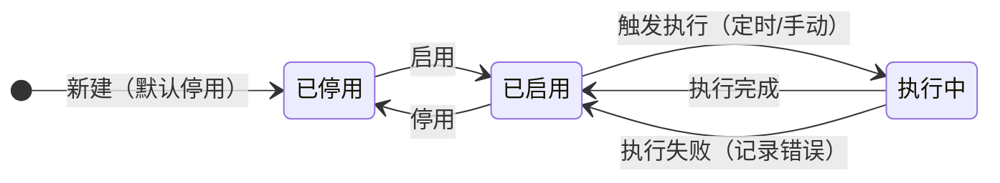
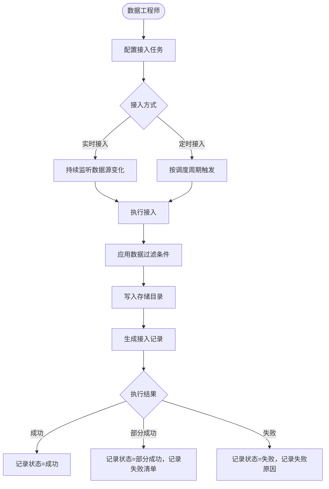
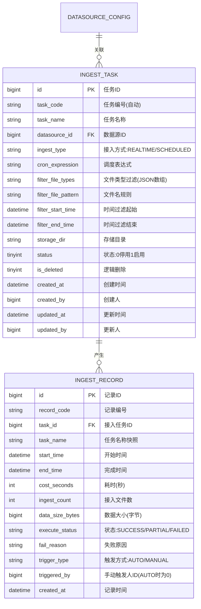

# 多场景影像传感设备资源协同调度系统 · 数据接入管理模块 PRD

| 属性 | 内容 |
|------|------|
| 文档版本 | V1.0 |
| 创建日期 | 2026-05-26 |
| 作者 | — |
| 评审状态 | 待评审 |
| 所属系统 | 多场景影像传感设备资源协同调度系统 |

## 修订记录

| 版本 | 修改日期 | 修改人 | 修改内容 |
|------|----------|--------|----------|
| V1.0 | 2026-05-26 | — | 初稿 |

---

## 一、背景与目标

### 1.1 背景

影像传感设备持续产生数据，需要通过接入任务将数据从数据源拉取到系统存储中。支持实时接入和定时接入两种模式以适应不同场景。

**核心痛点**：
- 无法灵活配置接入策略（时间范围、文件类型过滤）
- 接入执行情况不可见，异常发现不及时

### 1.2 目标

- 支持实时与定时两种接入模式的任务配置
- 提供接入记录查询，准确统计每次接入的数量与大小
- 支持手动触发接入任务，满足临时性数据同步需求

---

## 二、用户角色

| 角色 | 描述 | 核心诉求 |
|------|------|----------|
| 数据工程师 | 配置和管理接入任务 | 灵活配置接入策略，监控执行情况 |
| 业务分析师 | 查看接入记录 | 了解数据来源数量和时间 |

---

## 三、功能说明

### 3.1 功能清单

| 功能点 | 优先级 | 说明 | 涉及角色 |
|--------|--------|------|----------|
| 接入任务列表 | P0 | 分页展示接入任务 | 数据工程师 |
| 新增接入任务 | P0 | 配置接入策略 | 数据工程师 |
| 编辑接入任务 | P0 | 修改任务配置 | 数据工程师 |
| 启用/停用任务 | P0 | 控制任务运行状态 | 数据工程师 |
| 手动触发执行 | P0 | 立即执行一次接入 | 数据工程师 |
| 接入记录查询 | P0 | 查看执行历史与结果 | 数据工程师、业务分析师 |
| 接入记录导出 | P1 | 导出 Excel | 业务分析师 |

### 3.2 接入任务状态机



### 3.3 接入记录执行状态

| 状态值 | 标签 | 说明 |
|--------|------|------|
| SUCCESS | 成功 | 所有文件均接入成功 |
| PARTIAL | 部分成功 | 部分文件接入成功，部分失败 |
| FAILED | 失败 | 接入过程中发生错误，无文件成功接入 |

### 3.4 主流程图



### 3.5 功能详细说明

#### 3.5.1 接入任务配置

**功能描述**：定义从指定数据源抓取数据的接入策略，支持实时和定时两种触发方式。

**字段说明**：

| 字段 | 类型 | 必填 | 校验规则 | 说明 |
|------|------|------|----------|------|
| taskName | string | ✓ | 最长100字，系统唯一 | 任务名称 |
| datasourceId | bigint | ✓ | 关联已启用的数据源 | 数据源 |
| ingestType | string | ✓ | REALTIME/SCHEDULED | 接入方式 |
| cronExpression | string | 条件必填 | ingestType=SCHEDULED时必填，Cron表达式格式 | 调度周期 |
| filterStartTime | datetime | ✗ | 早于filterEndTime | 数据过滤-时间范围起始 |
| filterEndTime | datetime | ✗ | 晚于filterStartTime | 数据过滤-时间范围结束 |
| filterFileTypes | array | ✗ | JPEG/PNG/RAW/MP4/OTHER 多选 | 数据过滤-文件类型 |
| filterFilePattern | string | ✗ | 正则表达式或通配符 | 数据过滤-文件名规则 |
| storageDir | string | ✓ | 以/开头的绝对路径 | 写入目标目录 |
| status | int | ✓ | 0-停用 1-启用 | 状态 |

**调度周期预设选项**（定时接入时）：

| 选项 | Cron表达式 | 说明 |
|------|-----------|------|
| 每小时 | `0 0 * * * ?` | 每小时整点执行 |
| 每天 00:00 | `0 0 0 * * ?` | 每天零点执行 |
| 每天 08:00 | `0 0 8 * * ?` | 每天8点执行 |
| 自定义 | 用户填写 | 支持自定义Cron表达式 |

#### 3.5.2 接入记录查询

**功能描述**：查询每次接入任务的执行情况，支持多维度筛选和 Excel 导出。

**字段说明**：

| 字段 | 类型 | 说明 |
|------|------|------|
| recordId | string | 记录编号（自动生成） |
| taskName | string | 关联接入任务名称 |
| startTime | datetime | 执行开始时间 |
| endTime | datetime | 执行完成时间 |
| costSeconds | int | 耗时（秒） |
| ingestCount | int | 本次接入文件数 |
| dataSize | string | 本次接入数据总大小（如 1.2 GB） |
| executeStatus | string | 执行状态：SUCCESS/PARTIAL/FAILED |
| failReason | string | 失败原因（异常时展示） |

---

## 四、业务边界

### In Scope（本期做）

- ✅ 接入任务 CRUD + 启用/停用 + 手动触发
- ✅ 实时接入与定时接入两种模式
- ✅ 基于时间范围、文件类型、文件名规则的数据过滤
- ✅ 接入记录查询（含分页、筛选、导出）

### Out of Scope（本期不做）

- ❌ 接入失败自动重试策略：下期迭代
- ❌ 接入任务依赖编排（A 完成后触发 B）：下期迭代

---

## 五、数据模型



---

## 六、接口设计

### 6.1 接口清单

| 接口名称 | 方法 | 路径 | 权限标识 |
|----------|------|------|---------|
| 接入任务列表 | GET | `/api/ingest/tasks` | ingest:task:list |
| 新增接入任务 | POST | `/api/ingest/tasks` | ingest:task:add |
| 接入任务详情 | GET | `/api/ingest/tasks/{id}` | ingest:task:list |
| 修改接入任务 | PUT | `/api/ingest/tasks/{id}` | ingest:task:edit |
| 修改任务状态 | PATCH | `/api/ingest/tasks/{id}/status` | ingest:task:edit |
| 手动触发接入 | POST | `/api/ingest/tasks/{id}/trigger` | ingest:task:edit |
| 删除接入任务 | DELETE | `/api/ingest/tasks/{id}` | ingest:task:delete |
| 接入记录列表 | GET | `/api/ingest/records` | ingest:record:list |
| 接入记录详情 | GET | `/api/ingest/records/{id}` | ingest:record:list |
| 导出接入记录 | GET | `/api/ingest/records/export` | ingest:record:export |

### 6.2 核心接口定义

#### 接入任务列表

```
GET /api/ingest/tasks?page=1&pageSize=10&keyword=&datasourceId=&ingestType=&status=
Authorization: Bearer {accessToken}

响应：
{
  "code": 200,
  "data": {
    "total": 8,
    "page": 1,
    "pageSize": 10,
    "records": [
      {
        "id": 1,
        "taskCode": "IT-20260101-001",
        "taskName": "产线1号相机-每日接入",
        "datasourceName": "产线1号相机",
        "ingestType": "SCHEDULED",
        "cronExpression": "0 0 2 * * ?",
        "storageDir": "/data/ingest/line1",
        "status": 1,
        "lastExecuteTime": "2026-05-26 02:00:00",
        "lastExecuteStatus": "SUCCESS",
        "createdAt": "2026-01-15 10:00:00"
      }
    ]
  }
}
```

#### 新增接入任务

```
POST /api/ingest/tasks
Authorization: Bearer {accessToken}
Content-Type: application/json

{
  "taskName": "产线1号相机-每日接入",
  "datasourceId": 1,
  "ingestType": "SCHEDULED",
  "cronExpression": "0 0 2 * * ?",
  "filterFileTypes": ["JPEG", "PNG"],
  "filterFilePattern": "^img_.*",
  "storageDir": "/data/ingest/line1",
  "status": 0
}

响应：{ "code": 200, "message": "创建成功", "data": { "id": 1 } }
错误：{ "code": 409, "message": "任务名称已存在" }
错误：{ "code": 422, "message": "数据源已停用，无法创建接入任务" }
```

#### 手动触发接入

```
POST /api/ingest/tasks/{id}/trigger
Authorization: Bearer {accessToken}

响应（成功触发）：
{
  "code": 200,
  "message": "任务已触发，请在接入记录中查看执行结果",
  "data": { "recordId": 100 }
}

错误：{ "code": 422, "message": "任务当前已在执行中，请勿重复触发" }
错误：{ "code": 422, "message": "任务已停用，请先启用后再触发" }
```

#### 接入记录列表

```
GET /api/ingest/records?page=1&pageSize=10&taskId=&executeStatus=&startTime=&endTime=
Authorization: Bearer {accessToken}

响应：
{
  "code": 200,
  "data": {
    "total": 200,
    "page": 1,
    "pageSize": 10,
    "records": [
      {
        "id": 100,
        "recordCode": "IR-20260526-001",
        "taskName": "产线1号相机-每日接入",
        "startTime": "2026-05-26 02:00:00",
        "endTime": "2026-05-26 02:03:20",
        "costSeconds": 200,
        "ingestCount": 1520,
        "dataSizeDisplay": "3.2 GB",
        "executeStatus": "SUCCESS",
        "triggerType": "AUTO"
      }
    ]
  }
}
```

---

## 七、异常流程

| 异常场景 | 触发条件 | 处理方式 | 用户提示 |
|----------|----------|----------|----------|
| 任务执行中重复触发 | 手动触发时任务正在执行 | 返回422拒绝 | "任务当前正在执行，请稍后再试" |
| 数据源不可用 | 执行时数据源连接失败 | 记录执行状态为FAILED | 执行记录中显示"数据源连接失败：XXX" |
| 存储目录不存在 | 目标目录未创建 | 尝试自动创建，失败则记录错误 | "存储目录创建失败，请检查存储空间权限" |
| 存储空间不足 | 存储使用率超过95% | 停止执行，记录失败 | "存储空间不足，接入任务已暂停" |
| Cron表达式格式错误 | 填写自定义Cron时格式非法 | 前端实时校验，返回400 | "Cron表达式格式错误，示例：0 0 2 * * ?" |

---

## 八、权限设计

| 操作 | 权限标识 | 可见角色 |
|------|---------|---------|
| 查看接入任务列表 | ingest:task:list | DATA_ENG, SUPER_ADMIN |
| 新增接入任务 | ingest:task:add | DATA_ENG, SUPER_ADMIN |
| 编辑/启停/触发任务 | ingest:task:edit | DATA_ENG, SUPER_ADMIN |
| 删除接入任务 | ingest:task:delete | SUPER_ADMIN |
| 查看接入记录 | ingest:record:list | DATA_ENG, ANALYST, SUPER_ADMIN |
| 导出接入记录 | ingest:record:export | DATA_ENG, ANALYST, SUPER_ADMIN |

---

## 九、验收标准

**AC-001 新增定时接入任务**
- Given：数据工程师在接入任务页面，有可用的已启用数据源
- When：填写任务名称，选择定时接入，配置Cron表达式和存储目录，点击保存
- Then：任务列表新增一条记录，状态默认为停用，任务编号自动生成

**AC-002 手动触发接入**
- Given：某接入任务当前状态为启用，且未在执行中
- When：点击"手动触发"按钮
- Then：提示"任务已触发"，接入记录列表中出现一条新的执行中记录

**AC-003 重复触发拦截**
- Given：某接入任务正在执行中
- When：再次点击"手动触发"
- Then：提示"任务当前正在执行，请稍后再试"，不产生新的执行记录

**AC-004 接入记录查询**
- Given：已有多条接入执行记录
- When：按任务名称、执行状态、时间范围筛选
- Then：列表正确过滤，展示匹配的记录，分页正常

**AC-005 接入记录导出**
- Given：业务分析师在接入记录页面
- When：设置筛选条件后点击"导出"
- Then：下载包含筛选结果的 Excel 文件，字段与页面列表一致

**AC-006 存储目录自动创建**
- Given：接入任务配置的存储目录不存在
- When：任务触发执行时
- Then：系统自动创建目录并成功接入数据，或创建失败时记录明确错误原因
