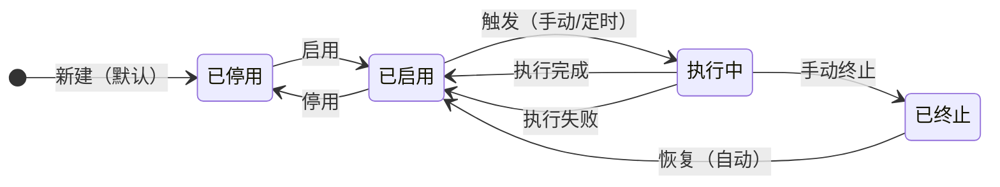
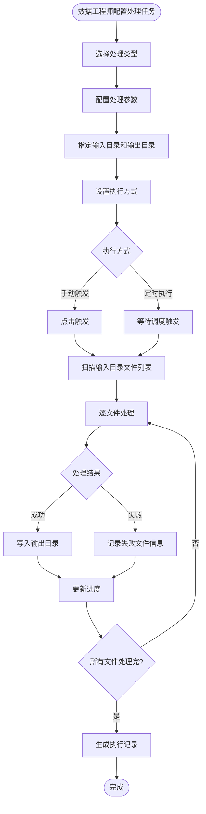
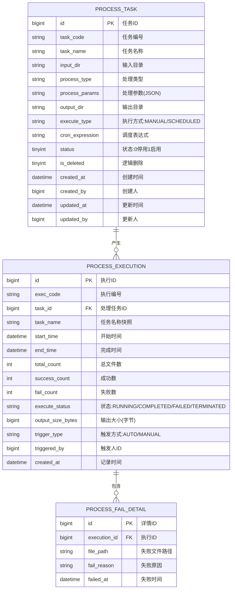

# 多场景影像传感设备资源协同调度系统 · 数据处理管理模块 PRD

| 属性 | 内容 |
|------|------|
| 文档版本 | V1.0 |
| 创建日期 | 2026-05-26 |
| 作者 | — |
| 评审状态 | 待评审 |
| 所属系统 | 多场景影像传感设备资源协同调度系统 |

## 修订记录

| 版本 | 修改日期 | 修改人 | 修改内容 |
|------|----------|--------|----------|
| V1.0 | 2026-05-26 | — | 初稿 |

---

## 一、背景与目标

### 1.1 背景

原始影像数据接入后，往往需要进行压缩、格式转换、分辨率调整等标准化加工处理，方便后续存储和使用。当前缺乏统一的处理任务配置和监控能力。

**核心痛点**：
- 批量处理脚本维护困难，参数调整需要改代码
- 处理任务执行进度不可见，出错后无法快速定位失败文件

### 1.2 目标

- 提供可视化的处理任务配置界面，支持5种处理类型
- 实时监控任务执行进度（百分比 + 文件数）
- 提供处理结果查询，含失败文件清单

---

## 二、用户角色

| 角色 | 描述 | 核心诉求 |
|------|------|----------|
| 数据工程师 | 配置和管理处理任务 | 灵活配置处理参数，监控执行进度 |
| 业务分析师 | 查看处理结果 | 了解处理成功率和产出数据 |

---

## 三、功能说明

### 3.1 功能清单

| 功能点 | 优先级 | 说明 | 涉及角色 |
|--------|--------|------|----------|
| 处理任务列表 | P0 | 分页展示处理任务 | 数据工程师 |
| 新增处理任务 | P0 | 配置处理类型与参数 | 数据工程师 |
| 编辑处理任务 | P0 | 修改任务配置（非执行中状态） | 数据工程师 |
| 启用/停用任务 | P0 | 控制任务可执行状态 | 数据工程师 |
| 手动触发执行 | P0 | 立即执行一次处理 | 数据工程师 |
| 任务执行监控 | P0 | 实时查看执行进度 | 数据工程师 |
| 手动终止任务 | P0 | 强制停止正在执行的任务 | 数据工程师 |
| 处理结果查看 | P0 | 查询执行历史与结果 | 数据工程师、业务分析师 |
| 结果导出 | P1 | 导出执行结果 Excel | 业务分析师 |

### 3.2 处理类型说明

| 处理类型 | 标识 | 参数 | 说明 |
|---------|------|------|------|
| 图像压缩 | IMAGE_COMPRESS | quality（0~100，整数） | 对图像文件进行有损压缩 |
| 格式转换 | FORMAT_CONVERT | targetFormat（JPEG/PNG/BMP） | 转换图像格式 |
| 分辨率调整 | RESOLUTION_RESIZE | targetWidth（像素）、targetHeight（像素） | 调整图像分辨率 |
| 批量重命名 | BATCH_RENAME | pattern（模板：{date}_{seq}等） | 按规则批量重命名文件 |
| 质量过滤 | QUALITY_FILTER | minFileSizeKB（最小文件大小，KB） | 过滤小于阈值的无效图像 |

### 3.3 处理任务状态机



### 3.4 执行记录状态

| 状态值 | 标签 | 说明 |
|--------|------|------|
| RUNNING | 执行中 | 任务正在处理文件 |
| COMPLETED | 已完成 | 所有文件处理完毕（含部分失败） |
| FAILED | 失败 | 执行过程中发生系统错误 |
| TERMINATED | 已终止 | 用户手动终止 |

### 3.5 主流程图



### 3.6 功能详细说明

#### 3.6.1 处理任务配置

**字段说明**：

| 字段 | 类型 | 必填 | 校验规则 | 说明 |
|------|------|------|----------|------|
| taskName | string | ✓ | 最长100字，系统唯一 | 任务名称 |
| inputDir | string | ✓ | 以/开头的绝对路径 | 输入数据目录 |
| processType | string | ✓ | 枚举值 | 处理类型 |
| processParams | object | ✓ | 根据处理类型动态校验 | 处理参数（JSON） |
| outputDir | string | ✓ | 以/开头的绝对路径，不可与输入目录相同 | 输出目录 |
| executeType | string | ✓ | MANUAL/SCHEDULED | 执行方式 |
| cronExpression | string | 条件必填 | executeType=SCHEDULED时必填 | 调度表达式 |
| status | int | ✓ | 0-停用 1-启用 | 状态 |

**处理参数校验规则**：

| 处理类型 | 参数名 | 类型 | 范围 |
|---------|-------|------|------|
| IMAGE_COMPRESS | quality | int | 1~100 |
| FORMAT_CONVERT | targetFormat | string | JPEG/PNG/BMP |
| RESOLUTION_RESIZE | targetWidth | int | 1~65535 |
| RESOLUTION_RESIZE | targetHeight | int | 1~65535 |
| BATCH_RENAME | pattern | string | 含{date}或{seq}的模板字符串 |
| QUALITY_FILTER | minFileSizeKB | int | 1~102400 |

#### 3.6.2 任务执行监控

**功能描述**：实时展示当前正在执行的处理任务进度，支持手动终止。

| 指标 | 说明 |
|------|------|
| 任务名称 | 正在执行的任务 |
| 执行进度 | 百分比进度条 |
| 已处理文件数 / 总文件数 | 如：520 / 1000 |
| 成功数 / 失败数 | 实时统计 |
| 预计完成时间 | 基于当前速率估算 |
| 执行耗时 | 已执行的时间 |

#### 3.6.3 处理结果查看

**功能描述**：查询每次处理任务的执行结果，可查看失败文件清单。

| 字段 | 类型 | 说明 |
|------|------|------|
| execId | string | 执行编号（自动生成） |
| taskName | string | 关联处理任务名称 |
| startTime | datetime | 执行开始时间 |
| endTime | datetime | 执行完成时间 |
| totalCount | int | 处理文件总数 |
| successCount | int | 处理成功数 |
| failCount | int | 处理失败数 |
| executeStatus | string | 执行状态 |
| outputSizeDisplay | string | 输出结果总大小 |

---

## 四、业务边界

### In Scope（本期做）

- ✅ 处理任务 CRUD + 启用/停用 + 手动触发
- ✅ 五种处理类型：图像压缩/格式转换/分辨率调整/批量重命名/质量过滤
- ✅ 任务执行实时进度监控
- ✅ 手动终止正在执行的任务
- ✅ 处理结果查询（含失败文件清单）

### Out of Scope（本期不做）

- ❌ 多种处理类型串联管道（如先压缩再转格式）：后续迭代
- ❌ GPU 加速图像处理：依赖硬件，后续评估

---

## 五、数据模型



---

## 六、接口设计

### 6.1 接口清单

| 接口名称 | 方法 | 路径 | 权限标识 |
|----------|------|------|---------|
| 处理任务列表 | GET | `/api/process/tasks` | process:task:list |
| 新增处理任务 | POST | `/api/process/tasks` | process:task:add |
| 处理任务详情 | GET | `/api/process/tasks/{id}` | process:task:list |
| 修改处理任务 | PUT | `/api/process/tasks/{id}` | process:task:edit |
| 修改任务状态 | PATCH | `/api/process/tasks/{id}/status` | process:task:edit |
| 手动触发处理 | POST | `/api/process/tasks/{id}/trigger` | process:task:edit |
| 手动终止任务 | POST | `/api/process/executions/{execId}/terminate` | process:task:edit |
| 删除处理任务 | DELETE | `/api/process/tasks/{id}` | process:task:delete |
| 执行监控列表 | GET | `/api/process/executions/running` | process:task:list |
| 执行结果列表 | GET | `/api/process/executions` | process:result:list |
| 执行结果详情 | GET | `/api/process/executions/{execId}` | process:result:list |
| 失败文件清单 | GET | `/api/process/executions/{execId}/fails` | process:result:list |
| 导出执行结果 | GET | `/api/process/executions/export` | process:result:export |

### 6.2 核心接口定义

#### 新增处理任务

```
POST /api/process/tasks
Authorization: Bearer {accessToken}
Content-Type: application/json

{
  "taskName": "产线图像压缩任务",
  "inputDir": "/data/ingest/line1",
  "processType": "IMAGE_COMPRESS",
  "processParams": { "quality": 80 },
  "outputDir": "/data/processed/line1/compressed",
  "executeType": "SCHEDULED",
  "cronExpression": "0 0 3 * * ?",
  "status": 0
}

响应：{ "code": 200, "message": "创建成功", "data": { "id": 1 } }
错误：{ "code": 422, "message": "输出目录不能与输入目录相同" }
错误：{ "code": 422, "message": "quality 参数必须在 1~100 之间" }
```

#### 任务执行监控（运行中）

```
GET /api/process/executions/running
Authorization: Bearer {accessToken}

响应：
{
  "code": 200,
  "data": [
    {
      "execId": 55,
      "execCode": "PE-20260526-055",
      "taskName": "产线图像压缩任务",
      "startTime": "2026-05-26 03:00:00",
      "totalCount": 1000,
      "processedCount": 520,
      "successCount": 518,
      "failCount": 2,
      "progressPercent": 52,
      "estimatedFinishTime": "2026-05-26 03:08:30",
      "costSeconds": 510
    }
  ]
}
```

#### 手动终止任务

```
POST /api/process/executions/{execId}/terminate
Authorization: Bearer {accessToken}

响应：{ "code": 200, "message": "任务终止指令已发送" }
错误：{ "code": 422, "message": "执行记录不存在或已非执行中状态" }
```

#### 失败文件清单

```
GET /api/process/executions/{execId}/fails?page=1&pageSize=20
Authorization: Bearer {accessToken}

响应：
{
  "code": 200,
  "data": {
    "total": 2,
    "page": 1,
    "pageSize": 20,
    "records": [
      {
        "filePath": "/data/ingest/line1/img_20260525_001.raw",
        "failReason": "不支持的文件格式：RAW 无法执行压缩操作",
        "failedAt": "2026-05-26 03:01:20"
      }
    ]
  }
}
```

---

## 七、异常流程

| 异常场景 | 触发条件 | 处理方式 | 用户提示 |
|----------|----------|----------|----------|
| 输出目录与输入相同 | 配置时两个目录路径一致 | 前端/后端校验，返回422 | "输出目录不能与输入目录相同" |
| 处理参数无效 | quality超出1~100范围 | 返回422 | "quality参数必须在1~100之间" |
| 输入目录为空 | 执行时目录无文件 | 记录为COMPLETED，totalCount=0 | 执行记录显示"处理文件总数：0" |
| 单文件处理异常 | 文件损坏或格式不匹配 | 跳过该文件，记入失败列表 | 失败清单中显示具体原因 |
| 手动终止时任务已完成 | 终止指令到达时任务已自然结束 | 返回422提示 | "任务已完成，无需终止" |

---

## 八、权限设计

| 操作 | 权限标识 | 可见角色 |
|------|---------|---------|
| 查看处理任务 | process:task:list | DATA_ENG, SUPER_ADMIN |
| 新增处理任务 | process:task:add | DATA_ENG, SUPER_ADMIN |
| 编辑/触发/终止任务 | process:task:edit | DATA_ENG, SUPER_ADMIN |
| 删除处理任务 | process:task:delete | SUPER_ADMIN |
| 查看处理结果 | process:result:list | DATA_ENG, ANALYST, SUPER_ADMIN |
| 导出处理结果 | process:result:export | DATA_ENG, ANALYST, SUPER_ADMIN |

---

## 九、验收标准

**AC-001 新增图像压缩任务**
- Given：数据工程师在处理任务页面
- When：选择处理类型为图像压缩，设置quality=80，填写输入/输出目录，保存
- Then：任务列表新增一条记录，processParams 正确保存 `{"quality":80}`

**AC-002 参数范围校验**
- Given：新增图像压缩任务
- When：输入 quality=150（超出范围）
- Then：提示"quality参数必须在1~100之间"，表单不提交

**AC-003 执行进度实时更新**
- Given：手动触发一个包含1000个文件的处理任务
- When：进入任务执行监控页面
- Then：进度条随文件处理实时更新，显示"已处理X/1000，进度X%"

**AC-004 手动终止任务**
- Given：某处理任务正在执行中
- When：点击"终止"按钮并确认
- Then：任务停止执行，执行记录状态变为"已终止"，已处理的文件数不回滚

**AC-005 失败文件清单查看**
- Given：某次执行有失败文件
- When：进入处理结果详情页，点击"查看失败清单"
- Then：展示失败文件的路径和具体失败原因

**AC-006 输入目录与输出目录相同拦截**
- Given：新增处理任务
- When：输入目录与输出目录填写完全相同
- Then：提示"输出目录不能与输入目录相同"，不允许保存
