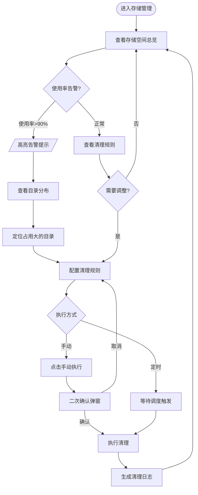
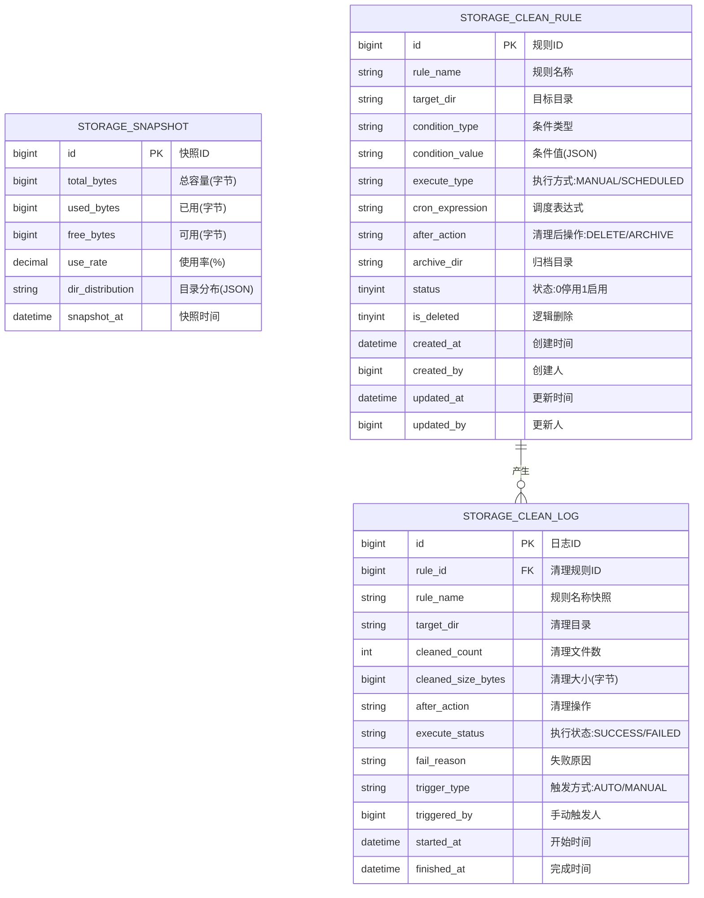

# 多场景影像传感设备资源协同调度系统 · 数据存储管理模块 PRD

| 属性 | 内容 |
|------|------|
| 文档版本 | V1.0 |
| 创建日期 | 2026-05-26 |
| 作者 | — |
| 评审状态 | 待评审 |
| 所属系统 | 多场景影像传感设备资源协同调度系统 |

## 修订记录

| 版本 | 修改日期 | 修改人 | 修改内容 |
|------|----------|--------|----------|
| V1.0 | 2026-05-26 | — | 初稿 |

---

## 一、背景与目标

### 1.1 背景

工业影像数据体量庞大，随着数据持续接入，存储空间存在耗尽风险。需要提供存储资源的可视化感知和自动化清理能力。

**核心痛点**：
- 存储使用情况不可见，只有在空间耗尽时才被动发现
- 手动清理数据费时且易误删，缺少规则化管理手段

### 1.2 目标

- 实时展示存储空间使用情况（总量/已用/可用/使用率）
- 支持按目录查看存储占用分布
- 提供可配置的数据清理规则，支持手动和定时执行

---

## 二、用户角色

| 角色 | 描述 | 核心诉求 |
|------|------|----------|
| 数据工程师 | 负责存储管理和清理规则配置 | 及时感知存储状态，安全清理过期数据 |
| 管理人员 | 查看存储统计 | 了解数据资产规模 |

---

## 三、功能说明

### 3.1 功能清单

| 功能点 | 优先级 | 说明 | 涉及角色 |
|--------|--------|------|----------|
| 存储空间总览 | P0 | 展示总量/已用/可用/使用率 | 数据工程师、管理人员 |
| 目录存储分布 | P1 | 按目录分组展示占用大小 | 数据工程师 |
| 清理规则管理 | P0 | 配置数据清理策略 | 数据工程师 |
| 手动触发清理 | P0 | 立即执行清理（需二次确认） | 数据工程师 |
| 清理日志查看 | P1 | 查看历史清理记录 | 数据工程师 |

### 3.2 主流程图



### 3.3 功能详细说明

#### 3.3.1 存储空间统计

**功能描述**：实时展示系统整体存储资源使用情况，使用率超过90%时高亮告警。

| 指标 | 展示形式 | 说明 |
|------|---------|------|
| 总存储容量 | 数值（TB/GB） | 系统配置的存储总量 |
| 已用空间 | 数值（TB/GB） | 当前已使用存储量 |
| 可用空间 | 数值（TB/GB） | 剩余可用存储量 |
| 使用率 | 进度条 + 百分比 | 已用/总量，>90%时红色告警 |
| 数据更新时间 | 时间戳 | 最近一次统计的时间 |

**目录存储分布**：

| 字段 | 说明 |
|------|------|
| 目录路径 | 数据目录名 |
| 占用大小 | 格式化展示（如 1.2 GB） |
| 文件数量 | 目录下文件总数 |
| 占比 | 相对于总已用空间的百分比 |
| 最后修改时间 | 目录中最近文件的修改时间 |

#### 3.3.2 数据清理管理

**功能描述**：配置和执行数据清理策略，支持多种清理条件组合，清理后可永久删除或移动到归档目录。

**字段说明**：

| 字段 | 类型 | 必填 | 校验规则 | 说明 |
|------|------|------|----------|------|
| ruleName | string | ✓ | 最长100字，系统唯一 | 清理规则名称 |
| targetDir | string | ✓ | 以/开头的绝对路径 | 目标清理目录 |
| conditionType | string | ✓ | LAST_ACCESS_DAYS/BEFORE_DATE/FILE_SIZE | 清理条件类型 |
| conditionValue | object | ✓ | 根据conditionType动态校验 | 清理条件值 |
| executeType | string | ✓ | MANUAL/SCHEDULED | 执行方式 |
| cronExpression | string | 条件必填 | executeType=SCHEDULED时必填 | 调度表达式 |
| afterAction | string | ✓ | DELETE/ARCHIVE | 清理后操作 |
| archiveDir | string | 条件必填 | afterAction=ARCHIVE时必填 | 归档目标目录 |
| status | int | ✓ | 0-停用 1-启用 | 状态 |

**清理条件说明**：

| conditionType | conditionValue | 说明 |
|--------------|---------------|------|
| LAST_ACCESS_DAYS | `{"days": 30}` | 超过N天未被访问的文件 |
| BEFORE_DATE | `{"beforeDate": "2026-01-01"}` | 早于指定日期的文件 |
| FILE_SIZE | `{"minSizeMB": 500}` | 文件大小大于N MB的文件 |

> **注意**：手动触发清理时，必须弹出二次确认弹窗，明确显示"将清理目录 [XXX] 下符合条件的文件，此操作不可逆，确认继续？"

---

## 四、业务边界

### In Scope（本期做）

- ✅ 存储空间总览（总量/已用/可用/使用率）
- ✅ 目录存储分布展示
- ✅ 清理规则 CRUD + 启用/停用
- ✅ 手动触发清理（需二次确认）
- ✅ 定时清理
- ✅ 清理日志查询

### Out of Scope（本期不做）

- ❌ 存储使用率超阈值自动告警（邮件/短信）：后续结合通知模块
- ❌ 多存储介质（NAS + 云存储）统一管理：后续迭代

### 前置依赖

- 系统有权限扫描指定存储目录的文件信息

---

## 五、数据模型



---

## 六、接口设计

### 6.1 接口清单

| 接口名称 | 方法 | 路径 | 权限标识 |
|----------|------|------|---------|
| 存储空间统计 | GET | `/api/storage/overview` | storage:overview:list |
| 目录存储分布 | GET | `/api/storage/dirs` | storage:overview:list |
| 清理规则列表 | GET | `/api/storage/clean-rules` | storage:clean:list |
| 新增清理规则 | POST | `/api/storage/clean-rules` | storage:clean:add |
| 清理规则详情 | GET | `/api/storage/clean-rules/{id}` | storage:clean:list |
| 修改清理规则 | PUT | `/api/storage/clean-rules/{id}` | storage:clean:edit |
| 修改规则状态 | PATCH | `/api/storage/clean-rules/{id}/status` | storage:clean:edit |
| 手动触发清理 | POST | `/api/storage/clean-rules/{id}/execute` | storage:clean:execute |
| 删除清理规则 | DELETE | `/api/storage/clean-rules/{id}` | storage:clean:delete |
| 清理日志列表 | GET | `/api/storage/clean-logs` | storage:clean:list |

### 6.2 核心接口定义

#### 存储空间统计

```
GET /api/storage/overview
Authorization: Bearer {accessToken}

响应：
{
  "code": 200,
  "data": {
    "totalBytes": 10995116277760,
    "usedBytes": 8796093022208,
    "freeBytes": 2199023255552,
    "useRate": 80.00,
    "totalDisplay": "10.0 TB",
    "usedDisplay": "8.0 TB",
    "freeDisplay": "2.0 TB",
    "isWarning": false,
    "snapshotAt": "2026-05-26 10:00:00"
  }
}
```

#### 目录存储分布

```
GET /api/storage/dirs?orderBy=usedBytes&orderDir=desc
Authorization: Bearer {accessToken}

响应：
{
  "code": 200,
  "data": [
    {
      "dirPath": "/data/ingest/line1",
      "usedBytes": 3298534883328,
      "usedDisplay": "3.0 TB",
      "fileCount": 158000,
      "usedPercent": 37.50,
      "lastModifiedAt": "2026-05-26 02:03:20"
    },
    {
      "dirPath": "/data/processed/line1",
      "usedBytes": 2199023255552,
      "usedDisplay": "2.0 TB",
      "fileCount": 152000,
      "usedPercent": 25.00,
      "lastModifiedAt": "2026-05-26 03:08:30"
    }
  ]
}
```

#### 手动触发清理

```
POST /api/storage/clean-rules/{id}/execute
Authorization: Bearer {accessToken}

响应（触发成功）：
{
  "code": 200,
  "message": "清理任务已启动",
  "data": { "logId": 88 }
}

错误：{ "code": 422, "message": "规则已停用，无法执行" }
```

#### 清理日志列表

```
GET /api/storage/clean-logs?page=1&pageSize=10&ruleId=&executeStatus=&startTime=&endTime=
Authorization: Bearer {accessToken}

响应：
{
  "code": 200,
  "data": {
    "total": 50,
    "page": 1,
    "pageSize": 10,
    "records": [
      {
        "id": 88,
        "ruleName": "接入数据30天清理",
        "targetDir": "/data/ingest/line1",
        "cleanedCount": 5200,
        "cleanedSizeDisplay": "1.2 GB",
        "afterAction": "DELETE",
        "executeStatus": "SUCCESS",
        "triggerType": "MANUAL",
        "startedAt": "2026-05-26 11:00:00",
        "finishedAt": "2026-05-26 11:02:30"
      }
    ]
  }
}
```

---

## 七、异常流程

| 异常场景 | 触发条件 | 处理方式 | 用户提示 |
|----------|----------|----------|----------|
| 存储使用率≥90% | 快照统计结果超阈值 | 使用率进度条红色高亮 | "存储使用率已达90%，建议尽快执行清理" |
| 清理目录不存在 | 执行时目标目录已被删除 | 记录日志状态为FAILED | "目标目录不存在，清理任务取消" |
| 归档目录与清理目录相同 | 配置时填写相同路径 | 返回422 | "归档目录不能与清理目录相同" |
| 归档目录空间不足 | 归档时目标空间不足 | 停止归档，记录FAILED | "归档目录存储空间不足，归档失败" |
| 手动触发未确认 | 点击执行未通过二次确认弹窗 | 不执行清理 | 弹窗显示"此操作将永久删除/归档数据，确认继续？" |

---

## 八、权限设计

| 操作 | 权限标识 | 可见角色 |
|------|---------|---------|
| 查看存储统计/目录分布 | storage:overview:list | DATA_ENG, MANAGER, SUPER_ADMIN |
| 查看清理规则/日志 | storage:clean:list | DATA_ENG, SUPER_ADMIN |
| 新增清理规则 | storage:clean:add | DATA_ENG, SUPER_ADMIN |
| 编辑清理规则 | storage:clean:edit | DATA_ENG, SUPER_ADMIN |
| 执行清理（手动触发） | storage:clean:execute | SUPER_ADMIN |
| 删除清理规则 | storage:clean:delete | SUPER_ADMIN |

> **注意**：手动执行清理为高危操作，仅超级管理员可执行。

---

## 九、验收标准

**AC-001 存储总览展示**
- Given：系统存储已挂载，有数据接入
- When：进入存储管理页面
- Then：正确显示总量、已用、可用、使用率（进度条），数据刷新时间不超过5分钟

**AC-002 使用率告警**
- Given：当前存储使用率为92%
- When：进入存储管理页面
- Then：使用率进度条显示红色，并展示告警提示文字

**AC-003 新增清理规则**
- Given：数据工程师在清理规则页面
- When：配置清理条件为"超过30天未访问"，清理后操作为"永久删除"，保存
- Then：规则列表新增一条记录

**AC-004 手动触发清理需二次确认**
- Given：清理规则已配置且为启用状态
- When：点击"手动执行"按钮
- Then：弹出确认弹窗，明确显示目标目录和操作类型，点击确认后开始清理

**AC-005 清理日志记录**
- Given：手动触发清理成功执行
- When：查看清理日志
- Then：显示清理文件数量、清理大小、执行时间、触发方式（手动）

**AC-006 归档目录校验**
- Given：新增清理规则，清理后操作选择"归档"
- When：归档目录与清理目录填写相同
- Then：提示"归档目录不能与清理目录相同"，不允许保存
