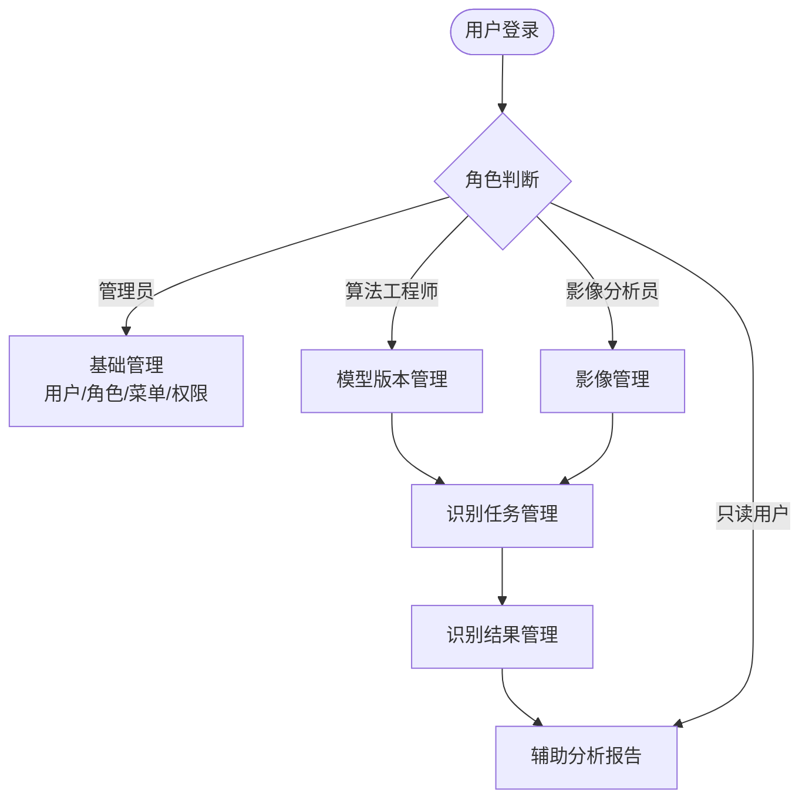

# 智能视觉影像识别辅助分析系统 产品需求文档

| 属性 | 内容 |
|------|------|
| 文档版本 | V1.0 |
| 创建日期 | 2026-05-26 |
| 作者 | — |
| 评审状态 | 待评审 |
| 技术栈 | Spring Boot 4.x · MySQL 9.x · PC Web |

## 修订记录

| 版本 | 修改日期 | 修改人 | 修改内容 |
|------|----------|--------|----------|
| V1.0 | 2026-05-26 | — | 初稿 |

---

## 一、背景与目标

### 1.1 背景

随着深度学习与计算机视觉技术的成熟，工业场景中的影像识别能力已大幅提升。然而，识别结果的解读、标注管理与分析汇总往往依赖人工处理，效率低下、追溯困难。

**核心痛点**：
- 待识别影像分散存储，无统一管理入口，分类检索困难
- 识别任务手动触发、状态不透明，工程师无法实时掌握进度
- 识别结果缺乏可视化标注工具，人工修正流程繁琐
- 无跨任务汇总分析能力，模型版本间效果对比只能依赖离线脚本
- 多角色协作缺乏权限隔离，敏感数据泄露风险高

### 1.2 目标

**功能目标**：
- 统一管理待识别影像，支持上传、分类与浏览
- 支持识别任务的创建、提交与状态追踪
- 展示识别结果，支持人工标注框绘制与结果修正
- 生成辅助分析报告，提供置信度与识别汇总数据
- 管理模型版本信息，跟踪模型迭代
- 集成用户权限管理，实现多角色分级访问控制

**业务目标（上线后）**：
- 影像识别工作流处理效率提升 ≥ 40%
- 识别结果人工修正时间缩短 ≥ 50%
- 系统可用率 ≥ 99%

**非目标（本期不涉及）**：
- 不包含模型训练与推理服务本身（系统对接已部署的推理接口）
- 不包含移动端适配
- 不包含多租户隔离

### 1.3 系统定位

- **类型：** PC 端 Web 应用（识别分析前端系统）
- **前端仓库名：** smart-vision-analysis-web
- **后端仓库名：** smart-vision-analysis
- **开发库名：** smart_vision_analysis_dev

---

## 二、用户角色

| 角色 | 标识 | 描述 | 核心诉求 |
|------|------|------|----------|
| 超级管理员 | SUPER_ADMIN | 平台最高权限，管理所有用户和配置 | 稳定可控的系统运营 |
| 算法工程师 | ALGO_ENG | 负责模型版本管理与识别任务配置 | 快速验证模型效果，对比版本迭代 |
| 影像分析员 | IMG_ANALYST | 负责影像上传、任务提交与结果标注 | 高效完成标注，减少重复操作 |
| 只读用户 | READONLY | 查看识别结果与分析报告，不可修改 | 快速获取分析数据，方便导出 |

**Persona（主要用户画像）**：
- 姓名：李工
- 职业/场景：工厂质检部门算法工程师，每日处理 500+ 张焊点影像识别任务
- 核心需求：快速查看模型识别效果，对比不同版本准确率
- 痛点：识别结果散落在各个报告文件中，跨任务比对极为繁琐

---

## 三、功能模块总览

### 模块文件索引

| 文件 | 模块 |
|------|------|
| [01-baseline-system.md](./01-baseline-system.md) | 基础管理（用户/角色/权限/菜单/日志） |
| [02-image-management.md](./02-image-management.md) | 影像管理（上传/分类/浏览） |
| [03-task-management.md](./03-task-management.md) | 识别任务管理（创建/状态/历史） |
| [04-result-management.md](./04-result-management.md) | 识别结果管理（标注/审核） |
| [05-analysis-report.md](./05-analysis-report.md) | 辅助分析报告（单次/汇总） |
| [06-model-management.md](./06-model-management.md) | 模型版本管理 |

---

## 四、非功能性需求

| 类别 | 要求 |
|------|------|
| 性能 | 页面加载 ≤ 3 秒；影像缩略图列表加载 ≤ 3 秒；接口 P99 响应 ≤ 500ms |
| 安全 | JWT 鉴权（accessToken 2h + refreshToken 7d）；操作日志全量记录；文件上传严格校验格式（JPEG/PNG/BMP）与大小（≤ 50MB） |
| 可用性 | 系统可用率 ≥ 99%；批量操作前提供二次确认 |
| 兼容性 | Chrome 90+、Edge 90+ |
| 数据保留 | 影像文件保留 2 年；识别结果数据保留 2 年 |
| 并发 | 支持 100 QPS 核心接口 |

---

## 五、系统接口前缀汇总

| 模块 | 接口前缀 |
|------|---------|
| 认证 | `/api/auth` |
| 用户管理 | `/api/system/users` |
| 角色管理 | `/api/system/roles` |
| 菜单管理 | `/api/system/menus` |
| 操作日志 | `/api/system/logs` |
| 影像管理 | `/api/image` |
| 影像分类 | `/api/image/categories` |
| 识别任务 | `/api/task` |
| 识别结果 | `/api/result` |
| 辅助分析报告 | `/api/report` |
| 模型版本管理 | `/api/model` |

---

## 六、部署与上线

### 发布策略

- [ ] 全量发布（首次上线，内部使用）

### 上线检查清单

- [ ] 后端接口联调通过
- [ ] 前端功能自测通过
- [ ] 测试用例全部通过
- [ ] 数据库变更脚本已准备
- [ ] 文件存储服务配置完成
- [ ] 操作日志写入验证通过
- [ ] JWT 密钥已配置
