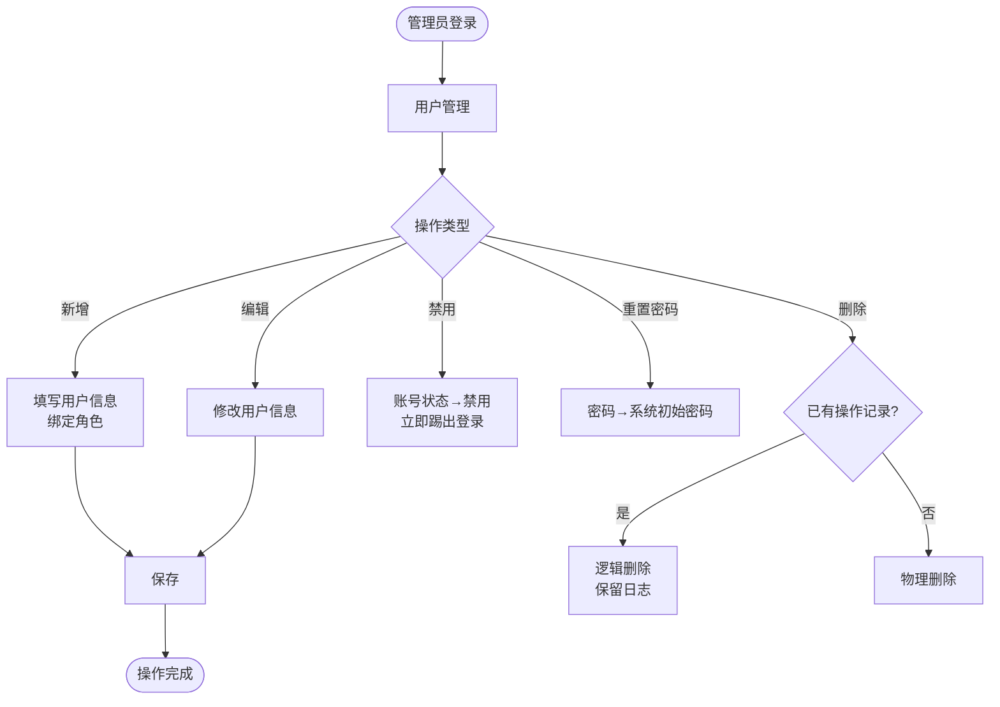
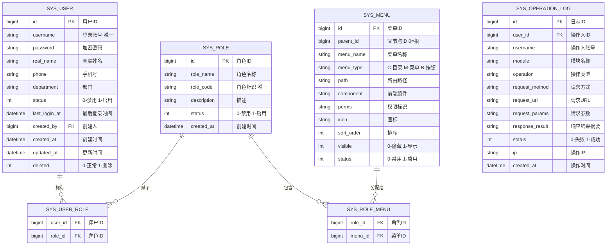

# 基础管理模块 PRD

> 所属系统：智能视觉影像识别辅助分析系统

---

## 一、功能说明

### 1.1 功能清单

| 功能点 | 优先级 | 说明 | 涉及角色 |
|--------|--------|------|----------|
| 用户列表查询 | P0 | 分页展示用户，支持多条件筛选 | SUPER_ADMIN |
| 新增用户 | P0 | 填写用户信息并绑定角色 | SUPER_ADMIN |
| 编辑用户 | P0 | 修改用户信息及角色绑定 | SUPER_ADMIN |
| 禁用/启用用户 | P0 | 切换账号状态 | SUPER_ADMIN |
| 重置密码 | P0 | 重置为系统初始密码 | SUPER_ADMIN |
| 删除用户 | P1 | 逻辑删除，日志保留 | SUPER_ADMIN |
| 角色列表 | P0 | 展示角色及其关联用户数 | SUPER_ADMIN |
| 角色授权 | P0 | 为角色分配菜单及按钮权限 | SUPER_ADMIN |
| 新增/编辑角色 | P0 | 维护角色基本信息 | SUPER_ADMIN |
| 菜单树管理 | P0 | 新增/编辑/删除菜单节点 | SUPER_ADMIN |
| 操作日志查询 | P1 | 查询全量操作日志 | SUPER_ADMIN |

### 1.2 主流程图



---

## 二、数据模型



---

## 三、接口设计

### 3.1 接口清单

| 接口名称 | 方法 | 路径 | 权限标识 |
|----------|------|------|---------|
| 用户列表 | GET | `/api/system/users` | `system:user:list` |
| 用户详情 | GET | `/api/system/users/{id}` | `system:user:list` |
| 新增用户 | POST | `/api/system/users` | `system:user:add` |
| 编辑用户 | PUT | `/api/system/users/{id}` | `system:user:edit` |
| 删除用户 | DELETE | `/api/system/users/{id}` | `system:user:delete` |
| 禁用/启用用户 | PATCH | `/api/system/users/{id}/status` | `system:user:edit` |
| 重置密码 | PATCH | `/api/system/users/{id}/password/reset` | `system:user:edit` |
| 角色列表 | GET | `/api/system/roles` | `system:role:list` |
| 新增角色 | POST | `/api/system/roles` | `system:role:add` |
| 编辑角色 | PUT | `/api/system/roles/{id}` | `system:role:edit` |
| 删除角色 | DELETE | `/api/system/roles/{id}` | `system:role:delete` |
| 角色授权 | PUT | `/api/system/roles/{id}/menus` | `system:role:edit` |
| 菜单树 | GET | `/api/system/menus/tree` | `system:menu:list` |
| 新增菜单 | POST | `/api/system/menus` | `system:menu:add` |
| 编辑菜单 | PUT | `/api/system/menus/{id}` | `system:menu:edit` |
| 删除菜单 | DELETE | `/api/system/menus/{id}` | `system:menu:delete` |
| 操作日志列表 | GET | `/api/system/logs` | `system:log:list` |
| 用户登录 | POST | `/api/auth/login` | 公开 |
| 刷新Token | POST | `/api/auth/token/refresh` | 公开 |
| 退出登录 | POST | `/api/auth/logout` | 需要鉴权 |

### 3.2 接口详细定义

#### 用户登录

**说明**：用户名密码登录，返回 JWT Token

**鉴权**：不需要

```
POST /api/auth/login
Content-Type: application/json

请求体：
{
  "username": "string",   // 登录账号
  "password": "string"    // 密码（明文，HTTPS传输）
}

响应（成功）：
{
  "code": 200,
  "data": {
    "accessToken": "eyJhbGci...",
    "refreshToken": "eyJhbGci...",
    "expiresIn": 7200,
    "userInfo": {
      "id": 1,
      "username": "admin",
      "realName": "管理员",
      "roles": ["SUPER_ADMIN"]
    }
  }
}

响应（失败）：
{ "code": 401, "message": "账号或密码错误" }
{ "code": 403, "message": "账号已被禁用，请联系管理员" }
```

#### 用户列表

**说明**：分页查询用户列表，支持多条件筛选

**鉴权**：需要

**权限标识**：`system:user:list`

```
GET /api/system/users
Authorization: Bearer {accessToken}

Query 参数：
- realName   string  否  姓名（模糊搜索）
- username   string  否  账号（模糊搜索）
- roleId     long    否  角色ID
- status     int     否  状态：0-禁用 1-启用
- page       int     是  页码，从1开始
- pageSize   int     是  每页条数，默认20

响应（成功）：
{
  "code": 200,
  "data": {
    "total": 100,
    "page": 1,
    "pageSize": 20,
    "records": [
      {
        "id": 1,
        "username": "zhangsan",
        "realName": "张三",
        "phone": "138****8888",
        "department": "算法部",
        "status": 1,
        "roles": [{"id": 2, "roleName": "算法工程师"}],
        "lastLoginAt": "2026-05-25 10:00:00",
        "createdAt": "2026-01-01 00:00:00"
      }
    ]
  }
}
```

#### 新增用户

**说明**：创建新用户并绑定角色

**鉴权**：需要

**权限标识**：`system:user:add`

```
POST /api/system/users
Authorization: Bearer {accessToken}
Content-Type: application/json

请求体：
{
  "username": "string",      // 必填，6-20位字母数字，全局唯一
  "realName": "string",      // 必填，真实姓名
  "phone": "string",         // 必填，11位手机号
  "department": "string",    // 可选，部门
  "password": "string",      // 必填，8-20位含大小写字母与数字
  "roleIds": [1, 2]          // 必填，关联角色ID列表
}

响应（成功）：
{
  "code": 200,
  "data": { "id": 101 }
}

响应（失败）：
{ "code": 400, "message": "账号已存在" }
{ "code": 400, "message": "密码格式不符合要求" }
```

#### 禁用/启用用户

**说明**：切换用户账号状态

**鉴权**：需要

**权限标识**：`system:user:edit`

```
PATCH /api/system/users/{id}/status
Authorization: Bearer {accessToken}
Content-Type: application/json

请求体：
{
  "status": 0    // 0-禁用 1-启用
}

响应（成功）：
{ "code": 200, "data": null }

响应（失败）：
{ "code": 400, "message": "不能禁用当前登录账号" }
```

#### 角色授权

**说明**：为角色分配菜单权限

**鉴权**：需要

**权限标识**：`system:role:edit`

```
PUT /api/system/roles/{id}/menus
Authorization: Bearer {accessToken}
Content-Type: application/json

请求体：
{
  "menuIds": [1, 2, 3, 10, 11]    // 菜单ID列表（含按钮权限）
}

响应（成功）：
{ "code": 200, "data": null }
```

---

## 四、字段校验规则

| 字段 | 类型 | 必填 | 校验规则 | 说明 |
|------|------|------|----------|------|
| username | string | ✓ | 6~20 位字母或数字，全局唯一 | 登录账号，创建后不可修改 |
| password | string | ✓ | 8~20 位，须同时包含大写字母、小写字母、数字 | 存储时 BCrypt 加密 |
| phone | string | ✓ | 11 位国内手机号格式 | 脱敏展示（中间4位替换为*） |
| roleName | string | ✓ | 不超过 50 字，系统内唯一 | — |
| roleCode | string | ✓ | 大写字母+下划线，不超过 30 字 | 如 ALGO_ENG |

---

## 五、权限设计

| 操作 | 权限标识 | 可见角色 |
|------|---------|----------|
| 查看用户列表 | `system:user:list` | SUPER_ADMIN |
| 新增用户 | `system:user:add` | SUPER_ADMIN |
| 编辑用户 | `system:user:edit` | SUPER_ADMIN |
| 删除用户 | `system:user:delete` | SUPER_ADMIN |
| 查看角色列表 | `system:role:list` | SUPER_ADMIN |
| 新增/编辑角色 | `system:role:add`/`edit` | SUPER_ADMIN |
| 角色授权 | `system:role:edit` | SUPER_ADMIN |
| 删除角色 | `system:role:delete` | SUPER_ADMIN |
| 菜单管理 | `system:menu:*` | SUPER_ADMIN |
| 操作日志查看 | `system:log:list` | SUPER_ADMIN |

---

## 六、异常流程

| 异常场景 | 触发条件 | 处理方式 | 用户提示 |
|----------|----------|----------|----------|
| 账号已存在 | 新增用户时 username 重复 | 返回 400 | "登录账号已存在，请更换" |
| 删除有绑定用户的角色 | 角色下存在用户 | 返回 400 | "角色下存在用户，请先解除绑定" |
| 删除有子节点的菜单 | 菜单存在子节点 | 返回 400 | "请先删除子菜单" |
| 禁用当前登录用户 | 操作自身账号 | 返回 400 | "不能禁用当前登录账号" |
| 密码格式不符 | 新增/修改密码时格式校验失败 | 返回 400 | "密码须包含大小写字母与数字，长度8-20位" |

---

## 七、验收标准

**AC-001 用户登录-正常**
- Given：已注册账号，状态为启用，在登录页
- When：输入正确账号和密码，点击登录
- Then：跳转至系统首页，导航显示用户姓名
  - And：后端记录一条登录成功日志

**AC-002 用户登录-账号禁用**
- Given：账号状态为禁用
- When：输入正确账号密码点击登录
- Then：提示"账号已被禁用，请联系管理员"，停留登录页

**AC-003 新增用户-账号重复**
- Given：系统已存在账号 `test01`
- When：管理员新增用户，账号填写 `test01`，点击保存
- Then：提示"登录账号已存在，请更换"，用户未被创建

**AC-004 角色授权**
- Given：算法工程师角色已存在，待分配菜单权限
- When：管理员在角色授权页勾选对应菜单/按钮，点击保存
- Then：保存成功，该角色用户下次请求接口时权限立即生效

**AC-005 删除角色-有绑定用户**
- Given：角色"影像分析员"下绑定有 3 名用户
- When：管理员点击删除该角色
- Then：提示"角色下存在用户，请先解除绑定"，角色未删除
