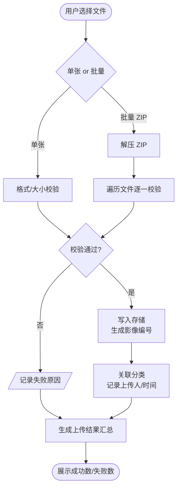
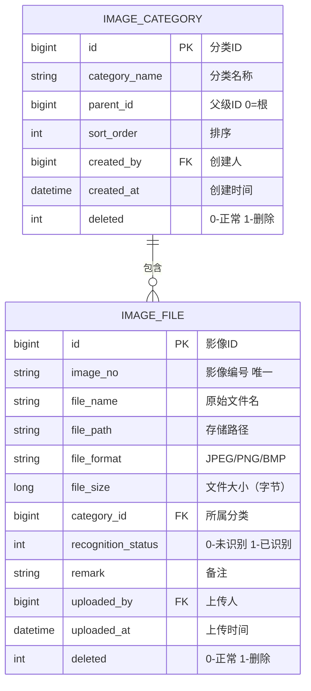

# 影像管理模块 PRD

> 所属系统：智能视觉影像识别辅助分析系统

---

## 一、功能说明

### 1.1 功能清单

| 功能点 | 优先级 | 说明 | 涉及角色 |
|--------|--------|------|----------|
| 单张影像上传 | P0 | 上传单张 JPEG/PNG/BMP 影像 | IMG_ANALYST, ALGO_ENG |
| 批量影像上传 | P0 | ZIP 包解压批量入库，显示进度 | IMG_ANALYST, ALGO_ENG |
| 上传结果汇总 | P0 | 显示成功数/失败数及失败原因 | IMG_ANALYST, ALGO_ENG |
| 影像分类管理 | P0 | 维护二级分类目录 | IMG_ANALYST, ALGO_ENG |
| 影像列表查询 | P0 | 支持多条件筛选，列表/缩略图视图 | 全部角色 |
| 影像大图预览 | P0 | 弹窗内缩放/拖拽预览 | 全部角色 |
| 删除影像 | P1 | 逻辑删除，已提交识别任务的影像不可删 | IMG_ANALYST, ALGO_ENG |

### 1.2 影像上传主流程



### 1.3 功能详细说明

#### 影像上传

**功能描述**：将待识别影像上传至系统，支持单张与批量（ZIP）两种模式。

**字段说明**：

| 字段 | 类型 | 必填 | 规则 | 说明 |
|------|------|------|------|------|
| file | file | ✓ | JPEG/PNG/BMP，单文件 ≤ 50MB | 上传文件 |
| categoryId | long | ✓ | 已存在的分类ID | 所属分类 |
| remark | string | ✗ | 最长 200 字 | 备注 |

**自动记录字段**：影像编号（系统生成）、文件名（取原始文件名）、文件大小、上传人、上传时间、识别状态（默认"未识别"）。

#### 影像分类管理

**功能描述**：维护影像分类目录，支持最多二级层级。

**字段说明**：

| 字段 | 类型 | 必填 | 规则 | 说明 |
|------|------|------|------|------|
| categoryName | string | ✓ | 不超过 50 字 | 分类名称 |
| parentId | long | ✗ | 为空时表示一级分类 | 父级分类ID |

> **注意**：有影像关联的分类不可删除；删除分类前须将影像迁移或删除。

---

## 二、数据模型



---

## 三、接口设计

### 3.1 接口清单

| 接口名称 | 方法 | 路径 | 权限标识 |
|----------|------|------|---------|
| 影像列表 | GET | `/api/image` | `image:list` |
| 影像详情 | GET | `/api/image/{id}` | `image:list` |
| 单张上传 | POST | `/api/image/upload` | `image:add` |
| 批量上传（ZIP） | POST | `/api/image/upload/batch` | `image:add` |
| 删除影像 | DELETE | `/api/image/{id}` | `image:delete` |
| 分类树 | GET | `/api/image/categories/tree` | `image:list` |
| 新增分类 | POST | `/api/image/categories` | `image:category:add` |
| 编辑分类 | PUT | `/api/image/categories/{id}` | `image:category:edit` |
| 删除分类 | DELETE | `/api/image/categories/{id}` | `image:category:delete` |

### 3.2 接口详细定义

#### 影像列表

**说明**：分页查询影像，支持多条件筛选，支持列表/缩略图模式

**鉴权**：需要

**权限标识**：`image:list`

```
GET /api/image
Authorization: Bearer {accessToken}

Query 参数：
- categoryId       long    否  分类ID（含子分类）
- fileName         string  否  文件名模糊搜索
- uploadedBy       long    否  上传人ID
- recognitionStatus int    否  0-未识别 1-已识别
- uploadedAtStart  string  否  上传时间起（yyyy-MM-dd）
- uploadedAtEnd    string  否  上传时间止（yyyy-MM-dd）
- page             int     是  页码，从1开始
- pageSize         int     是  每页条数，默认20

响应（成功）：
{
  "code": 200,
  "data": {
    "total": 500,
    "page": 1,
    "pageSize": 20,
    "records": [
      {
        "id": 1001,
        "imageNo": "IMG-20260526-001001",
        "fileName": "weld_001.jpg",
        "thumbnailUrl": "https://.../thumb/weld_001.jpg",
        "fileFormat": "JPEG",
        "fileSize": 2048000,
        "categoryId": 3,
        "categoryName": "焊点影像",
        "recognitionStatus": 0,
        "uploadedBy": 5,
        "uploaderName": "李四",
        "uploadedAt": "2026-05-26 09:30:00"
      }
    ]
  }
}
```

#### 单张上传

**说明**：上传单张影像文件

**鉴权**：需要

**权限标识**：`image:add`

```
POST /api/image/upload
Authorization: Bearer {accessToken}
Content-Type: multipart/form-data

表单字段：
- file        file    必填  影像文件（JPEG/PNG/BMP，≤ 50MB）
- categoryId  long    必填  所属分类ID
- remark      string  可选  备注

响应（成功）：
{
  "code": 200,
  "data": {
    "id": 1001,
    "imageNo": "IMG-20260526-001001",
    "fileName": "weld_001.jpg"
  }
}

响应（失败）：
{ "code": 400, "message": "文件格式不支持，仅允许 JPEG/PNG/BMP" }
{ "code": 400, "message": "文件大小超过 50MB 限制" }
```

#### 批量上传（ZIP）

**说明**：上传 ZIP 包，服务端解压后批量入库

**鉴权**：需要

**权限标识**：`image:add`

```
POST /api/image/upload/batch
Authorization: Bearer {accessToken}
Content-Type: multipart/form-data

表单字段：
- file        file  必填  ZIP 压缩包（包内文件为 JPEG/PNG/BMP）
- categoryId  long  必填  所属分类ID

响应（成功）：
{
  "code": 200,
  "data": {
    "total": 50,
    "successCount": 48,
    "failCount": 2,
    "failDetails": [
      { "fileName": "bad.gif", "reason": "文件格式不支持" },
      { "fileName": "huge.png", "reason": "文件大小超过 50MB" }
    ]
  }
}
```

---

## 四、权限设计

| 操作 | 权限标识 | 可见角色 |
|------|---------|----------|
| 查看影像列表/详情 | `image:list` | 全部角色 |
| 上传影像 | `image:add` | IMG_ANALYST, ALGO_ENG |
| 删除影像 | `image:delete` | IMG_ANALYST, ALGO_ENG |
| 新增分类 | `image:category:add` | IMG_ANALYST, ALGO_ENG |
| 编辑分类 | `image:category:edit` | IMG_ANALYST, ALGO_ENG |
| 删除分类 | `image:category:delete` | ALGO_ENG |

---

## 五、异常流程

| 异常场景 | 触发条件 | 处理方式 | 用户提示 |
|----------|----------|----------|----------|
| 文件格式不符 | 上传非 JPEG/PNG/BMP 文件 | 拒绝，返回 400 | "文件格式不支持，仅允许 JPEG/PNG/BMP" |
| 文件过大 | 单文件 > 50MB | 拒绝，返回 400 | "文件大小超过 50MB 限制" |
| 删除已关联任务的影像 | 影像已被识别任务引用 | 拒绝，返回 400 | "影像已关联识别任务，不可删除" |
| 删除有影像的分类 | 分类下存在影像 | 拒绝，返回 400 | "分类下存在影像，请先移除或删除影像" |
| ZIP 内无有效文件 | ZIP 解压后无合规文件 | 返回 200，successCount=0 | "ZIP 包内未找到有效影像文件" |

---

## 六、验收标准

**AC-001 单张上传-正常**
- Given：用户在影像上传页，已选择分类，选择一张 2MB 的 JPEG 文件
- When：点击上传
- Then：上传成功，影像列表中出现该文件，识别状态为"未识别"
  - And：文件名、大小、上传人、上传时间自动填写正确

**AC-002 上传格式校验**
- Given：用户选择一张 .gif 格式文件
- When：点击上传
- Then：提示"文件格式不支持，仅允许 JPEG/PNG/BMP"，文件未入库

**AC-003 批量上传**
- Given：ZIP 包内包含 10 张 JPEG 和 1 张 GIF
- When：上传该 ZIP 包
- Then：显示上传结果：成功 10，失败 1，失败原因"文件格式不支持"

**AC-004 影像大图预览**
- Given：影像列表中存在影像记录
- When：用户点击某张影像缩略图
- Then：弹窗打开，显示原图，支持滚轮缩放与鼠标拖拽

**AC-005 删除有关联任务的影像**
- Given：影像 IMG-001 已被识别任务 TASK-001 引用
- When：用户尝试删除 IMG-001
- Then：提示"影像已关联识别任务，不可删除"
