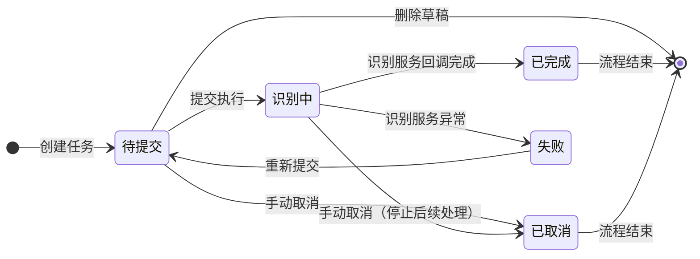
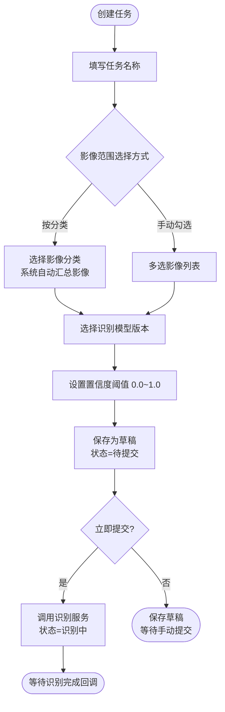
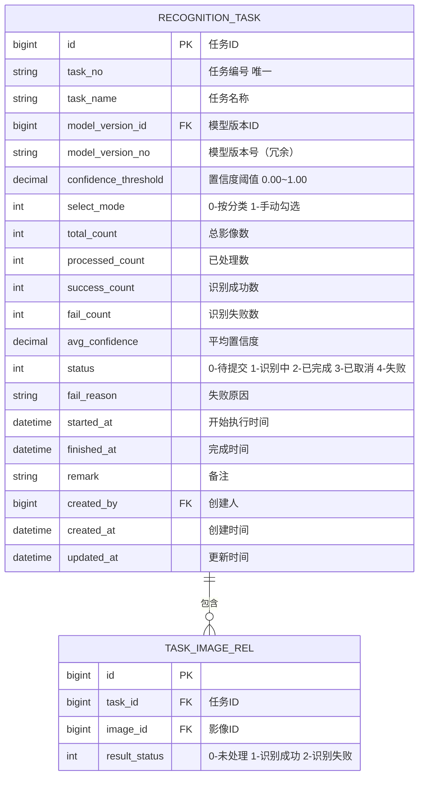

# 识别任务管理模块 PRD

> 所属系统：智能视觉影像识别辅助分析系统

---

## 一、功能说明

### 1.1 功能清单

| 功能点 | 优先级 | 说明 | 涉及角色 |
|--------|--------|------|----------|
| 创建识别任务 | P0 | 定义任务范围、模型版本、置信度阈值 | ALGO_ENG, IMG_ANALYST |
| 提交任务执行 | P0 | 提交任务到识别服务，状态变为"识别中" | ALGO_ENG, IMG_ANALYST |
| 任务进度查看 | P0 | 实时查看当前任务进度（百分比、已处理数） | 全部角色 |
| 取消任务 | P1 | 取消"待提交"或"识别中"的任务 | ALGO_ENG, IMG_ANALYST |
| 任务历史记录 | P0 | 查询历次任务执行情况，支持多条件筛选 | 全部角色 |

### 1.2 任务状态机



### 1.3 任务创建主流程



---

## 二、数据模型



---

## 三、接口设计

### 3.1 接口清单

| 接口名称 | 方法 | 路径 | 权限标识 |
|----------|------|------|---------|
| 创建任务 | POST | `/api/task` | `task:add` |
| 任务详情 | GET | `/api/task/{id}` | `task:list` |
| 任务列表（历史） | GET | `/api/task` | `task:list` |
| 提交任务 | POST | `/api/task/{id}/submit` | `task:add` |
| 取消任务 | POST | `/api/task/{id}/cancel` | `task:edit` |
| 删除草稿任务 | DELETE | `/api/task/{id}` | `task:delete` |
| 查询任务进度 | GET | `/api/task/{id}/progress` | `task:list` |

### 3.2 接口详细定义

#### 创建任务

**说明**：创建识别任务草稿，状态为"待提交"

**鉴权**：需要

**权限标识**：`task:add`

```
POST /api/task
Authorization: Bearer {accessToken}
Content-Type: application/json

请求体：
{
  "taskName": "string",             // 必填，任务名称
  "modelVersionId": 1,              // 必填，识别模型版本ID
  "confidenceThreshold": 0.8,       // 必填，置信度阈值 0.0~1.0
  "selectMode": 0,                  // 必填，0-按分类 1-手动勾选
  "categoryIds": [3, 5],            // selectMode=0 时必填，影像分类ID列表
  "imageIds": [1001, 1002, 1003],   // selectMode=1 时必填，影像ID列表
  "remark": "string"                // 可选，备注
}

响应（成功）：
{
  "code": 200,
  "data": {
    "id": 201,
    "taskNo": "TASK-20260526-000201",
    "totalCount": 48
  }
}

响应（失败）：
{ "code": 400, "message": "所选分类下无影像" }
{ "code": 400, "message": "模型版本不存在或已废弃" }
{ "code": 400, "message": "置信度阈值须在 0.0~1.0 之间" }
```

#### 提交任务

**说明**：将"待提交"任务提交到识别服务，状态变为"识别中"

**鉴权**：需要

**权限标识**：`task:add`

```
POST /api/task/{id}/submit
Authorization: Bearer {accessToken}

响应（成功）：
{
  "code": 200,
  "data": { "status": 1, "statusDesc": "识别中" }
}

响应（失败）：
{ "code": 400, "message": "任务状态不允许提交，当前状态：已完成" }
{ "code": 503, "message": "识别服务暂不可用，请稍后重试" }
```

#### 查询任务进度

**说明**：实时查询任务当前处理进度

**鉴权**：需要

**权限标识**：`task:list`

```
GET /api/task/{id}/progress
Authorization: Bearer {accessToken}

响应（成功）：
{
  "code": 200,
  "data": {
    "taskId": 201,
    "taskNo": "TASK-20260526-000201",
    "status": 1,
    "statusDesc": "识别中",
    "totalCount": 48,
    "processedCount": 32,
    "progressPercent": 66.7,
    "estimatedFinishAt": "2026-05-26 10:45:00"
  }
}
```

#### 任务历史列表

**说明**：分页查询历次任务，支持多条件筛选

**鉴权**：需要

**权限标识**：`task:list`

```
GET /api/task
Authorization: Bearer {accessToken}

Query 参数：
- taskName        string  否  任务名称模糊搜索
- modelVersionId  long    否  模型版本ID
- status          int[]   否  任务状态（多选，逗号分隔）
- startedAtStart  string  否  执行时间起（yyyy-MM-dd）
- startedAtEnd    string  否  执行时间止（yyyy-MM-dd）
- page            int     是  页码，从1开始
- pageSize        int     是  每页条数，默认20

响应（成功）：
{
  "code": 200,
  "data": {
    "total": 30,
    "page": 1,
    "pageSize": 20,
    "records": [
      {
        "id": 201,
        "taskNo": "TASK-20260526-000201",
        "taskName": "焊点检测-批次001",
        "modelVersionNo": "v2.1.0",
        "totalCount": 48,
        "successCount": 46,
        "failCount": 2,
        "avgConfidence": 0.923,
        "status": 2,
        "statusDesc": "已完成",
        "finishedAt": "2026-05-26 10:50:00",
        "createdBy": 3,
        "creatorName": "李工"
      }
    ]
  }
}
```

---

## 四、字段校验规则

| 字段 | 类型 | 必填 | 校验规则 |
|------|------|------|---------|
| taskName | string | ✓ | 不超过 100 字 |
| modelVersionId | long | ✓ | 模型状态须为"可用" |
| confidenceThreshold | decimal | ✓ | 0.0 ≤ 值 ≤ 1.0，精度 2 位小数 |
| selectMode=0 时 categoryIds | array | ✓ | 至少一个分类，且分类下须有影像 |
| selectMode=1 时 imageIds | array | ✓ | 至少一张影像，最多 1000 张 |

---

## 五、权限设计

| 操作 | 权限标识 | 可见角色 |
|------|---------|----------|
| 查看任务列表/详情/进度 | `task:list` | 全部角色 |
| 创建/提交任务 | `task:add` | IMG_ANALYST, ALGO_ENG |
| 取消任务 | `task:edit` | IMG_ANALYST, ALGO_ENG |
| 删除草稿任务 | `task:delete` | ALGO_ENG |

---

## 六、异常流程

| 异常场景 | 触发条件 | 处理方式 | 用户提示 |
|----------|----------|----------|----------|
| 分类下无影像 | 选择分类时该分类为空 | 返回 400 | "所选分类下无影像，请重新选择" |
| 模型版本已废弃 | 选用状态为"已废弃"的版本 | 返回 400 | "模型版本已废弃，请选择可用版本" |
| 重复提交 | 任务已在"识别中"再次提交 | 返回 400 | "任务正在执行中，不可重复提交" |
| 识别服务不可用 | 识别服务宕机或超时 | 返回 503，任务保持"待提交" | "识别服务暂不可用，请稍后重试" |
| 取消进行中任务 | 任务状态为"识别中"时取消 | 通知识别服务停止，状态改为"已取消" | "任务已取消，已处理部分结果将保留" |

---

## 七、验收标准

**AC-001 创建任务-按分类选择**
- Given：分类"焊点影像"下有 50 张影像，模型版本 v2.1.0 状态为可用
- When：算法工程师创建任务，选择该分类，置信度阈值 0.8，提交
- Then：任务创建成功，totalCount=50，状态变为"识别中"

**AC-002 创建任务-模型版本已废弃**
- Given：模型版本 v1.0.0 状态为"已废弃"
- When：创建任务时选择 v1.0.0
- Then：提示"模型版本已废弃，请选择可用版本"，任务未创建

**AC-003 任务进度实时查看**
- Given：任务处于"识别中"，已处理 30/50 张
- When：用户查询任务进度
- Then：返回 processedCount=30，totalCount=50，progressPercent=60.0

**AC-004 取消执行中任务**
- Given：任务状态为"识别中"
- When：用户点击取消
- Then：任务状态变为"已取消"，已生成的识别结果保留，后续影像停止处理
  - And：操作日志记录取消操作

**AC-005 任务历史筛选**
- Given：系统中存在 30 条任务记录，其中 5 条"已完成"
- When：按状态"已完成"筛选
- Then：返回 5 条记录，total=5
