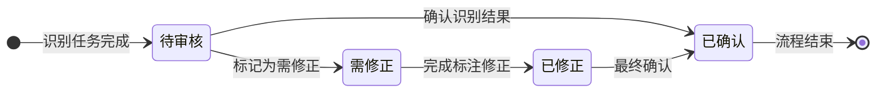
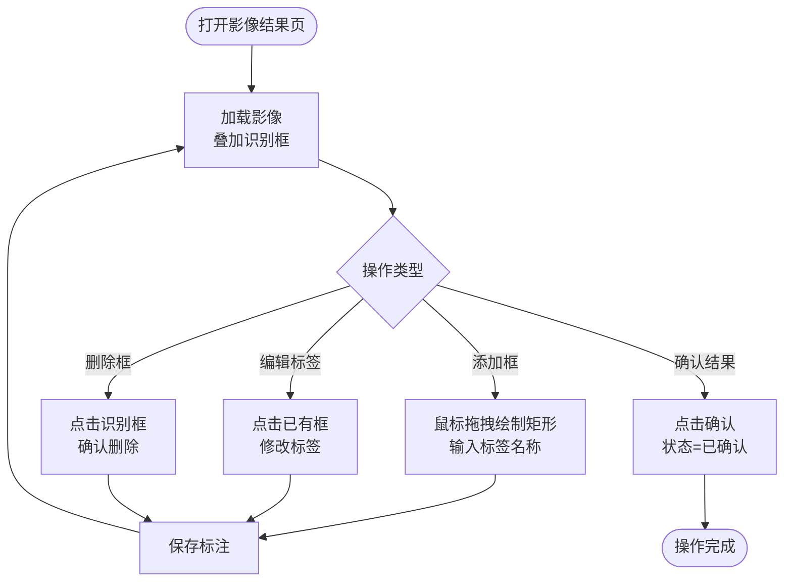
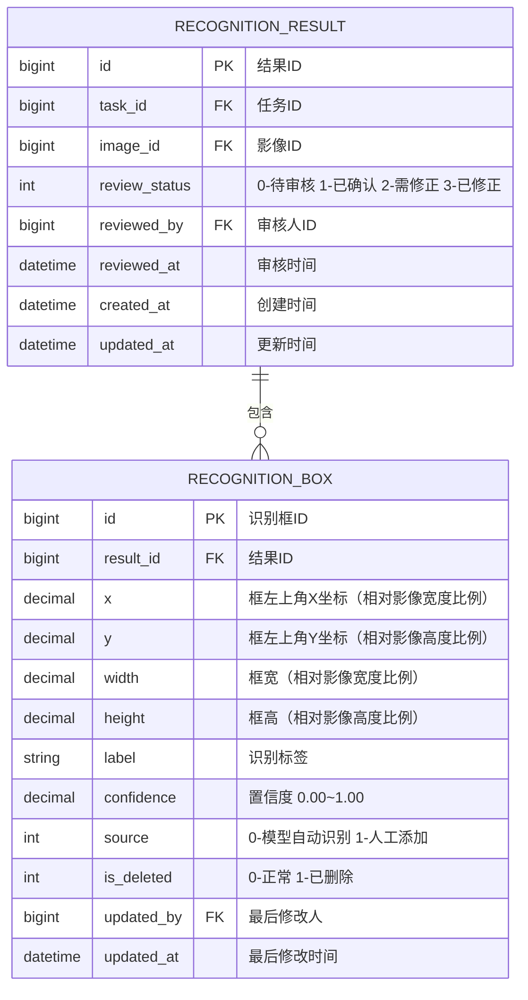

# 识别结果管理模块 PRD

> 所属系统：智能视觉影像识别辅助分析系统

---

## 一、功能说明

### 1.1 功能清单

| 功能点 | 优先级 | 说明 | 涉及角色 |
|--------|--------|------|----------|
| 识别结果列表 | P0 | 查看任务内各影像识别结果概要 | 全部角色 |
| 识别框可视化 | P0 | 在影像上叠加矩形识别框及标签 | 全部角色 |
| 添加标注框 | P0 | 手动拖拽绘制矩形框并添加标签 | IMG_ANALYST, ALGO_ENG |
| 编辑标签 | P0 | 修改识别框的分类标签 | IMG_ANALYST, ALGO_ENG |
| 删除识别框 | P0 | 删除误识别的框 | IMG_ANALYST, ALGO_ENG |
| 确认识别结果 | P0 | 标记影像结果为"已确认" | IMG_ANALYST, ALGO_ENG |
| 批量审核 | P1 | 批量确认或标记需修正 | IMG_ANALYST, ALGO_ENG |

### 1.2 结果审核状态机



### 1.3 标注操作流程



---

## 二、数据模型



---

## 三、接口设计

### 3.1 接口清单

| 接口名称 | 方法 | 路径 | 权限标识 |
|----------|------|------|---------|
| 结果列表（按任务） | GET | `/api/result` | `result:list` |
| 单张影像结果详情 | GET | `/api/result/{id}` | `result:list` |
| 添加标注框 | POST | `/api/result/{id}/boxes` | `result:edit` |
| 编辑标注框标签 | PUT | `/api/result/{id}/boxes/{boxId}` | `result:edit` |
| 删除标注框 | DELETE | `/api/result/{id}/boxes/{boxId}` | `result:edit` |
| 确认识别结果 | PATCH | `/api/result/{id}/confirm` | `result:edit` |
| 标记需修正 | PATCH | `/api/result/{id}/reject` | `result:edit` |
| 批量审核 | POST | `/api/result/batch-review` | `result:edit` |

### 3.2 接口详细定义

#### 结果列表（按任务）

**说明**：分页查询指定任务下各影像的识别结果概要

**鉴权**：需要

**权限标识**：`result:list`

```
GET /api/result
Authorization: Bearer {accessToken}

Query 参数：
- taskId       long  是  任务ID
- reviewStatus int   否  审核状态（0/1/2/3）
- page         int   是  页码，从1开始
- pageSize     int   是  每页条数，默认20

响应（成功）：
{
  "code": 200,
  "data": {
    "total": 48,
    "page": 1,
    "pageSize": 20,
    "records": [
      {
        "id": 3001,
        "taskId": 201,
        "imageId": 1001,
        "imageNo": "IMG-20260526-001001",
        "fileName": "weld_001.jpg",
        "thumbnailUrl": "https://.../thumb/weld_001.jpg",
        "boxCount": 3,
        "minConfidence": 0.72,
        "avgConfidence": 0.89,
        "reviewStatus": 0,
        "reviewStatusDesc": "待审核"
      }
    ]
  }
}
```

#### 单张影像结果详情

**说明**：获取单张影像的识别结果及所有标注框信息

**鉴权**：需要

**权限标识**：`result:list`

```
GET /api/result/{id}
Authorization: Bearer {accessToken}

响应（成功）：
{
  "code": 200,
  "data": {
    "id": 3001,
    "imageId": 1001,
    "imageUrl": "https://.../original/weld_001.jpg",
    "imageWidth": 1920,
    "imageHeight": 1080,
    "reviewStatus": 0,
    "boxes": [
      {
        "id": 50001,
        "x": 0.1,
        "y": 0.2,
        "width": 0.05,
        "height": 0.08,
        "label": "焊点缺陷",
        "confidence": 0.93,
        "source": 0
      }
    ]
  }
}
```

#### 添加标注框

**说明**：在影像上手动添加识别框

**鉴权**：需要

**权限标识**：`result:edit`

```
POST /api/result/{id}/boxes
Authorization: Bearer {accessToken}
Content-Type: application/json

请求体：
{
  "x": 0.15,          // 必填，框左上角X（相对比例 0~1）
  "y": 0.30,          // 必填，框左上角Y（相对比例 0~1）
  "width": 0.06,      // 必填，框宽（相对比例 0~1）
  "height": 0.09,     // 必填，框高（相对比例 0~1）
  "label": "string"   // 必填，分类标签
}

响应（成功）：
{
  "code": 200,
  "data": { "id": 50002, "source": 1 }
}
```

#### 批量审核

**说明**：批量确认或标记需修正

**鉴权**：需要

**权限标识**：`result:edit`

```
POST /api/result/batch-review
Authorization: Bearer {accessToken}
Content-Type: application/json

请求体：
{
  "resultIds": [3001, 3002, 3003],    // 必填，结果ID列表
  "action": "confirm"                  // 必填，confirm-确认 / reject-标记需修正
}

响应（成功）：
{
  "code": 200,
  "data": { "updatedCount": 3 }
}
```

---

## 四、前端交互说明

| 交互点 | 说明 |
|--------|------|
| 识别框渲染 | 使用 Canvas 在影像上绘制矩形框，框颜色按置信度着色（≥0.9 绿色，0.7~0.9 黄色，<0.7 红色） |
| 添加框操作 | 按住鼠标左键拖拽，松开后弹出标签输入框 |
| 框坐标系 | 统一使用相对比例（0~1），与影像实际像素无关，便于不同分辨率适配 |
| 影像缩放 | 支持滚轮缩放（最大 500%，最小 20%），标注框随影像等比缩放 |
| 已确认状态 | 影像卡片右上角显示绿色"已确认"角标 |

---

## 五、权限设计

| 操作 | 权限标识 | 可见角色 |
|------|---------|----------|
| 查看识别结果 | `result:list` | 全部角色 |
| 添加/编辑/删除标注框 | `result:edit` | IMG_ANALYST, ALGO_ENG |
| 确认/标记结果 | `result:edit` | IMG_ANALYST, ALGO_ENG |
| 批量审核 | `result:edit` | ALGO_ENG |

---

## 六、异常流程

| 异常场景 | 触发条件 | 处理方式 | 用户提示 |
|----------|----------|----------|----------|
| 标注框超出影像边界 | 坐标超出 0~1 范围 | 返回 400 | "标注框超出影像范围" |
| 修改已确认结果 | 对状态"已确认"的结果执行标注修改 | 允许，状态变为"已修正" | — |
| 批量审核超量 | 单次批量操作超过 200 条 | 返回 400 | "单次最多批量操作 200 条" |

---

## 七、验收标准

**AC-001 识别框叠加显示**
- Given：识别任务已完成，影像有 3 个识别框
- When：用户打开该影像的结果详情页
- Then：影像上叠加显示 3 个矩形框，每个框旁显示标签名称和置信度

**AC-002 添加标注框**
- Given：用户在影像结果页，影像识别状态为"待审核"
- When：按住鼠标拖拽绘制矩形区域，输入标签"焊点缺陷"，确认
- Then：新标注框出现在影像上，source=1（人工添加），结果状态变为"需修正"

**AC-003 确认识别结果**
- Given：影像结果状态为"待审核"，用户检查后认为识别正确
- When：点击"确认"按钮
- Then：结果状态变为"已确认"，审核人和审核时间自动记录

**AC-004 批量审核**
- Given：任务下有 20 张"待审核"的影像结果
- When：全选后点击"批量确认"
- Then：20 条记录状态均变为"已确认"，操作一次完成

**AC-005 置信度颜色区分**
- Given：识别框置信度分别为 0.95、0.80、0.65
- When：用户打开影像结果页
- Then：0.95 的框显示绿色，0.80 的框显示黄色，0.65 的框显示红色
