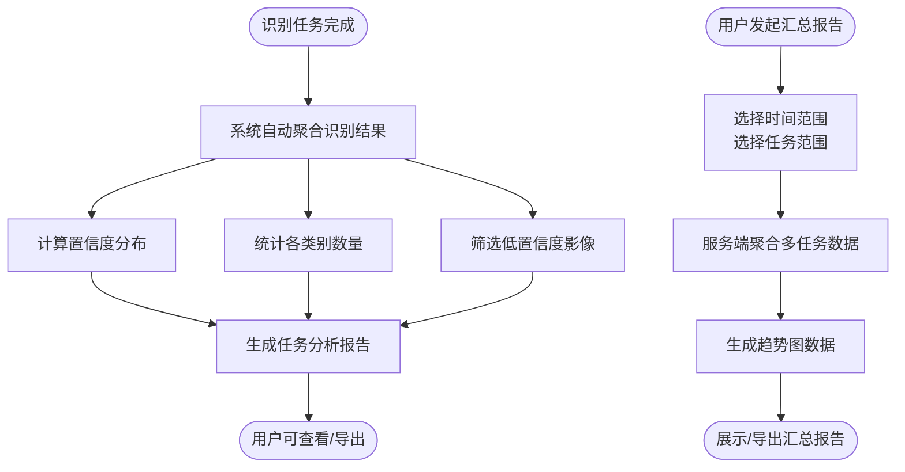
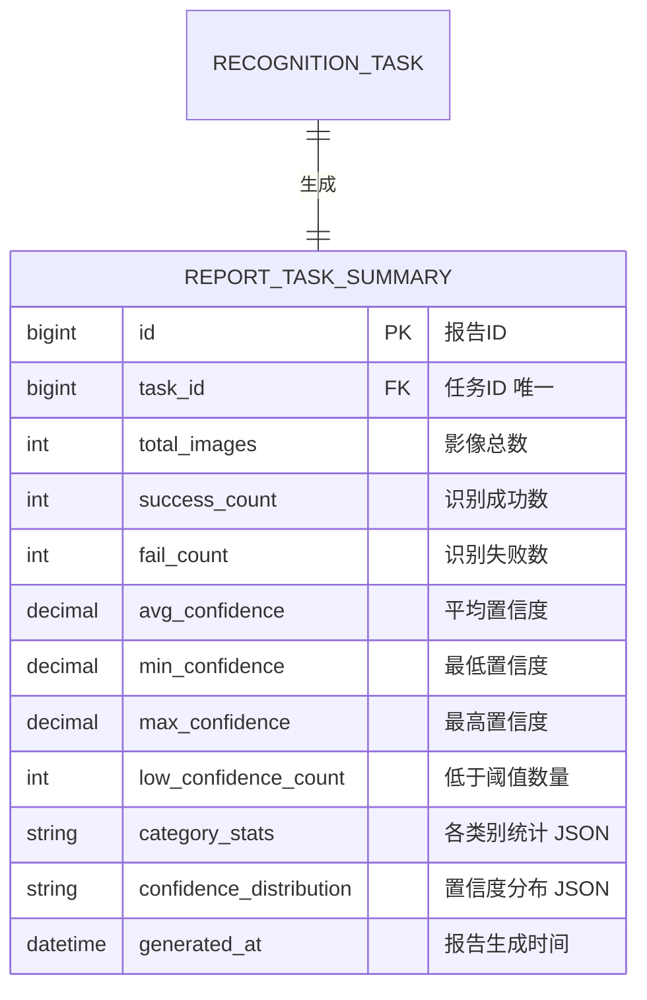

# 辅助分析报告模块 PRD

> 所属系统：智能视觉影像识别辅助分析系统

---

## 一、功能说明

### 1.1 功能清单

| 功能点 | 优先级 | 说明 | 涉及角色 |
|--------|--------|------|----------|
| 单次任务分析报告 | P0 | 为已完成任务生成详细分析报告 | 全部角色 |
| 置信度分布直方图 | P0 | 展示置信度区间占比（柱状图） | 全部角色 |
| 各类别识别数量统计 | P0 | 各识别标签的数量汇总（柱状图） | 全部角色 |
| 低置信度影像清单 | P0 | 低于阈值的影像列表，可跳转查看 | 全部角色 |
| 导出报告（PDF/Excel） | P1 | 导出单次任务分析报告 | ALGO_ENG, IMG_ANALYST |
| 批量汇总报告 | P1 | 跨任务汇总分析趋势 | ALGO_ENG |
| 汇总报告导出（Excel） | P1 | 导出批量汇总数据 | ALGO_ENG |

### 1.2 报告生成流程



---

## 二、数据模型



> **说明**：`category_stats` 格式：`[{"label":"焊点缺陷","count":23},...]`
> `confidence_distribution` 格式：`[{"range":"0.5-0.6","count":2,"percent":4.17},...]`

---

## 三、接口设计

### 3.1 接口清单

| 接口名称 | 方法 | 路径 | 权限标识 |
|----------|------|------|---------|
| 单次任务报告详情 | GET | `/api/report/task/{taskId}` | `report:list` |
| 低置信度影像列表 | GET | `/api/report/task/{taskId}/low-confidence` | `report:list` |
| 导出任务报告 PDF | GET | `/api/report/task/{taskId}/export/pdf` | `report:export` |
| 导出任务报告 Excel | GET | `/api/report/task/{taskId}/export/excel` | `report:export` |
| 批量汇总报告 | POST | `/api/report/summary` | `report:list` |
| 导出汇总报告 Excel | POST | `/api/report/summary/export/excel` | `report:export` |

### 3.2 接口详细定义

#### 单次任务报告详情

**说明**：获取指定已完成任务的分析报告数据

**鉴权**：需要

**权限标识**：`report:list`

```
GET /api/report/task/{taskId}
Authorization: Bearer {accessToken}

响应（成功）：
{
  "code": 200,
  "data": {
    "taskId": 201,
    "taskNo": "TASK-20260526-000201",
    "taskName": "焊点检测-批次001",
    "modelVersionNo": "v2.1.0",
    "startedAt": "2026-05-26 10:00:00",
    "finishedAt": "2026-05-26 10:50:00",
    "totalImages": 48,
    "successCount": 46,
    "failCount": 2,
    "avgConfidence": 0.923,
    "minConfidence": 0.62,
    "maxConfidence": 0.99,
    "lowConfidenceCount": 3,
    "confidenceThreshold": 0.8,
    "confidenceDistribution": [
      { "range": "0.5-0.6", "count": 1, "percent": 2.08 },
      { "range": "0.6-0.7", "count": 2, "percent": 4.17 },
      { "range": "0.7-0.8", "count": 5, "percent": 10.42 },
      { "range": "0.8-0.9", "count": 18, "percent": 37.50 },
      { "range": "0.9-1.0", "count": 20, "percent": 41.67 }
    ],
    "categoryStats": [
      { "label": "焊点缺陷", "count": 23 },
      { "label": "气孔", "count": 15 },
      { "label": "裂纹", "count": 8 }
    ]
  }
}

响应（失败）：
{ "code": 404, "message": "任务不存在" }
{ "code": 400, "message": "任务尚未完成，报告未生成" }
```

#### 低置信度影像列表

**说明**：获取任务内低于置信度阈值的影像列表

**鉴权**：需要

**权限标识**：`report:list`

```
GET /api/report/task/{taskId}/low-confidence
Authorization: Bearer {accessToken}

Query 参数：
- page      int  是  页码
- pageSize  int  是  每页条数，默认20

响应（成功）：
{
  "code": 200,
  "data": {
    "total": 3,
    "records": [
      {
        "imageId": 1045,
        "imageNo": "IMG-20260526-001045",
        "fileName": "weld_045.jpg",
        "thumbnailUrl": "https://.../thumb/weld_045.jpg",
        "minConfidence": 0.65,
        "resultId": 3045
      }
    ]
  }
}
```

#### 批量汇总报告

**说明**：跨多任务生成汇总分析报告

**鉴权**：需要

**权限标识**：`report:list`

```
POST /api/report/summary
Authorization: Bearer {accessToken}
Content-Type: application/json

请求体：
{
  "taskIds": [201, 202, 203],           // 可选，指定任务ID列表
  "startedAtStart": "2026-05-01",       // 可选，任务执行时间起
  "startedAtEnd": "2026-05-31",         // 可选，任务执行时间止
  "modelVersionId": 5                    // 可选，按模型版本筛选
}

响应（成功）：
{
  "code": 200,
  "data": {
    "taskCount": 3,
    "totalImages": 150,
    "overallAvgConfidence": 0.901,
    "taskConfidenceComparison": [
      { "taskId": 201, "taskName": "批次001", "avgConfidence": 0.923, "modelVersionNo": "v2.1.0" },
      { "taskId": 202, "taskName": "批次002", "avgConfidence": 0.887, "modelVersionNo": "v2.1.0" },
      { "taskId": 203, "taskName": "批次003", "avgConfidence": 0.893, "modelVersionNo": "v2.2.0" }
    ],
    "categoryTrend": [
      {
        "label": "焊点缺陷",
        "trend": [
          { "taskId": 201, "date": "2026-05-20", "count": 23 },
          { "taskId": 202, "date": "2026-05-22", "count": 19 },
          { "taskId": 203, "date": "2026-05-25", "count": 27 }
        ]
      }
    ],
    "modelVersionComparison": [
      { "modelVersionNo": "v2.1.0", "taskCount": 2, "avgConfidence": 0.905 },
      { "modelVersionNo": "v2.2.0", "taskCount": 1, "avgConfidence": 0.893 }
    ],
    "correctionRateTrend": [
      { "taskId": 201, "date": "2026-05-20", "correctionRate": 0.065 },
      { "taskId": 202, "date": "2026-05-22", "correctionRate": 0.083 },
      { "taskId": 203, "date": "2026-05-25", "correctionRate": 0.051 }
    ]
  }
}
```

---

## 四、报告内容规格

### 单次任务报告内容

| 分析项 | 可视化形式 | 说明 |
|--------|-----------|------|
| 任务基本信息 | 信息卡片 | 任务名称、模型版本、执行时间、影像总数 |
| 识别结果概况 | 数字看板 | 识别成功数、失败数、平均置信度 |
| 置信度分布 | 直方图 | 0.5~1.0 各区间（每0.1一档）占比 |
| 各类别识别数量 | 横向柱状图 | 各识别标签类别的数量统计，降序排列 |
| 低置信度影像清单 | 列表+缩略图 | 置信度低于阈值的影像，点击跳转结果页 |

### 批量汇总报告内容

| 分析项 | 可视化形式 | 说明 |
|--------|-----------|------|
| 各任务平均置信度对比 | 柱状图 | 横轴为任务，纵轴为平均置信度 |
| 识别标签类别趋势 | 折线图 | 按任务时间轴展示各类别数量变化 |
| 模型版本效果对比 | 分组柱状图 | 不同模型版本的平均置信度对比 |
| 审核修正率趋势 | 折线图 | 人工修正占识别结果的比例变化趋势 |

---

## 五、权限设计

| 操作 | 权限标识 | 可见角色 |
|------|---------|----------|
| 查看分析报告 | `report:list` | 全部角色 |
| 导出报告 | `report:export` | ALGO_ENG, IMG_ANALYST |
| 生成批量汇总报告 | `report:list` | ALGO_ENG |
| 导出汇总报告 | `report:export` | ALGO_ENG |

---

## 六、异常流程

| 异常场景 | 触发条件 | 处理方式 | 用户提示 |
|----------|----------|----------|----------|
| 任务未完成请求报告 | 任务状态非"已完成" | 返回 400 | "任务尚未完成，报告未生成" |
| 汇总报告无数据 | 筛选条件匹配不到任何任务 | 返回空数据 | "暂无符合条件的任务数据" |
| PDF 导出超时 | 影像过多导致 PDF 生成超时 | 异步生成，提供下载链接 | "报告生成中，完成后将通知您下载" |

---

## 七、验收标准

**AC-001 单次任务报告展示**
- Given：识别任务 TASK-001 已完成，包含 48 张影像结果
- When：用户进入该任务的分析报告页
- Then：展示识别成功数、失败数、平均置信度；置信度分布直方图正确渲染（5 个区间）；各类别数量柱状图正确渲染

**AC-002 低置信度影像跳转**
- Given：任务报告中低置信度影像清单有 3 条
- When：用户点击某条记录的"查看"
- Then：跳转至该影像的识别结果详情页，高亮显示低置信度框

**AC-003 导出 Excel**
- Given：用户在任务报告页
- When：点击"导出 Excel"
- Then：浏览器下载 Excel 文件，内含报告核心数据表格

**AC-004 批量汇总报告**
- Given：5 月份共完成 3 个识别任务
- When：算法工程师选择 2026-05-01 至 2026-05-31，点击生成汇总报告
- Then：展示 3 个任务的置信度对比柱状图；审核修正率趋势折线图；模型版本效果对比

**AC-005 未完成任务请求报告**
- Given：任务 TASK-002 状态为"识别中"
- When：用户尝试访问该任务的分析报告
- Then：提示"任务尚未完成，报告未生成"
