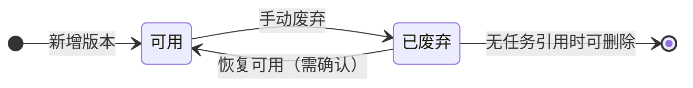
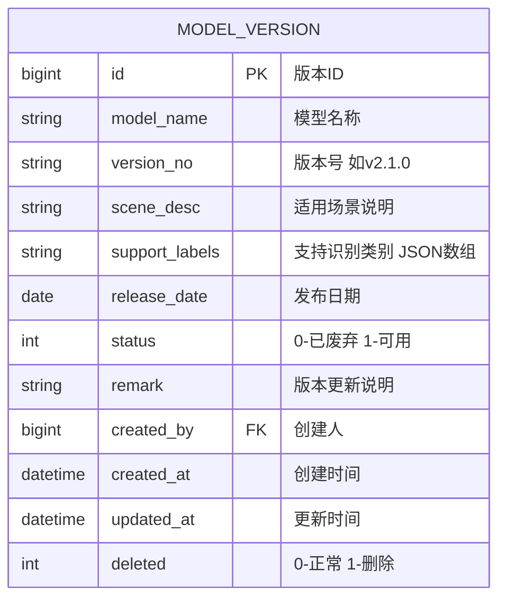

# 模型版本管理模块 PRD

> 所属系统：智能视觉影像识别辅助分析系统

---

## 一、功能说明

### 1.1 功能清单

| 功能点 | 优先级 | 说明 | 涉及角色 |
|--------|--------|------|----------|
| 模型版本列表 | P0 | 展示所有模型及版本，支持筛选 | 全部角色 |
| 新增模型版本 | P0 | 录入新模型版本信息 | ALGO_ENG |
| 编辑版本信息 | P0 | 修改版本基本信息 | ALGO_ENG |
| 废弃版本 | P0 | 将版本标记为已废弃 | ALGO_ENG |
| 查看使用历史 | P1 | 查看该版本关联的识别任务列表 | ALGO_ENG |

### 1.2 模型版本状态机



> **注意**：已被识别任务使用的版本不可删除，只能废弃。

---

## 二、数据模型



> `support_labels` 格式：`["焊点缺陷","气孔","裂纹"]`

---

## 三、接口设计

### 3.1 接口清单

| 接口名称 | 方法 | 路径 | 权限标识 |
|----------|------|------|---------|
| 模型版本列表 | GET | `/api/model` | `model:list` |
| 模型版本详情 | GET | `/api/model/{id}` | `model:list` |
| 新增模型版本 | POST | `/api/model` | `model:add` |
| 编辑模型版本 | PUT | `/api/model/{id}` | `model:edit` |
| 废弃模型版本 | PATCH | `/api/model/{id}/deprecate` | `model:edit` |
| 恢复模型版本 | PATCH | `/api/model/{id}/restore` | `model:edit` |
| 删除模型版本 | DELETE | `/api/model/{id}` | `model:delete` |
| 版本使用历史 | GET | `/api/model/{id}/tasks` | `model:list` |

### 3.2 接口详细定义

#### 模型版本列表

**说明**：分页查询模型版本，支持按名称和状态筛选

**鉴权**：需要

**权限标识**：`model:list`

```
GET /api/model
Authorization: Bearer {accessToken}

Query 参数：
- modelName  string  否  模型名称模糊搜索
- status     int     否  0-已废弃 1-可用
- page       int     是  页码，从1开始
- pageSize   int     是  每页条数，默认20

响应（成功）：
{
  "code": 200,
  "data": {
    "total": 8,
    "page": 1,
    "pageSize": 20,
    "records": [
      {
        "id": 5,
        "modelName": "焊点缺陷检测模型",
        "versionNo": "v2.1.0",
        "sceneDesc": "工业焊点表面缺陷自动识别",
        "supportLabels": ["焊点缺陷", "气孔", "裂纹"],
        "releaseDate": "2026-04-15",
        "status": 1,
        "statusDesc": "可用",
        "taskCount": 12,
        "remark": "优化气孔识别精度，召回率提升 8%",
        "createdAt": "2026-04-15 09:00:00"
      }
    ]
  }
}
```

#### 新增模型版本

**说明**：录入新的模型版本信息

**鉴权**：需要

**权限标识**：`model:add`

```
POST /api/model
Authorization: Bearer {accessToken}
Content-Type: application/json

请求体：
{
  "modelName": "string",           // 必填，模型名称，不超过100字
  "versionNo": "string",           // 必填，版本号，如 v2.1.0
  "sceneDesc": "string",           // 必填，适用场景说明
  "supportLabels": ["焊点缺陷"],   // 必填，支持识别类别列表
  "releaseDate": "2026-04-15",     // 必填，发布日期
  "remark": "string"               // 可选，版本更新说明
}

响应（成功）：
{
  "code": 200,
  "data": { "id": 6 }
}

响应（失败）：
{ "code": 400, "message": "同一模型下版本号已存在" }
```

#### 废弃模型版本

**说明**：将版本标记为已废弃，不可再用于新任务

**鉴权**：需要

**权限标识**：`model:edit`

```
PATCH /api/model/{id}/deprecate
Authorization: Bearer {accessToken}

响应（成功）：
{ "code": 200, "data": null }

响应（失败）：
{ "code": 400, "message": "版本当前状态已为废弃" }
```

#### 版本使用历史

**说明**：查询该模型版本关联的识别任务列表

**鉴权**：需要

**权限标识**：`model:list`

```
GET /api/model/{id}/tasks
Authorization: Bearer {accessToken}

Query 参数：
- page      int  是  页码
- pageSize  int  是  每页条数，默认20

响应（成功）：
{
  "code": 200,
  "data": {
    "total": 12,
    "records": [
      {
        "taskId": 201,
        "taskNo": "TASK-20260526-000201",
        "taskName": "焊点检测-批次001",
        "status": 2,
        "statusDesc": "已完成",
        "finishedAt": "2026-05-26 10:50:00"
      }
    ]
  }
}
```

---

## 四、字段校验规则

| 字段 | 类型 | 必填 | 校验规则 | 说明 |
|------|------|------|----------|------|
| modelName | string | ✓ | 不超过 100 字 | — |
| versionNo | string | ✓ | 格式：v{数字}.{数字}.{数字}，如 v2.1.0；同一模型下唯一 | — |
| sceneDesc | string | ✓ | 不超过 500 字 | — |
| supportLabels | array | ✓ | 至少一个标签，每个标签不超过 50 字 | — |
| releaseDate | date | ✓ | yyyy-MM-dd 格式，不可晚于当天 | — |

---

## 五、权限设计

| 操作 | 权限标识 | 可见角色 |
|------|---------|----------|
| 查看模型版本列表/详情 | `model:list` | 全部角色 |
| 新增模型版本 | `model:add` | ALGO_ENG |
| 编辑/废弃/恢复版本 | `model:edit` | ALGO_ENG |
| 删除模型版本 | `model:delete` | ALGO_ENG |

---

## 六、异常流程

| 异常场景 | 触发条件 | 处理方式 | 用户提示 |
|----------|----------|----------|----------|
| 版本号重复 | 同一模型下已存在相同版本号 | 返回 400 | "同一模型下版本号已存在" |
| 删除已使用版本 | 版本关联有识别任务 | 返回 400 | "版本已被识别任务使用，不可删除，可选择废弃" |
| 选用废弃版本创建任务 | 创建任务时选择废弃版本 | 返回 400 | "模型版本已废弃，请选择可用版本" |

---

## 七、验收标准

**AC-001 新增模型版本**
- Given：算法工程师在模型版本管理页
- When：填写模型名称"焊点缺陷检测模型"、版本号"v2.2.0"、发布日期、至少一个识别类别，点击保存
- Then：版本创建成功，列表中显示新记录，状态为"可用"

**AC-002 版本号重复校验**
- Given：模型"焊点缺陷检测模型"下已存在版本 v2.1.0
- When：新增版本时版本号填写 v2.1.0
- Then：提示"同一模型下版本号已存在"，版本未创建

**AC-003 废弃版本**
- Given：模型版本 v1.0.0 状态为"可用"
- When：算法工程师点击废弃
- Then：版本状态变为"已废弃"；在创建识别任务时该版本不再出现于选项列表

**AC-004 删除已使用版本**
- Given：模型版本 v2.1.0 已被 12 个识别任务引用
- When：算法工程师尝试删除该版本
- Then：提示"版本已被识别任务使用，不可删除，可选择废弃"

**AC-005 查看使用历史**
- Given：模型版本 v2.1.0 关联了 12 个任务
- When：用户点击该版本的"使用历史"
- Then：弹出或跳转至任务列表，展示 12 条任务记录，包含任务名称、状态、完成时间
