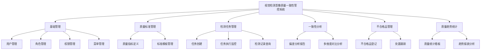

# 视觉检测影像质量一致性管控系统 产品需求文档

| 属性 | 内容 |
|------|------|
| 文档版本 | V1.0 |
| 创建日期 | 2026-05-26 |
| 作者 | — |
| 评审状态 | 待评审 |
| 迭代版本 | Sprint 1 |

## 修订记录

| 版本 | 修改日期 | 修改人 | 修改内容 |
|------|----------|--------|----------|
| V1.0 | 2026-05-26 | — | 初稿 |

---

## 一、背景与目标

### 1.1 背景

在工业视觉检测场景中，多台相机、多条产线采集的影像质量往往存在差异，包括亮度不均、对比度偏差、分辨率不一致等问题。这些质量差异会直接影响缺陷检测算法的准确性与稳定性，导致误检、漏检。

**核心痛点**：
- 影像质量缺乏统一标准，不同产线 / 相机的采集结果难以横向比较
- 质量偏差发现滞后，问题累积后才被察觉，已造成大量误检或漏检
- 不合格影像的处置过程缺乏跟踪，无法评估改善效果
- 缺乏系统性的质量趋势分析，管理层无法及时掌握质量动态

### 1.2 目标

**功能目标**：
- 建立并维护影像质量标准指标体系，统一质量评估基准
- 支持影像质量检测任务的全生命周期管理（创建 → 执行 → 完成）
- 提供一致性分析，定量评估影像质量与标准的偏差情况
- 记录和管理不合格影像，支持完整的偏差处置跟踪闭环
- 统计质量趋势，为管理层提供可视化质量动态

**业务目标（上线后）**：
- 影像质量问题发现时效从事后分析缩短至实时告警
- 不合格品处置闭环率 ≥ 90%
- 通过质量管控将视觉检测误检率降低 ≥ 20%

**非目标（本期不涉及）**：
- 影像采集硬件控制（相机参数调整属硬件层）
- 实时流式影像接入（本期处理批次文件模式）
- 移动端 App

### 1.3 系统定位

- **类型：** PC 端 Web 应用（质量管控前端系统）
- **前端仓库名：** vision-quality-consistency-control-web
- **后端仓库名：** vision-quality-consistency-control
- **开发库名：** vision_quality_consistency_control_dev

---

## 二、用户角色

| 角色 | 标识 | 描述 | 核心诉求 |
|------|------|------|----------|
| 系统管理员 | SUPER_ADMIN | 负责平台用户、权限、系统参数管理 | 高效管理账号，精细控制访问权限 |
| 质量标准工程师 | QUALITY_ENG | 定义质量标准指标，配置检测任务 | 快速建立标准体系，准确评估偏差 |
| 检测操作员 | OPERATOR | 执行检测任务，查看检测结果 | 便捷提交任务，及时掌握不合格情况 |
| 管理人员 | MANAGER | 查看质量趋势统计，掌握整体管控状态 | 直观的统计看板，支持导出汇报 |

**主要用户画像（质量标准工程师）**：
- 姓名：李工
- 职业 / 场景：生产线质量工程师，日常需配置质量标准、查看检测结果
- 核心需求：快速定位哪条产线 / 哪台相机的影像质量不达标，及时安排整改
- 痛点：历史数据散落多处，横向比较费时费力，处置结果无法追溯

---

## 三、功能模块总览

---

## 四、业务边界

### In Scope（本期做）

- ✅ 基础管理：用户、角色、菜单、权限（RBAC，菜单级 + 按钮级）
- ✅ 质量指标定义与标准模板管理
- ✅ 检测任务创建、执行监控、结果查询
- ✅ 一致性偏差分析报告（支持导出 PDF / Excel）
- ✅ 多维度对比分析（跨任务、跨检测对象）
- ✅ 不合格品登记与处置跟踪（含验证状态）
- ✅ 质量统计看板与趋势报表

### Out of Scope（本期不做）

- ❌ 相机 / 采集设备硬件参数远程调整：属于硬件集成层，后续版本
- ❌ 实时流式影像接入：本期支持批次文件上传模式
- ❌ 移动端应用：本期仅支持 PC Web
- ❌ AI 自动修复建议生成：后续版本引入 AI 算法

### 前置依赖

- 影像文件存储服务（本地文件系统或 OSS）
- JWT 认证服务
- 数据库：MySQL 9.x
- 后端框架：Spring Boot 4.x

---

## 五、非功能性需求

| 类别 | 要求 |
|------|------|
| 性能 | 页面加载 ≤ 3 秒；检测记录查询响应 ≤ 3 秒；统计看板加载 ≤ 5 秒 |
| 安全 | JWT 认证（AccessToken 2h + RefreshToken 7d）；操作日志全量记录；密码 BCrypt 加密；RBAC 接口鉴权 |
| 可用性 | 系统可用率 ≥ 99%；关键数据修改需用户二次确认弹窗 |
| 兼容性 | Chrome 90+、Edge 90+ |
| 数据保留 | 检测记录和不合格品数据保留 2 年；操作日志保留 1 年 |
| 运行环境 | Windows 10+；分辨率 1920×1080 及以上 |

---

## 六、系统接口前缀规范

| 模块 | 接口前缀 |
|------|---------|
| 用户管理 | `/api/v1/system/users` |
| 角色管理 | `/api/v1/system/roles` |
| 菜单管理 | `/api/v1/system/menus` |
| 质量指标管理 | `/api/v1/quality/metrics` |
| 标准模板管理 | `/api/v1/quality/templates` |
| 检测任务管理 | `/api/v1/quality/tasks` |
| 一致性分析 | `/api/v1/quality/analysis` |
| 不合格品管理 | `/api/v1/quality/defects` |
| 质量统计 | `/api/v1/stats` |

---

## 七、子文档目录

| 文件 | 内容 |
|------|------|
| [01-基础管理模块.md](01-基础管理模块.md) | 用户 / 角色 / 权限 / 菜单管理 |
| [02-质量标准管理模块.md](02-质量标准管理模块.md) | 质量指标定义、标准模板管理 |
| [03-检测任务管理模块.md](03-检测任务管理模块.md) | 任务创建、执行监控、检测记录查询 |
| [04-一致性分析模块.md](04-一致性分析模块.md) | 偏差分析报告、多维度对比分析 |
| [05-不合格品管理模块.md](05-不合格品管理模块.md) | 不合格品登记、处置跟踪 |
| [06-质量趋势统计模块.md](06-质量趋势统计模块.md) | 质量统计看板、趋势报表分析 |
| [07-数据模型.md](07-数据模型.md) | 全局 ER 图与表结构 |
| [08-验收标准.md](08-验收标准.md) | Given-When-Then 验收条件 |
