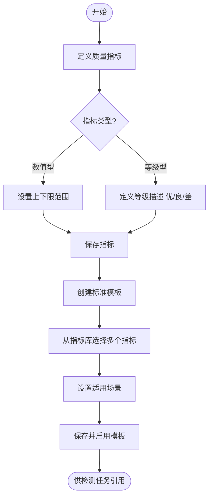

# 质量标准管理模块 PRD

> 所属系统：视觉检测影像质量一致性管控系统
> 文档版本：V1.0 | 创建日期：2026-05-26

---

## 一、模块概述

质量标准管理模块是系统的核心基础模块，负责定义影像质量评估的度量指标（质量指标），并将多个指标组合为标准模板供检测任务引用。

---

## 二、功能清单

| 功能点 | 优先级 | 说明 | 涉及角色 |
|--------|--------|------|----------|
| 质量指标列表 | P0 | 分页展示所有指标 | QUALITY_ENG |
| 新增质量指标 | P0 | 定义新的度量指标 | QUALITY_ENG |
| 编辑质量指标 | P0 | 修改指标参数 | QUALITY_ENG |
| 停用指标 | P1 | 禁止被新模板引用 | QUALITY_ENG |
| 标准模板列表 | P0 | 分页展示模板 | QUALITY_ENG |
| 新增标准模板 | P0 | 组合指标为模板 | QUALITY_ENG |
| 编辑标准模板 | P0 | 修改模板指标组合 | QUALITY_ENG |
| 查看模板详情 | P0 | 展示模板含的所有指标及其范围 | QUALITY_ENG, OPERATOR |
| 停用标准模板 | P1 | 禁止被新任务引用 | QUALITY_ENG |

---

## 三、业务流程



---

## 四、功能详细说明

### 4.1 质量指标定义

**功能描述**：定义影像质量评估的度量指标，作为检测与一致性分析的基准。

**字段说明**：

| 字段 | 类型 | 必填 | 校验规则 | 说明 |
|------|------|------|----------|------|
| 指标名称 | string | ✓ | 2~50 字，同名不可重复 | 如：平均亮度、对比度、清晰度、噪点水平 |
| 指标类型 | tinyint | ✓ | 0 或 1 | 0-数值型 / 1-等级型 |
| 计量单位 | string | ✗ | 最长 20 字 | 如：灰度值、比率、无量纲 |
| 正常范围下限 | decimal | 数值型必填 | 数字，< 上限 | 合格下限 |
| 正常范围上限 | decimal | 数值型必填 | 数字，> 下限 | 合格上限 |
| 等级描述 | string | 等级型必填 | JSON 格式 | 各等级定义（优/良/差） |
| 重要性 | tinyint | ✓ | 0/1/2 | 0-低 / 1-中 / 2-高 |
| 备注 | string | ✗ | 最长 500 字 | 指标说明与测量方法 |

**业务规则**：
- 指标名称全系统唯一，重复时提示"指标名称已存在"
- 已被标准模板引用的指标不可删除，只能停用
- 停用后的指标在现有模板中仍然有效，但不可被新模板添加

---

### 4.2 标准模板管理

**功能描述**：将多个质量指标组合为一套标准模板，供检测任务引用。

**字段说明**：

| 字段 | 类型 | 必填 | 校验规则 | 说明 |
|------|------|------|----------|------|
| 模板名称 | string | ✓ | 2~100 字，不可重复 | 描述性名称 |
| 适用场景 | string | ✓ | 最长 200 字 | 如：产线 A、产品类型 B |
| 包含指标 | array | ✓ | 至少选 1 个启用状态的指标 | 从指标库多选 |
| 备注 | string | ✗ | 最长 500 字 | — |

**业务规则**：
- 模板名称全系统唯一
- 只能选择"启用"状态的指标
- 已被检测任务引用的模板不可删除，只能停用
- 停用后的模板不可被新任务引用，已引用的历史任务数据保持不变

---

## 五、接口设计

### 5.1 质量指标接口

#### 查询质量指标列表

```
GET /api/v1/quality/metrics?page=1&pageSize=10&keyword=&metricType=&importance=&status=
Authorization: Bearer {token}

Query 参数：
- keyword       string   否  指标名称模糊搜索
- metricType    int      否  0-数值型 1-等级型
- importance    int      否  0-低 1-中 2-高
- status        int      否  0-停用 1-启用

响应：
{
  "code": 200,
  "data": {
    "total": 20,
    "page": 1,
    "pageSize": 10,
    "records": [
      {
        "id": 1,
        "metricCode": "QM-001",
        "metricName": "平均亮度",
        "metricType": 0,
        "metricTypeLabel": "数值型",
        "unit": "灰度值",
        "minValue": 80.0,
        "maxValue": 200.0,
        "levelDesc": null,
        "importance": 2,
        "importanceLabel": "高",
        "status": 1,
        "remark": "衡量影像整体亮度水平",
        "createdAt": "2026-05-10 10:00:00"
      }
    ]
  }
}
```

#### 创建质量指标

```
POST /api/v1/quality/metrics
Authorization: Bearer {token}
Content-Type: application/json

{
  "metricName": "平均亮度",
  "metricType": 0,
  "unit": "灰度值",
  "minValue": 80.0,
  "maxValue": 200.0,
  "levelDesc": null,
  "importance": 2,
  "remark": "衡量影像整体亮度水平"
}

响应：{ "code": 200, "message": "创建成功", "data": { "id": 1 } }
错误：{ "code": 409, "message": "指标名称已存在：平均亮度" }
```

#### 修改质量指标

```
PUT /api/v1/quality/metrics/{id}
Authorization: Bearer {token}
Content-Type: application/json

{
  "metricName": "平均亮度",
  "unit": "灰度值",
  "minValue": 90.0,
  "maxValue": 210.0,
  "importance": 2,
  "remark": "更新说明"
}

响应：{ "code": 200, "message": "修改成功" }
```

#### 修改指标状态（停用/启用）

```
PATCH /api/v1/quality/metrics/{id}/status
Authorization: Bearer {token}
Content-Type: application/json

{ "status": 0 }   // 0-停用 1-启用

响应：{ "code": 200, "message": "状态已更新" }
错误（停用时）：{ "code": 422, "message": "指标已被 2 个模板引用，仅可停用不可删除" }
```

#### 获取质量指标详情

```
GET /api/v1/quality/metrics/{id}
Authorization: Bearer {token}

响应：{ "code": 200, "data": { ...指标完整信息... } }
```

---

### 5.2 标准模板接口

#### 查询标准模板列表

```
GET /api/v1/quality/templates?page=1&pageSize=10&keyword=&status=
Authorization: Bearer {token}

响应：
{
  "code": 200,
  "data": {
    "total": 10,
    "page": 1,
    "pageSize": 10,
    "records": [
      {
        "id": 1,
        "templateCode": "TPL-001",
        "templateName": "产线A标准模板",
        "applicableScene": "产线 A 工业相机",
        "metricCount": 4,
        "status": 1,
        "createdBy": "李工",
        "createdAt": "2026-05-10 10:00:00"
      }
    ]
  }
}
```

#### 创建标准模板

```
POST /api/v1/quality/templates
Authorization: Bearer {token}
Content-Type: application/json

{
  "templateName": "产线A标准模板",
  "applicableScene": "产线 A 工业相机",
  "metricIds": [1, 2, 3, 4],
  "remark": "适用于产线A所有相机"
}

响应：{ "code": 200, "message": "创建成功", "data": { "id": 1 } }
错误：{ "code": 409, "message": "模板名称已存在" }
```

#### 修改标准模板

```
PUT /api/v1/quality/templates/{id}
Authorization: Bearer {token}
Content-Type: application/json

{
  "templateName": "产线A标准模板V2",
  "applicableScene": "产线 A 工业相机",
  "metricIds": [1, 2, 3, 5],
  "remark": "更新指标组合"
}

响应：{ "code": 200, "message": "修改成功" }
```

#### 查看模板详情（含指标列表）

```
GET /api/v1/quality/templates/{id}
Authorization: Bearer {token}

响应：
{
  "code": 200,
  "data": {
    "id": 1,
    "templateCode": "TPL-001",
    "templateName": "产线A标准模板",
    "applicableScene": "产线 A 工业相机",
    "status": 1,
    "metrics": [
      {
        "id": 1,
        "metricName": "平均亮度",
        "metricType": 0,
        "unit": "灰度值",
        "minValue": 80.0,
        "maxValue": 200.0,
        "importance": 2
      }
    ],
    "createdBy": "李工",
    "createdAt": "2026-05-10 10:00:00"
  }
}
```

#### 修改模板状态（停用/启用）

```
PATCH /api/v1/quality/templates/{id}/status
Authorization: Bearer {token}
Content-Type: application/json

{ "status": 0 }

响应：{ "code": 200, "message": "状态已更新" }
```

---

## 六、权限设计

| 操作 | 权限标识 | 可见角色 |
|------|---------|----------|
| 查看质量指标 | `quality:metric:list` | QUALITY_ENG, OPERATOR, MANAGER |
| 新增质量指标 | `quality:metric:add` | QUALITY_ENG |
| 编辑质量指标 | `quality:metric:edit` | QUALITY_ENG |
| 停用/启用指标 | `quality:metric:status` | QUALITY_ENG |
| 查看标准模板 | `quality:template:list` | QUALITY_ENG, OPERATOR, MANAGER |
| 新增标准模板 | `quality:template:add` | QUALITY_ENG |
| 编辑标准模板 | `quality:template:edit` | QUALITY_ENG |
| 停用/启用模板 | `quality:template:status` | QUALITY_ENG |

---

## 七、异常流程

| 异常场景 | 触发条件 | 处理方式 | 用户提示 |
|----------|----------|----------|----------|
| 指标名称重复 | 新增时名称已存在 | 返回 409 | "指标名称已存在，请换一个" |
| 删除被引用指标 | 指标已被模板引用 | 返回 422 | "指标已被引用，不可删除，可停用" |
| 模板名称重复 | 新增时名称已存在 | 返回 409 | "模板名称已存在，请换一个" |
| 删除被引用模板 | 模板已被任务引用 | 返回 422 | "模板已被引用，不可删除，可停用" |
| 选择停用指标 | 新增模板时选了停用指标 | 返回 400 | "所选指标 XX 已停用，不可加入模板" |
