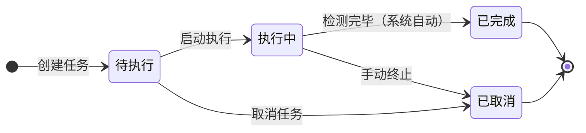
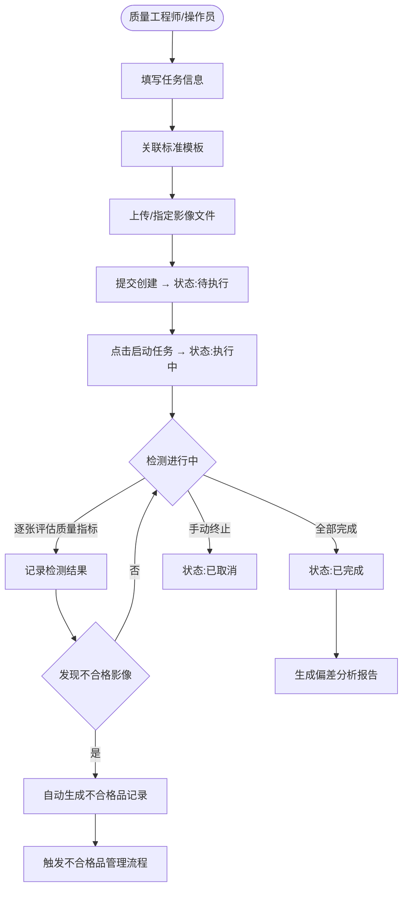

# 检测任务管理模块 PRD

> 所属系统：视觉检测影像质量一致性管控系统
> 文档版本：V1.0 | 创建日期：2026-05-26

---

## 一、模块概述

检测任务管理模块负责影像质量检测任务的全生命周期管理，包含任务创建、执行监控、历史记录查询三个子功能。任务状态从"待执行"经"执行中"流转至"已完成"或"已取消"。

---

## 二、功能清单

| 功能点 | 优先级 | 说明 | 涉及角色 |
|--------|--------|------|----------|
| 任务列表 & 查询 | P0 | 分页展示所有任务，支持多条件筛选 | QUALITY_ENG, OPERATOR |
| 创建检测任务 | P0 | 填写检测对象、关联模板、上传影像 | QUALITY_ENG, OPERATOR |
| 启动任务 | P0 | 将任务状态从待执行切换为执行中 | QUALITY_ENG, OPERATOR |
| 任务执行进度监控 | P0 | 实时查看执行进度及不合格发现数 | QUALITY_ENG, OPERATOR |
| 手动终止任务 | P1 | 中止执行中的任务 | QUALITY_ENG, OPERATOR |
| 取消任务 | P1 | 取消待执行的任务 | QUALITY_ENG |
| 检测记录查询 | P0 | 查询历次任务执行结果汇总 | QUALITY_ENG, OPERATOR, MANAGER |
| 查看任务详情 | P0 | 查看任务基本信息与执行结果 | QUALITY_ENG, OPERATOR, MANAGER |

---

## 三、任务状态机



**状态说明**：

| 状态 | code | 说明 |
|------|------|------|
| 待执行 | 1 | 任务已创建，等待启动 |
| 执行中 | 2 | 任务正在检测影像文件 |
| 已完成 | 3 | 全部影像检测完毕，结果已生成 |
| 已取消 | 4 | 任务被手动取消或终止 |

---

## 四、业务主流程



---

## 五、功能详细说明

### 5.1 任务创建

**字段说明**：

| 字段 | 类型 | 必填 | 校验规则 | 说明 |
|------|------|------|----------|------|
| 任务名称 | string | ✓ | 2~100 字 | 描述性名称 |
| 检测对象 | string | ✓ | 最长 200 字 | 如：产线 A 相机 01、批次编号 BN20260526 |
| 质量标准模板 | bigint | ✓ | 必须为启用状态的模板 | 下拉选择 |
| 影像数量 | int | ✓ | > 0 且 ≤ 10000 | 本次检测的影像文件数量 |
| 计划执行时间 | datetime | ✗ | 不早于当前时间 | 任务预计开始时间 |
| 优先级 | tinyint | ✓ | 0/1/2 | 0-低 / 1-中 / 2-高 |
| 备注 | string | ✗ | 最长 500 字 | — |

---

### 5.2 任务执行监控

执行中任务实时展示以下信息（前端轮询 / WebSocket 推送）：

| 展示项 | 说明 |
|--------|------|
| 任务名称 & 状态 | 当前任务标题与状态标签 |
| 整体进度 | 百分比进度条，已检测数 / 总数量 |
| 已发现不合格数 | 实时统计超出标准范围的影像数 |
| 合格率（实时） | 已检测中合格数 / 已检测总数 |
| 预计完成时间 | 根据当前速率估算 |

---

### 5.3 检测记录查询

**筛选条件**：

| 筛选字段 | 类型 | 说明 |
|---------|------|------|
| 任务名称 | string | 模糊搜索 |
| 检测对象 | string | 模糊搜索 |
| 标准模板 | long | 下拉选择 |
| 执行时间 | daterange | 时间范围筛选 |
| 合格率范围 | number | 数值区间（如 80 ~ 100） |
| 任务状态 | int | 下拉筛选 |

**列表字段**：任务编号、任务名称、检测对象、标准模板、执行时间、检测总数、合格数、不合格数、合格率、状态、操作（查看详情 / 查看分析报告）

---

## 六、接口设计

### 6.1 检测任务 CRUD

#### 查询任务列表

```
GET /api/v1/quality/tasks?page=1&pageSize=10&keyword=&templateId=&status=&startTime=&endTime=&qualifiedRateMin=&qualifiedRateMax=
Authorization: Bearer {token}

响应：
{
  "code": 200,
  "data": {
    "total": 100,
    "page": 1,
    "pageSize": 10,
    "records": [
      {
        "id": 1001,
        "taskCode": "TASK-20260526-001",
        "taskName": "产线A相机01-2026年5月检测",
        "detectionTarget": "产线A相机01",
        "templateId": 1,
        "templateName": "产线A标准模板",
        "imageCount": 500,
        "status": 3,
        "statusLabel": "已完成",
        "priority": 1,
        "startTime": "2026-05-26 09:00:00",
        "endTime": "2026-05-26 09:45:00",
        "qualifiedCount": 480,
        "unqualifiedCount": 20,
        "qualifiedRate": 96.0,
        "createdBy": "李工",
        "createdAt": "2026-05-26 08:00:00"
      }
    ]
  }
}
```

#### 创建检测任务

```
POST /api/v1/quality/tasks
Authorization: Bearer {token}
Content-Type: application/json

{
  "taskName": "产线A相机01-2026年5月检测",
  "detectionTarget": "产线A相机01",
  "templateId": 1,
  "imageCount": 500,
  "planExecuteTime": "2026-05-26 09:00:00",
  "priority": 1,
  "remark": "本月例行检测"
}

响应：{ "code": 200, "message": "创建成功", "data": { "id": 1001 } }
```

#### 获取任务详情

```
GET /api/v1/quality/tasks/{id}
Authorization: Bearer {token}

响应：
{
  "code": 200,
  "data": {
    "id": 1001,
    "taskCode": "TASK-20260526-001",
    "taskName": "...",
    "detectionTarget": "产线A相机01",
    "template": { "id": 1, "templateName": "产线A标准模板" },
    "imageCount": 500,
    "status": 3,
    "priority": 1,
    "startTime": "2026-05-26 09:00:00",
    "endTime": "2026-05-26 09:45:00",
    "qualifiedCount": 480,
    "unqualifiedCount": 20,
    "qualifiedRate": 96.0,
    "remark": "本月例行检测"
  }
}
```

#### 修改任务（仅待执行状态可修改）

```
PUT /api/v1/quality/tasks/{id}
Authorization: Bearer {token}
Content-Type: application/json

{
  "taskName": "修改后任务名",
  "detectionTarget": "产线A相机01",
  "templateId": 1,
  "imageCount": 600,
  "planExecuteTime": "2026-05-27 09:00:00",
  "priority": 2,
  "remark": "备注"
}

响应：{ "code": 200, "message": "修改成功" }
错误：{ "code": 422, "message": "任务已启动，不可修改基本信息" }
```

---

### 6.2 任务状态变更接口

#### 启动任务

```
POST /api/v1/quality/tasks/{id}/start
Authorization: Bearer {token}

响应：{ "code": 200, "message": "任务已启动" }
错误：{ "code": 422, "message": "任务当前状态为 XX，不可启动" }
```

#### 手动终止 / 取消任务

```
POST /api/v1/quality/tasks/{id}/cancel
Authorization: Bearer {token}
Content-Type: application/json

{ "reason": "设备故障，暂停检测" }

响应：{ "code": 200, "message": "任务已取消" }
错误：{ "code": 422, "message": "已完成的任务不可取消" }
```

---

### 6.3 任务执行进度接口

#### 查询任务进度（轮询）

```
GET /api/v1/quality/tasks/{id}/progress
Authorization: Bearer {token}

响应：
{
  "code": 200,
  "data": {
    "taskId": 1001,
    "taskName": "产线A相机01-2026年5月检测",
    "status": 2,
    "statusLabel": "执行中",
    "totalCount": 500,
    "checkedCount": 320,
    "qualifiedCount": 305,
    "unqualifiedCount": 15,
    "qualifiedRate": 95.3,
    "progressPercent": 64,
    "estimatedFinishTime": "2026-05-26 09:40:00"
  }
}
```

---

## 七、权限设计

| 操作 | 权限标识 | 可见角色 |
|------|---------|----------|
| 查看任务列表 | `quality:task:list` | QUALITY_ENG, OPERATOR, MANAGER |
| 创建任务 | `quality:task:add` | QUALITY_ENG, OPERATOR |
| 编辑任务 | `quality:task:edit` | QUALITY_ENG, OPERATOR |
| 启动任务 | `quality:task:start` | QUALITY_ENG, OPERATOR |
| 取消任务 | `quality:task:cancel` | QUALITY_ENG, OPERATOR |
| 查看进度 | `quality:task:progress` | QUALITY_ENG, OPERATOR |
| 查看任务详情 | `quality:task:detail` | QUALITY_ENG, OPERATOR, MANAGER |

---

## 八、异常流程

| 异常场景 | 触发条件 | 处理方式 | 用户提示 |
|----------|----------|----------|----------|
| 启动非待执行任务 | 任务状态不为"待执行" | 返回 422 | "任务当前状态为 XX，不可启动" |
| 修改执行中任务 | 任务已启动时尝试修改 | 返回 422 | "任务已启动，不可修改基本信息" |
| 取消已完成任务 | 任务已完成时尝试取消 | 返回 422 | "已完成的任务不可取消" |
| 选择停用模板 | 创建任务时选择停用状态模板 | 返回 400 | "所选标准模板已停用" |
| 进度查询失败 | 任务不存在或无权限 | 返回 404 / 403 | "任务不存在" / "无操作权限" |
