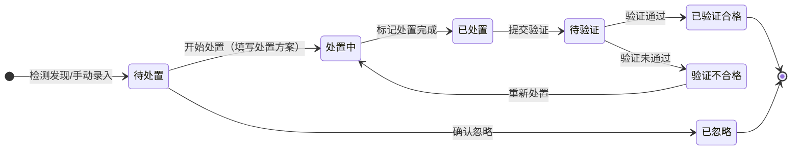
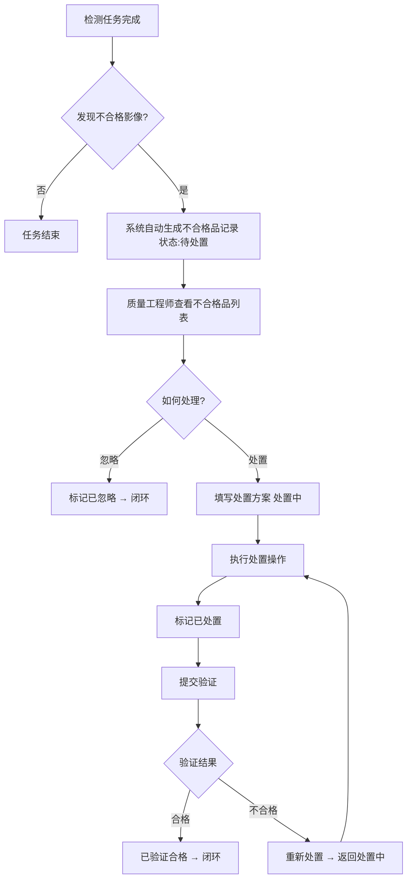

# 不合格品管理模块 PRD

> 所属系统：视觉检测影像质量一致性管控系统
> 文档版本：V1.0 | 创建日期：2026-05-26

---

## 一、模块概述

不合格品管理模块记录检测过程中发现的不合格影像信息，跟踪其从发现到处置、验证的完整闭环流程。支持系统自动录入（检测任务完成时）及手动补录。

---

## 二、功能清单

| 功能点 | 优先级 | 说明 | 涉及角色 |
|--------|--------|------|----------|
| 不合格品列表查询 | P0 | 多条件筛选不合格品记录 | QUALITY_ENG, OPERATOR |
| 自动录入 | P0 | 检测任务完成后系统自动生成 | 系统自动 |
| 手动补录 | P1 | 手动新增不合格品记录 | QUALITY_ENG |
| 查看详情 | P0 | 查看超标指标、超标值、处置历史 | QUALITY_ENG, OPERATOR |
| 填写处置方案 | P0 | 登记处置方案与处置结果 | QUALITY_ENG, OPERATOR |
| 更新处置状态 | P0 | 流转处置状态 | QUALITY_ENG, OPERATOR |
| 验证处置结果 | P1 | 验证处置后是否达标 | QUALITY_ENG |
| 查看处置历史 | P0 | 查看完整处置流水记录 | QUALITY_ENG, OPERATOR, MANAGER |

---

## 三、处置状态机



**处置状态说明**：

| 状态 | code | 说明 |
|------|------|------|
| 待处置 | 1 | 刚发现，尚未开始处置 |
| 处置中 | 2 | 已填写处置方案，正在执行 |
| 已处置 | 3 | 处置操作已完成，等待验证 |
| 已忽略 | 4 | 经确认忽略，不进行整改（如：接受偏差） |

**验证状态说明**：

| 状态 | code | 说明 |
|------|------|------|
| 待验证 | 0 | 未提交验证 |
| 已验证合格 | 1 | 验证通过，问题已消除 |
| 验证不合格 | 2 | 验证未通过，需重新处置 |

---

## 四、业务主流程



---

## 五、功能详细说明

### 5.1 不合格品登记字段

**系统自动录入字段**：

| 字段 | 类型 | 说明 |
|------|------|------|
| 不合格记录编号 | string | 系统自动生成，格式 DEF-{yyyyMMdd}-{序号} |
| 关联检测任务 | bigint | 来源任务 ID |
| 影像标识 | string | 影像文件名或编号 |
| 超标指标 | JSON | 哪些质量指标超出标准范围（指标 ID 及名称列表） |
| 超标值 | JSON | 各超标指标的实测值 |
| 标准范围 | JSON | 对应指标的合格范围（上下限） |
| 发现时间 | datetime | 自动记录 |
| 处置状态 | tinyint | 初始为 1（待处置） |
| 验证状态 | tinyint | 初始为 0（待验证） |

**手动补录时须填写**：

| 字段 | 类型 | 必填 | 说明 |
|------|------|------|------|
| 关联检测任务 | bigint | ✓ | 下拉选择 |
| 影像标识 | string | ✓ | 影像文件名或编号 |
| 超标指标 | array | ✓ | 多选指标 |
| 超标值 | JSON | ✓ | 每个超标指标的实测值 |

---

### 5.2 处置跟踪字段

| 字段 | 类型 | 必填 | 校验规则 | 说明 |
|------|------|------|----------|------|
| 处置方案 | tinyint | ✓ | 1-4 | 1-重新采集 / 2-参数调整 / 3-设备维护 / 4-接受（忽略） |
| 处置结果说明 | string | ✓ | 最长 500 字 | 处置过程与结果描述 |
| 处置人 | bigint | 系统自动 | — | 当前登录用户 |
| 处置时间 | datetime | 系统自动 | — | 操作时间 |

---

## 六、接口设计

### 6.1 不合格品查询

#### 查询不合格品列表

```
GET /api/v1/quality/defects?page=1&pageSize=10&taskId=&detectionTarget=&disposeStatus=&verifyStatus=&startTime=&endTime=
Authorization: Bearer {token}

Query 参数：
- taskId            long    否  关联任务 ID
- detectionTarget   string  否  检测对象（模糊搜索）
- disposeStatus     int     否  处置状态：1-待处置 2-处置中 3-已处置 4-已忽略
- verifyStatus      int     否  验证状态：0-待验证 1-已验证合格 2-验证不合格
- startTime         string  否  发现时间起始
- endTime           string  否  发现时间结束

响应：
{
  "code": 200,
  "data": {
    "total": 50,
    "page": 1,
    "pageSize": 10,
    "records": [
      {
        "id": 2001,
        "defectCode": "DEF-20260526-001",
        "taskId": 1001,
        "taskName": "产线A相机01-2026年5月检测",
        "detectionTarget": "产线A相机01",
        "imageId": "IMG_20260526_00125.jpg",
        "exceededMetrics": [
          { "metricId": 3, "metricName": "噪点水平", "measuredValue": 45.2, "minValue": 0, "maxValue": 30.0 }
        ],
        "foundAt": "2026-05-26 09:23:15",
        "disposeStatus": 1,
        "disposeStatusLabel": "待处置",
        "verifyStatus": 0,
        "verifyStatusLabel": "待验证"
      }
    ]
  }
}
```

#### 获取不合格品详情

```
GET /api/v1/quality/defects/{id}
Authorization: Bearer {token}

响应：
{
  "code": 200,
  "data": {
    "id": 2001,
    "defectCode": "DEF-20260526-001",
    "taskId": 1001,
    "taskName": "产线A相机01-2026年5月检测",
    "imageId": "IMG_20260526_00125.jpg",
    "exceededMetrics": [...],
    "foundAt": "2026-05-26 09:23:15",
    "disposeStatus": 3,
    "verifyStatus": 0,
    "disposeHistory": [
      {
        "id": 1,
        "disposePlan": 2,
        "disposePlanLabel": "参数调整",
        "operatorId": 1001,
        "operatorName": "李工",
        "operateAt": "2026-05-26 14:00:00",
        "resultDesc": "调整相机ISO参数从800降至400，噪点水平恢复正常",
        "verifyStatus": 0
      }
    ]
  }
}
```

---

### 6.2 手动补录不合格品

```
POST /api/v1/quality/defects
Authorization: Bearer {token}
Content-Type: application/json

{
  "taskId": 1001,
  "imageId": "IMG_20260526_00200.jpg",
  "exceededMetrics": [
    {
      "metricId": 3,
      "measuredValue": 48.5
    }
  ]
}

响应：{ "code": 200, "message": "补录成功", "data": { "id": 2002 } }
```

---

### 6.3 处置操作接口

#### 提交处置信息

```
POST /api/v1/quality/defects/{id}/dispose
Authorization: Bearer {token}
Content-Type: application/json

{
  "disposePlan": 2,                         // 1-重新采集 2-参数调整 3-设备维护 4-接受
  "resultDesc": "调整相机ISO参数，重新采集验证"
}

响应：{ "code": 200, "message": "处置信息已记录，状态已更新为处置中" }
```

#### 标记处置完成

```
PATCH /api/v1/quality/defects/{id}/dispose-status
Authorization: Bearer {token}
Content-Type: application/json

{ "disposeStatus": 3 }   // 3-已处置

响应：{ "code": 200, "message": "状态已更新" }
```

#### 提交验证结果

```
POST /api/v1/quality/defects/{id}/verify
Authorization: Bearer {token}
Content-Type: application/json

{
  "verifyStatus": 1,       // 1-已验证合格 2-验证不合格
  "verifyComment": "复测噪点水平 22.3，已在正常范围内"
}

响应：{ "code": 200, "message": "验证结果已记录" }
```

#### 忽略不合格品

```
POST /api/v1/quality/defects/{id}/ignore
Authorization: Bearer {token}
Content-Type: application/json

{ "reason": "偏差在可接受范围内，本批次影像已批准使用" }

响应：{ "code": 200, "message": "已标记为忽略" }
```

---

### 6.4 处置历史接口

#### 查看处置历史记录

```
GET /api/v1/quality/defects/{id}/dispose-history
Authorization: Bearer {token}

响应：
{
  "code": 200,
  "data": [
    {
      "id": 1,
      "disposePlan": 2,
      "disposePlanLabel": "参数调整",
      "operatorId": 1001,
      "operatorName": "李工",
      "operateAt": "2026-05-26 14:00:00",
      "resultDesc": "调整相机ISO参数",
      "verifyStatus": 2,
      "verifyStatusLabel": "验证不合格",
      "verifyComment": "复测仍超标"
    },
    {
      "id": 2,
      "disposePlan": 3,
      "disposePlanLabel": "设备维护",
      "operatorId": 1001,
      "operatorName": "李工",
      "operateAt": "2026-05-27 09:00:00",
      "resultDesc": "清洁传感器并重新校准",
      "verifyStatus": 1,
      "verifyStatusLabel": "已验证合格",
      "verifyComment": "复测噪点水平 22.3，已达标"
    }
  ]
}
```

---

## 七、权限设计

| 操作 | 权限标识 | 可见角色 |
|------|---------|----------|
| 查看不合格品列表 | `quality:defect:list` | QUALITY_ENG, OPERATOR, MANAGER |
| 手动补录 | `quality:defect:add` | QUALITY_ENG |
| 查看详情 | `quality:defect:detail` | QUALITY_ENG, OPERATOR, MANAGER |
| 填写处置方案 | `quality:defect:dispose` | QUALITY_ENG, OPERATOR |
| 更新处置状态 | `quality:defect:dispose` | QUALITY_ENG, OPERATOR |
| 验证处置结果 | `quality:defect:verify` | QUALITY_ENG |
| 忽略不合格品 | `quality:defect:ignore` | QUALITY_ENG |

---

## 八、异常流程

| 异常场景 | 触发条件 | 处理方式 | 用户提示 |
|----------|----------|----------|----------|
| 重复忽略 | 已忽略状态再次提交忽略 | 返回 422 | "该记录已处于忽略状态" |
| 已完成记录再处置 | 已验证合格后尝试处置 | 返回 422 | "该记录已验证合格，无需再处置" |
| 未处置直接验证 | 处置状态为待处置时提交验证 | 返回 422 | "请先填写处置方案后再提交验证" |
| 关联任务不存在 | 手动补录时任务 ID 无效 | 返回 404 | "关联任务不存在" |
