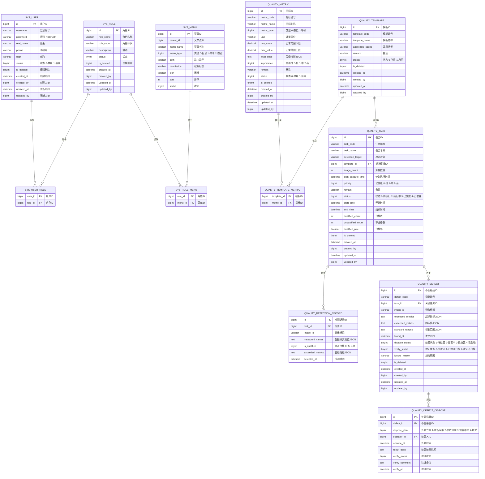

# 数据模型 PRD

> 所属系统：视觉检测影像质量一致性管控系统
> 文档版本：V1.0 | 创建日期：2026-05-26

---

## 一、全局 ER 图

---

## 二、核心表结构说明

### 2.1 sys_user（用户表）

| 字段 | 类型 | 约束 | 说明 |
|------|------|------|------|
| id | bigint | PK, AUTO_INCREMENT | 用户 ID |
| username | varchar(50) | NOT NULL, UNIQUE | 登录账号 |
| password | varchar(100) | NOT NULL | BCrypt 加密密码 |
| real_name | varchar(50) | NOT NULL | 真实姓名 |
| phone | varchar(20) | NOT NULL | 手机号 |
| dept | varchar(100) | NULL | 部门 |
| status | tinyint(1) | NOT NULL, DEFAULT 1 | 0-禁用 1-启用 |
| is_deleted | tinyint(1) | NOT NULL, DEFAULT 0 | 逻辑删除 |
| created_at | datetime | NOT NULL | 创建时间 |
| created_by | bigint | NULL | 创建人 ID |
| updated_at | datetime | NOT NULL | 更新时间 |
| updated_by | bigint | NULL | 更新人 ID |

---

### 2.2 quality_metric（质量指标表）

| 字段 | 类型 | 约束 | 说明 |
|------|------|------|------|
| id | bigint | PK, AUTO_INCREMENT | 指标 ID |
| metric_code | varchar(50) | NOT NULL, UNIQUE | 系统自动生成，格式 QM-{序号} |
| metric_name | varchar(100) | NOT NULL, UNIQUE | 指标名称 |
| metric_type | tinyint(1) | NOT NULL | 0-数值型 1-等级型 |
| unit | varchar(50) | NULL | 计量单位 |
| min_value | decimal(10,4) | NULL | 数值型下限 |
| max_value | decimal(10,4) | NULL | 数值型上限 |
| level_desc | text | NULL | 等级描述，JSON：{"好":"...", "良":"...", "差":"..."} |
| importance | tinyint(1) | NOT NULL, DEFAULT 1 | 0-低 1-中 2-高 |
| remark | varchar(500) | NULL | 备注 |
| status | tinyint(1) | NOT NULL, DEFAULT 1 | 0-停用 1-启用 |
| is_deleted | tinyint(1) | NOT NULL, DEFAULT 0 | — |
| created_at | datetime | NOT NULL | — |
| created_by | bigint | NULL | — |
| updated_at | datetime | NOT NULL | — |
| updated_by | bigint | NULL | — |

---

### 2.3 quality_task（检测任务表）

| 字段 | 类型 | 约束 | 说明 |
|------|------|------|------|
| id | bigint | PK, AUTO_INCREMENT | 任务 ID |
| task_code | varchar(50) | NOT NULL, UNIQUE | TASK-{yyyyMMdd}-{序号} |
| task_name | varchar(200) | NOT NULL | 任务名称 |
| detection_target | varchar(200) | NOT NULL | 检测对象描述 |
| template_id | bigint | NOT NULL, FK | 关联标准模板 |
| image_count | int | NOT NULL | 影像总数量 |
| plan_execute_time | datetime | NULL | 计划执行时间 |
| priority | tinyint(1) | NOT NULL, DEFAULT 1 | 0-低 1-中 2-高 |
| remark | varchar(500) | NULL | — |
| status | tinyint(1) | NOT NULL, DEFAULT 1 | 1-待执行 2-执行中 3-已完成 4-已取消 |
| start_time | datetime | NULL | 实际开始时间 |
| end_time | datetime | NULL | 实际结束时间 |
| qualified_count | int | NOT NULL, DEFAULT 0 | 合格影像数 |
| unqualified_count | int | NOT NULL, DEFAULT 0 | 不合格影像数 |
| qualified_rate | decimal(5,2) | NULL | 合格率（完成后计算）|
| is_deleted | tinyint(1) | NOT NULL, DEFAULT 0 | — |
| created_at | datetime | NOT NULL | — |
| created_by | bigint | NULL | — |
| updated_at | datetime | NOT NULL | — |
| updated_by | bigint | NULL | — |

---

### 2.4 quality_detection_record（检测记录表）

| 字段 | 类型 | 约束 | 说明 |
|------|------|------|------|
| id | bigint | PK, AUTO_INCREMENT | 记录 ID |
| task_id | bigint | NOT NULL, FK, INDEX | 关联任务 |
| image_id | varchar(200) | NOT NULL | 影像文件名或编号 |
| measured_values | json | NOT NULL | 各指标实测值，格式：[{"metricId":1,"value":165.3}] |
| is_qualified | tinyint(1) | NOT NULL | 0-不合格 1-合格 |
| exceeded_metrics | json | NULL | 超标指标详情 |
| detected_at | datetime | NOT NULL | 检测时间 |

**说明**：该表数据量较大，建议按 task_id 分区或按月分表。

---

### 2.5 quality_defect（不合格品表）

| 字段 | 类型 | 约束 | 说明 |
|------|------|------|------|
| id | bigint | PK, AUTO_INCREMENT | 记录 ID |
| defect_code | varchar(50) | NOT NULL, UNIQUE | DEF-{yyyyMMdd}-{序号} |
| task_id | bigint | NOT NULL, FK, INDEX | 关联任务 |
| image_id | varchar(200) | NOT NULL | 影像标识 |
| exceeded_metrics | json | NOT NULL | 超标指标信息 |
| exceeded_values | json | NOT NULL | 各超标指标实测值 |
| standard_ranges | json | NOT NULL | 各指标标准范围快照 |
| found_at | datetime | NOT NULL | 发现时间 |
| dispose_status | tinyint(1) | NOT NULL, DEFAULT 1 | 1-待处置 2-处置中 3-已处置 4-已忽略 |
| verify_status | tinyint(1) | NOT NULL, DEFAULT 0 | 0-待验证 1-已验证合格 2-验证不合格 |
| ignore_reason | varchar(500) | NULL | 忽略原因 |
| is_deleted | tinyint(1) | NOT NULL, DEFAULT 0 | — |
| created_at | datetime | NOT NULL | — |
| created_by | bigint | NULL | — |
| updated_at | datetime | NOT NULL | — |
| updated_by | bigint | NULL | — |

---

### 2.6 quality_defect_dispose（处置记录表）

| 字段 | 类型 | 约束 | 说明 |
|------|------|------|------|
| id | bigint | PK, AUTO_INCREMENT | 处置记录 ID |
| defect_id | bigint | NOT NULL, FK, INDEX | 关联不合格品 |
| dispose_plan | tinyint(1) | NOT NULL | 1-重新采集 2-参数调整 3-设备维护 4-接受 |
| operator_id | bigint | NOT NULL, FK | 处置人 ID |
| operate_at | datetime | NOT NULL | 处置时间 |
| result_desc | varchar(500) | NOT NULL | 处置结果说明 |
| verify_status | tinyint(1) | NOT NULL, DEFAULT 0 | 验证状态 |
| verify_comment | varchar(500) | NULL | 验证备注 |
| verify_at | datetime | NULL | 验证时间 |

---

## 三、索引建议

| 表名 | 索引字段 | 索引类型 | 说明 |
|------|---------|---------|------|
| quality_task | (template_id, status) | 复合索引 | 按模板+状态筛选任务 |
| quality_task | (detection_target, status) | 复合索引 | 按检测对象筛选 |
| quality_task | (created_at) | 普通索引 | 时间范围查询 |
| quality_detection_record | (task_id, is_qualified) | 复合索引 | 任务合格率计算 |
| quality_defect | (task_id, dispose_status) | 复合索引 | 按任务+处置状态筛选 |
| quality_defect | (found_at, dispose_status) | 复合索引 | 统计查询 |
| quality_defect_dispose | (defect_id) | 普通索引 | 处置历史查询 |
