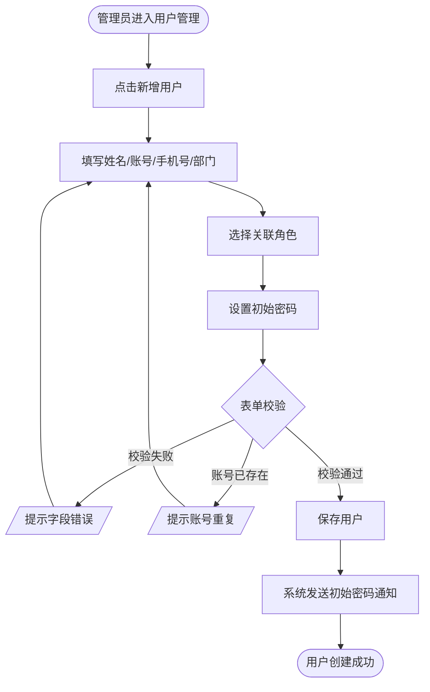
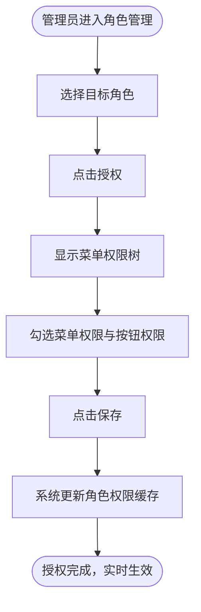
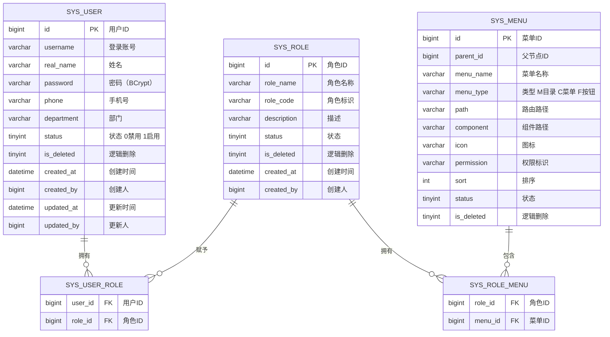

# 基础管理模块 产品需求文档

| 属性 | 内容 |
|------|------|
| 文档版本 | V1.0 |
| 创建日期 | 2026-05-26 |
| 所属系统 | 跨场景影像传感数据融合与决策支持系统 |
| 评审状态 | 待评审 |

---

## 一、模块概述

基础管理模块是系统的权限与账号管控底座，采用 **RBAC（基于角色的访问控制）** 模型，提供用户账号全生命周期管理、角色权限分配、菜单树管理等能力。所有其他模块的访问控制均依赖本模块的配置。

### 功能清单

| 功能点 | 优先级 | 说明 | 涉及角色 |
|--------|--------|------|----------|
| 用户列表查询 | P0 | 分页查询，支持多条件筛选 | SUPER_ADMIN |
| 新增用户 | P0 | 创建账号并绑定角色 | SUPER_ADMIN |
| 编辑用户 | P0 | 修改基本信息与关联角色 | SUPER_ADMIN |
| 禁用/启用用户 | P0 | 切换账号状态 | SUPER_ADMIN |
| 重置密码 | P0 | 重置为系统默认初始密码 | SUPER_ADMIN |
| 删除用户 | P1 | 逻辑删除 | SUPER_ADMIN |
| 角色列表查询 | P0 | 展示所有角色 | SUPER_ADMIN |
| 新增角色 | P0 | 创建自定义角色 | SUPER_ADMIN |
| 角色授权 | P0 | 为角色分配菜单与按钮权限 | SUPER_ADMIN |
| 删除角色 | P1 | 仅可删除无绑定用户的角色 | SUPER_ADMIN |
| 菜单树管理 | P0 | 增删改查菜单节点 | SUPER_ADMIN |

---

## 二、业务流程

### 2.1 用户创建主流程



### 2.2 角色授权主流程



---

## 三、数据模型

### 3.1 ER 图



### 3.2 内置角色定义

| 角色名称 | 标识 | 权限范围 |
|---------|------|---------|
| 超级管理员 | SUPER_ADMIN | 全部权限 |
| 融合配置工程师 | FUSION_ENG | 数据源、融合配置、决策规则全权限；融合/决策结果查询 |
| 决策分析员 | ANALYST | 融合结果、决策结果查询及导出 |
| 只读用户 | READONLY | 融合结果、报表只读查看 |

---

## 四、接口设计

### 4.1 接口清单

| 接口名称 | 方法 | 路径 | 权限标识 |
|----------|------|------|---------|
| 用户分页列表 | GET | `/api/system/users` | `system:user:list` |
| 新增用户 | POST | `/api/system/users` | `system:user:add` |
| 获取用户详情 | GET | `/api/system/users/{id}` | `system:user:query` |
| 编辑用户 | PUT | `/api/system/users/{id}` | `system:user:edit` |
| 修改用户状态 | PATCH | `/api/system/users/{id}/status` | `system:user:edit` |
| 重置密码 | POST | `/api/system/users/{id}/reset-password` | `system:user:edit` |
| 删除用户 | DELETE | `/api/system/users/{id}` | `system:user:delete` |
| 角色分页列表 | GET | `/api/system/roles` | `system:role:list` |
| 新增角色 | POST | `/api/system/roles` | `system:role:add` |
| 编辑角色 | PUT | `/api/system/roles/{id}` | `system:role:edit` |
| 角色授权（保存权限） | PUT | `/api/system/roles/{id}/menus` | `system:role:auth` |
| 删除角色 | DELETE | `/api/system/roles/{id}` | `system:role:delete` |
| 菜单树 | GET | `/api/system/menus/tree` | `system:menu:list` |
| 新增菜单 | POST | `/api/system/menus` | `system:menu:add` |
| 编辑菜单 | PUT | `/api/system/menus/{id}` | `system:menu:edit` |
| 删除菜单 | DELETE | `/api/system/menus/{id}` | `system:menu:delete` |
| 获取当前用户权限 | GET | `/api/system/permissions/current` | 无（已登录即可） |

### 4.2 接口详情

#### 用户分页列表

**说明**：分页查询用户列表，支持按姓名、账号、角色、状态筛选

**鉴权**：需要

**权限标识**：`system:user:list`

```
GET /api/system/users?page=1&pageSize=10&keyword=&roleId=&status=
Authorization: Bearer {accessToken}

Query 参数：
- page       int     否  当前页，默认 1
- pageSize   int     否  每页数量，默认 10，最大 100
- keyword    string  否  姓名或账号模糊搜索
- roleId     long    否  角色 ID 筛选
- status     int     否  状态筛选：0-禁用 1-启用

响应（成功）：
{
  "code": 200,
  "data": {
    "total": 50,
    "page": 1,
    "pageSize": 10,
    "records": [
      {
        "id": 1001,
        "username": "zhangsan",
        "realName": "张三",
        "phone": "13800138001",
        "department": "质检部",
        "status": 1,
        "roles": [{"id": 2, "roleName": "融合配置工程师"}],
        "createdAt": "2026-01-10 09:00:00"
      }
    ]
  }
}
```

#### 新增用户

**说明**：创建用户账号并绑定角色

**鉴权**：需要

**权限标识**：`system:user:add`

```
POST /api/system/users
Authorization: Bearer {accessToken}
Content-Type: application/json

请求体：
{
  "username": "zhangsan",       // 登录账号，6~20 位字母数字，全局唯一
  "realName": "张三",           // 姓名，必填，最长 50 字
  "phone": "13800138001",       // 手机号，11 位国内格式
  "department": "质检部",        // 部门，最长 100 字
  "password": "Init@12345",     // 初始密码，8~20 位含大小写字母与数字
  "roleIds": [2, 3]             // 关联角色 ID 列表，至少 1 个
}

响应（成功）：
{ "code": 200, "message": "创建成功", "data": { "id": 1002 } }

响应（账号重复）：
{ "code": 409, "message": "登录账号已存在" }
```

#### 修改用户状态

**说明**：启用或禁用用户账号

**鉴权**：需要

**权限标识**：`system:user:edit`

```
PATCH /api/system/users/{id}/status
Authorization: Bearer {accessToken}
Content-Type: application/json

请求体：
{ "status": 0 }   // 0-禁用 1-启用

响应（成功）：
{ "code": 200, "message": "状态已更新" }

响应（不可禁用自身）：
{ "code": 422, "message": "不能禁用当前登录账号" }
```

#### 重置密码

**说明**：将指定用户密码重置为系统默认初始密码

**鉴权**：需要

**权限标识**：`system:user:edit`

```
POST /api/system/users/{id}/reset-password
Authorization: Bearer {accessToken}

响应（成功）：
{ "code": 200, "message": "密码已重置", "data": { "newPassword": "Init@12345" } }
```

#### 角色授权

**说明**：保存角色关联的菜单与按钮权限

**鉴权**：需要

**权限标识**：`system:role:auth`

```
PUT /api/system/roles/{id}/menus
Authorization: Bearer {accessToken}
Content-Type: application/json

请求体：
{ "menuIds": [1, 2, 3, 10, 11, 12] }   // 菜单与按钮节点 ID 列表

响应（成功）：
{ "code": 200, "message": "授权成功" }
```

#### 获取当前用户权限

**说明**：登录后获取当前用户的菜单树与按钮权限列表，供前端渲染动态路由使用

**鉴权**：需要（已登录即可）

```
GET /api/system/permissions/current
Authorization: Bearer {accessToken}

响应：
{
  "code": 200,
  "data": {
    "menus": [
      {
        "id": 1, "menuName": "数据源管理", "path": "/datasource",
        "icon": "database", "children": [
          { "id": 11, "menuName": "场景数据源配置", "path": "/datasource/config" }
        ]
      }
    ],
    "permissions": ["system:user:list", "fusion:scheme:add", "datasource:edit"]
  }
}
```

---

## 五、字段校验规则

| 字段 | 规则 |
|------|------|
| 登录账号（username） | 6~20 位字母数字，正则 `^[a-zA-Z0-9]{6,20}$`，全局唯一 |
| 密码（password） | 8~20 位，必须包含大写字母、小写字母、数字，正则 `^(?=.*[a-z])(?=.*[A-Z])(?=.*\d).{8,20}$` |
| 手机号（phone） | 11 位国内手机号，正则 `^1[3-9]\d{9}$` |
| 角色标识（roleCode） | 大写字母下划线，正则 `^[A-Z_]{2,50}$`，全局唯一 |

---

## 六、权限设计

| 操作 | 权限标识 | 可操作角色 |
|------|---------|----------|
| 查看用户列表 | `system:user:list` | SUPER_ADMIN |
| 新增用户 | `system:user:add` | SUPER_ADMIN |
| 编辑用户 | `system:user:edit` | SUPER_ADMIN |
| 删除用户 | `system:user:delete` | SUPER_ADMIN |
| 查看角色列表 | `system:role:list` | SUPER_ADMIN |
| 新增角色 | `system:role:add` | SUPER_ADMIN |
| 编辑角色 | `system:role:edit` | SUPER_ADMIN |
| 角色授权 | `system:role:auth` | SUPER_ADMIN |
| 删除角色 | `system:role:delete` | SUPER_ADMIN |
| 菜单管理 | `system:menu:add/edit/delete` | SUPER_ADMIN |

---

## 七、异常流程

| 异常场景 | 触发条件 | 处理方式 | 用户提示 |
|----------|----------|----------|----------|
| 账号已存在 | 新增用户时账号与已有记录重复 | 拦截不写库 | "登录账号已存在，请更换" |
| 删除绑定角色 | 删除仍有用户关联的角色 | 拦截 | "该角色下还有 N 个用户，无法删除" |
| 删除有子节点菜单 | 删除有子级的菜单 | 拦截 | "请先删除子菜单" |
| 禁用自身账号 | 管理员禁用自己 | 拦截 | "不能禁用当前登录账号" |
| 重置超级管理员密码 | 重置 SUPER_ADMIN 账号密码 | 需额外确认 | 弹窗二次确认 |

---

## 八、验收标准

**AC-001 新增用户成功**
- Given：管理员已登录，进入用户管理页面
- When：填写合法的账号、姓名、手机号、密码，选择至少 1 个角色，点击确认
- Then：用户列表新增一条记录，状态为启用
  - And：返回提示"创建成功"

**AC-002 账号格式不合法**
- Given：管理员在新增用户表单
- When：输入账号"ab"（少于 6 位），点击提交
- Then：表单不提交，账号字段显示"登录账号须为 6~20 位字母数字"

**AC-003 账号重复**
- Given：系统中已存在账号 "zhangsan"
- When：再次新增同名账号，点击提交
- Then：接口返回 409，页面提示"登录账号已存在，请更换"

**AC-004 禁用用户**
- Given：用户 "lisi" 当前状态为启用
- When：管理员点击"禁用"并确认
- Then：用户状态变为禁用；"lisi" 再次登录时提示"账号已禁用"

**AC-005 删除有绑定用户的角色**
- Given：角色"决策分析员"下绑定 3 个用户
- When：管理员尝试删除该角色
- Then：系统拒绝，提示"该角色下还有 3 个用户，无法删除"

**AC-006 角色授权实时生效**
- Given：用户 A 当前登录，角色为"决策分析员"
- When：管理员修改该角色权限，移除"报表导出"按钮权限
- Then：用户 A 刷新页面后，报表页面导出按钮不再显示
