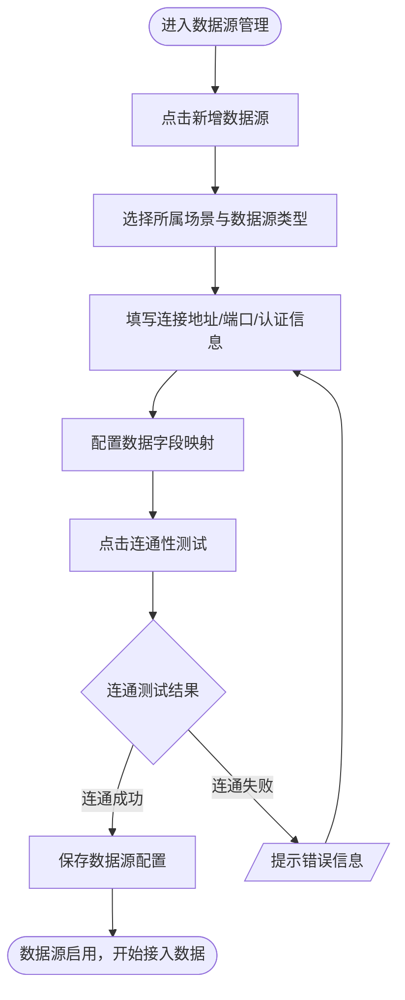
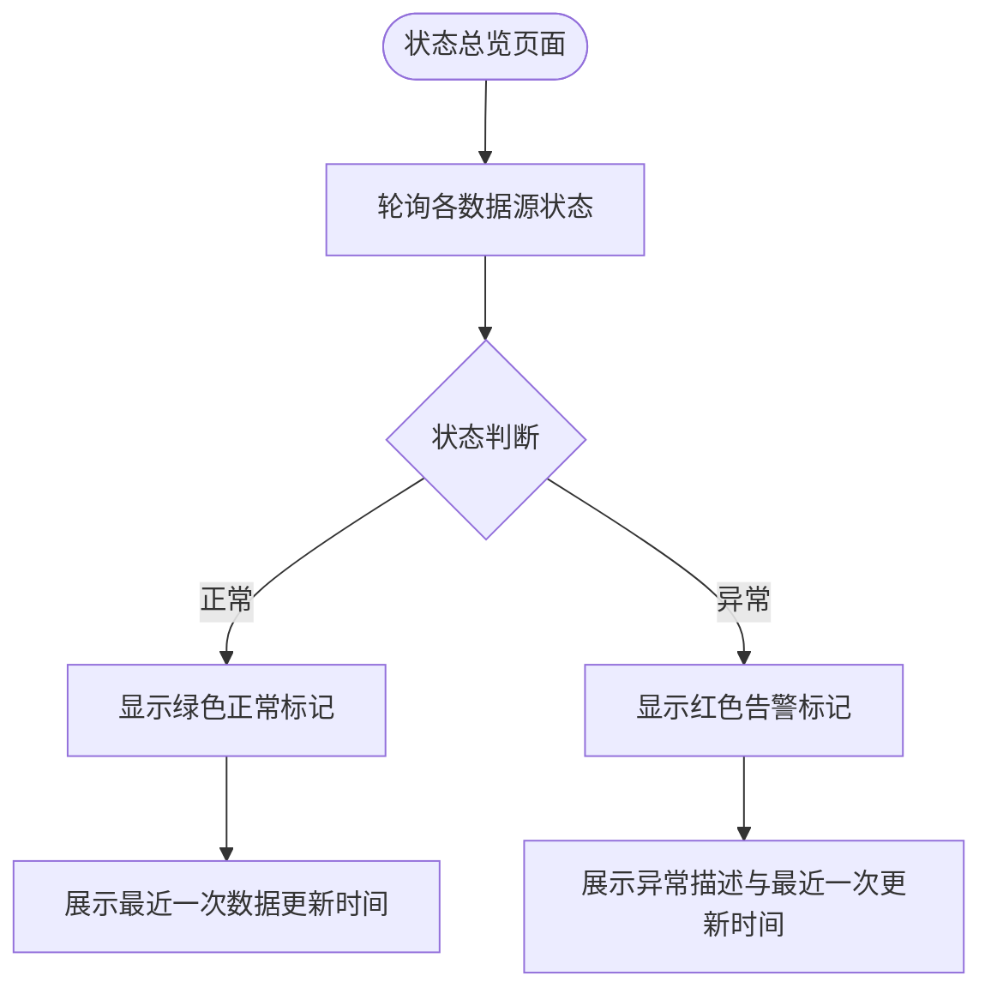
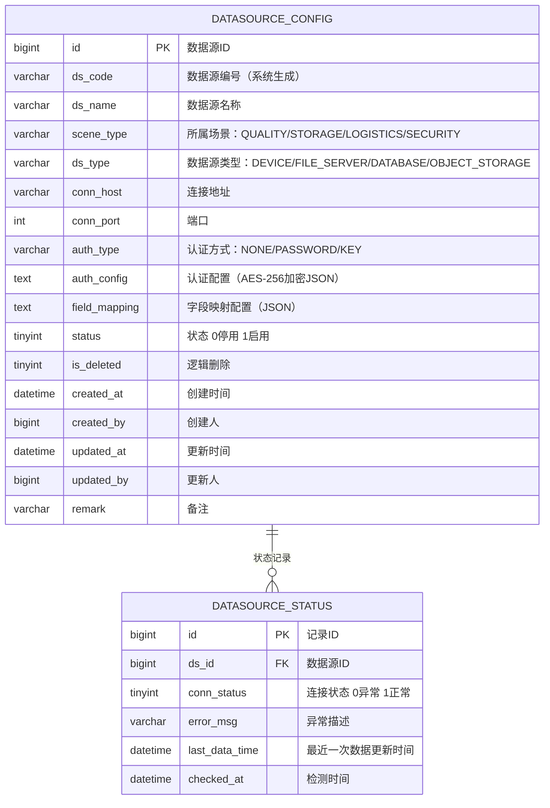

# 数据源管理模块 产品需求文档

| 属性 | 内容 |
|------|------|
| 文档版本 | V1.0 |
| 创建日期 | 2026-05-26 |
| 所属系统 | 跨场景影像传感数据融合与决策支持系统 |
| 评审状态 | 待评审 |

---

## 一、模块概述

数据源管理模块负责管理各场景影像传感数据的接入配置，是融合配置的基础前提。支持设备直连、文件服务器、数据库、对象存储等多类型数据源的配置与状态监控。

### 功能清单

| 功能点 | 优先级 | 说明 | 涉及角色 |
|--------|--------|------|----------|
| 数据源列表查询 | P0 | 分页查询，支持场景、类型、状态筛选 | FUSION_ENG, SUPER_ADMIN |
| 新增数据源 | P0 | 配置新场景数据源接入 | FUSION_ENG |
| 编辑数据源 | P0 | 修改数据源配置参数 | FUSION_ENG |
| 连通性测试 | P0 | 测试数据源连通是否正常 | FUSION_ENG |
| 停用数据源 | P0 | 停止指定数据源的数据接入 | FUSION_ENG |
| 数据源状态总览 | P1 | 查看所有数据源实时接入状态 | FUSION_ENG, ANALYST |
| 异常数据源告警 | P1 | 异常数据源标红并展示告警信息 | FUSION_ENG |

---

## 二、业务流程

### 2.1 数据源配置主流程



### 2.2 数据源状态监控



---

## 三、数据模型

### 3.1 ER 图



### 3.2 场景类型枚举

| 枚举值 | 显示名称 |
|--------|---------|
| QUALITY | 质检产线 |
| STORAGE | 仓储 |
| LOGISTICS | 物流 |
| SECURITY | 安防 |

### 3.3 数据源类型枚举

| 枚举值 | 显示名称 |
|--------|---------|
| DEVICE | 设备直连 |
| FILE_SERVER | 文件服务器 |
| DATABASE | 数据库 |
| OBJECT_STORAGE | 对象存储 |

---

## 四、接口设计

### 4.1 接口清单

| 接口名称 | 方法 | 路径 | 权限标识 |
|----------|------|------|---------|
| 数据源分页列表 | GET | `/api/datasource` | `datasource:list` |
| 新增数据源 | POST | `/api/datasource` | `datasource:add` |
| 获取数据源详情 | GET | `/api/datasource/{id}` | `datasource:query` |
| 编辑数据源 | PUT | `/api/datasource/{id}` | `datasource:edit` |
| 修改数据源状态 | PATCH | `/api/datasource/{id}/status` | `datasource:edit` |
| 连通性测试 | POST | `/api/datasource/{id}/test-conn` | `datasource:edit` |
| 数据源状态总览 | GET | `/api/datasource/status/overview` | `datasource:list` |

### 4.2 接口详情

#### 数据源分页列表

**说明**：分页查询数据源配置列表

**鉴权**：需要

**权限标识**：`datasource:list`

```
GET /api/datasource?page=1&pageSize=10&sceneType=&dsType=&status=&keyword=
Authorization: Bearer {accessToken}

Query 参数：
- page        int     否  当前页，默认 1
- pageSize    int     否  每页数量，默认 10
- sceneType   string  否  场景类型：QUALITY/STORAGE/LOGISTICS/SECURITY
- dsType      string  否  数据源类型：DEVICE/FILE_SERVER/DATABASE/OBJECT_STORAGE
- status      int     否  状态：0-停用 1-启用
- keyword     string  否  数据源名称模糊搜索

响应（成功）：
{
  "code": 200,
  "data": {
    "total": 20,
    "page": 1,
    "pageSize": 10,
    "records": [
      {
        "id": 101,
        "dsCode": "DS20260101001",
        "dsName": "质检产线A-摄像头组",
        "sceneType": "QUALITY",
        "sceneTypeName": "质检产线",
        "dsType": "DEVICE",
        "dsTypeName": "设备直连",
        "connHost": "192.168.1.100",
        "connPort": 8080,
        "status": 1,
        "connStatus": 1,
        "lastDataTime": "2026-05-26 10:30:00",
        "createdAt": "2026-01-15 09:00:00"
      }
    ]
  }
}
```

#### 新增数据源

**说明**：创建新的场景数据源接入配置

**鉴权**：需要

**权限标识**：`datasource:add`

```
POST /api/datasource
Authorization: Bearer {accessToken}
Content-Type: application/json

请求体：
{
  "dsName": "质检产线A-摄像头组",        // 必填，数据源名称，最长 100 字
  "sceneType": "QUALITY",              // 必填，所属场景枚举
  "dsType": "DEVICE",                  // 必填，数据源类型枚举
  "connHost": "192.168.1.100",         // 必填，连接地址
  "connPort": 8080,                    // 必填，端口 1-65535
  "authType": "PASSWORD",              // 必填，认证方式
  "authConfig": {                      // 认证配置，按 authType 变化
    "username": "admin",
    "password": "encrypted_pwd"        // 前端传输需加密，后端 AES-256 存储
  },
  "fieldMapping": [                    // 字段映射配置列表
    { "sourceField": "img_id", "targetField": "imageId", "fieldType": "string" },
    { "sourceField": "defect_score", "targetField": "defectScore", "fieldType": "float" }
  ],
  "remark": "质检A线4台摄像头"
}

响应（成功）：
{ "code": 200, "message": "创建成功", "data": { "id": 101, "dsCode": "DS20260526001" } }
```

#### 连通性测试

**说明**：测试指定数据源的连通状态

**鉴权**：需要

**权限标识**：`datasource:edit`

```
POST /api/datasource/{id}/test-conn
Authorization: Bearer {accessToken}

响应（连通成功）：
{
  "code": 200,
  "data": {
    "success": true,
    "latencyMs": 45,
    "message": "连通测试成功"
  }
}

响应（连通失败）：
{
  "code": 200,
  "data": {
    "success": false,
    "latencyMs": null,
    "message": "连接超时：目标主机 192.168.1.100:8080 无响应"
  }
}
```

#### 数据源状态总览

**说明**：获取所有启用数据源的实时状态概览

**鉴权**：需要

**权限标识**：`datasource:list`

```
GET /api/datasource/status/overview
Authorization: Bearer {accessToken}

响应：
{
  "code": 200,
  "data": {
    "totalCount": 8,
    "normalCount": 6,
    "errorCount": 2,
    "items": [
      {
        "dsId": 101,
        "dsName": "质检产线A-摄像头组",
        "sceneType": "QUALITY",
        "connStatus": 1,
        "lastDataTime": "2026-05-26 10:30:00",
        "errorMsg": null
      },
      {
        "dsId": 105,
        "dsName": "仓储区域B-传感器",
        "sceneType": "STORAGE",
        "connStatus": 0,
        "lastDataTime": "2026-05-26 08:15:00",
        "errorMsg": "连接超时，已重试 3 次"
      }
    ]
  }
}
```

---

## 五、权限设计

| 操作 | 权限标识 | 可操作角色 |
|------|---------|----------|
| 查看数据源列表 | `datasource:list` | SUPER_ADMIN, FUSION_ENG, ANALYST |
| 新增数据源 | `datasource:add` | SUPER_ADMIN, FUSION_ENG |
| 编辑数据源 | `datasource:edit` | SUPER_ADMIN, FUSION_ENG |
| 停用数据源 | `datasource:edit` | SUPER_ADMIN, FUSION_ENG |
| 连通性测试 | `datasource:edit` | SUPER_ADMIN, FUSION_ENG |

---

## 六、安全说明

> ⚠️ **警告**：数据源认证凭证（用户名/密码/密钥）在存储和传输时需要加密处理：
> - 前端传输：使用 HTTPS + 应用层加密（RSA 公钥加密）
> - 数据库存储：AES-256-GCM 加密存储，密钥由系统配置文件管理
> - 接口返回：认证字段仅返回脱敏信息（如 `****word`），不返回明文

---

## 七、异常流程

| 异常场景 | 触发条件 | 处理方式 | 用户提示 |
|----------|----------|----------|----------|
| 连通测试失败 | 目标主机不可达或认证失败 | 返回失败原因，不保存 | "连接失败：{具体原因}" |
| 停用正在使用的数据源 | 数据源被融合方案引用且方案启用中 | 弹出确认，二次确认后停用 | "该数据源正被 N 个融合方案使用，停用后相关方案将异常，是否继续？" |
| 端口号超范围 | 填写端口 > 65535 或 ≤ 0 | 前端校验拦截 | "端口号须在 1-65535 之间" |

---

## 八、验收标准

**AC-001 新增数据源并连通成功**
- Given：融合配置工程师已登录，进入数据源管理
- When：填写合法的数据源配置，点击"连通性测试"
- Then：提示"连通测试成功"，返回延迟时间；点击保存后数据源列表新增一条记录，状态为启用

**AC-002 连通测试失败**
- Given：工程师配置了错误的 IP 地址
- When：点击"连通性测试"
- Then：提示"连接失败"及具体原因，不保存配置

**AC-003 停用被引用的数据源**
- Given：数据源被 2 个启用中的融合方案引用
- When：工程师尝试停用该数据源
- Then：弹出确认提示，说明影响范围；确认后数据源状态变为停用，相关融合方案状态变为异常

**AC-004 状态总览异常标记**
- Given：数据源"仓储区域B"连接异常
- When：进入数据源状态总览页面
- Then：异常数据源显示红色告警标记，展示最后异常时间和错误描述；正常数据源显示绿色
