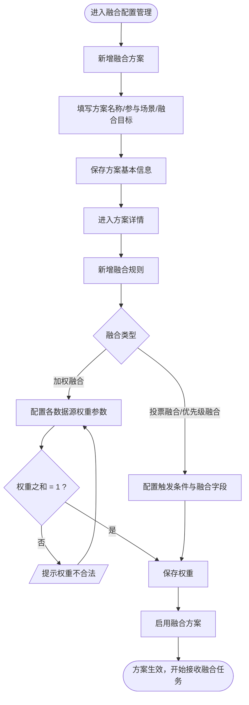
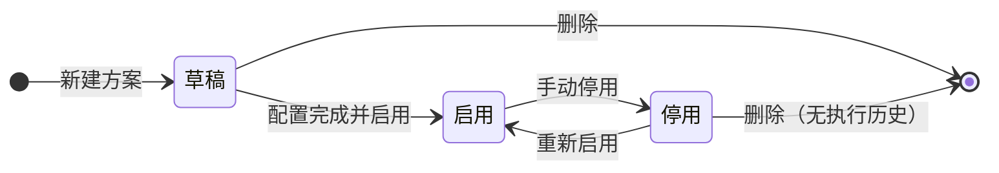
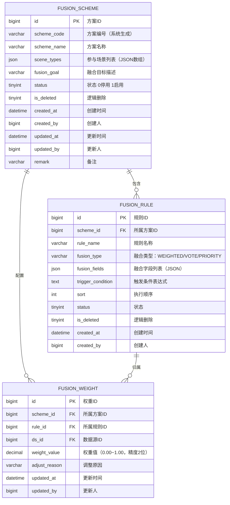

# 融合配置管理模块 产品需求文档

| 属性 | 内容 |
|------|------|
| 文档版本 | V1.0 |
| 创建日期 | 2026-05-26 |
| 所属系统 | 跨场景影像传感数据融合与决策支持系统 |
| 评审状态 | 待评审 |

---

## 一、模块概述

融合配置管理模块是系统的核心业务配置入口，允许融合配置工程师灵活定义跨场景数据融合的策略、规则和权重参数，形成可复用的融合方案，为融合任务执行提供配置依据。

### 功能清单

| 功能点 | 优先级 | 说明 | 涉及角色 |
|--------|--------|------|----------|
| 融合方案列表 | P0 | 分页查询融合方案 | FUSION_ENG, SUPER_ADMIN |
| 新增融合方案 | P0 | 创建融合方案及基本信息 | FUSION_ENG |
| 编辑融合方案 | P0 | 修改方案基本信息 | FUSION_ENG |
| 停用融合方案 | P0 | 停止方案执行 | FUSION_ENG |
| 方案详情查看 | P0 | 查看方案含融合规则与权重配置 | FUSION_ENG, ANALYST |
| 融合规则配置 | P0 | 在方案下配置规则（类型/字段/触发条件） | FUSION_ENG |
| 权重参数设置 | P0 | 为加权融合方案配置各数据源权重 | FUSION_ENG |
| 权重合法性校验 | P0 | 自动校验所有数据源权重之和是否为 1 | 系统自动 |

---

## 二、业务流程

### 2.1 融合方案配置主流程



### 2.2 融合方案状态机



---

## 三、数据模型

### 3.1 ER 图



### 3.2 融合类型枚举

| 枚举值 | 名称 | 说明 |
|--------|------|------|
| WEIGHTED | 加权融合 | 按各数据源权重值加权平均，需配置权重参数 |
| VOTE | 投票融合 | 多个数据源结果按多数决策 |
| PRIORITY | 优先级融合 | 按数据源优先级依次判断，取第一个满足条件的结果 |

---

## 四、接口设计

### 4.1 接口清单

| 接口名称 | 方法 | 路径 | 权限标识 |
|----------|------|------|---------|
| 融合方案分页列表 | GET | `/api/fusion/schemes` | `fusion:scheme:list` |
| 新增融合方案 | POST | `/api/fusion/schemes` | `fusion:scheme:add` |
| 方案详情 | GET | `/api/fusion/schemes/{id}` | `fusion:scheme:query` |
| 编辑融合方案 | PUT | `/api/fusion/schemes/{id}` | `fusion:scheme:edit` |
| 修改方案状态 | PATCH | `/api/fusion/schemes/{id}/status` | `fusion:scheme:edit` |
| 删除融合方案 | DELETE | `/api/fusion/schemes/{id}` | `fusion:scheme:delete` |
| 方案下规则列表 | GET | `/api/fusion/schemes/{schemeId}/rules` | `fusion:rule:list` |
| 新增融合规则 | POST | `/api/fusion/rules` | `fusion:rule:add` |
| 编辑融合规则 | PUT | `/api/fusion/rules/{id}` | `fusion:rule:edit` |
| 删除融合规则 | DELETE | `/api/fusion/rules/{id}` | `fusion:rule:delete` |
| 查询方案权重配置 | GET | `/api/fusion/weights?schemeId={id}` | `fusion:weight:list` |
| 保存方案权重配置 | PUT | `/api/fusion/weights/scheme/{schemeId}` | `fusion:weight:edit` |

### 4.2 接口详情

#### 融合方案分页列表

**说明**：分页查询融合方案

**鉴权**：需要

**权限标识**：`fusion:scheme:list`

```
GET /api/fusion/schemes?page=1&pageSize=10&keyword=&status=
Authorization: Bearer {accessToken}

Query 参数：
- page      int     否  当前页，默认 1
- pageSize  int     否  每页数量，默认 10
- keyword   string  否  方案名称模糊搜索
- status    int     否  状态：0-停用 1-启用

响应（成功）：
{
  "code": 200,
  "data": {
    "total": 15,
    "page": 1,
    "pageSize": 10,
    "records": [
      {
        "id": 201,
        "schemeCode": "FS20260101001",
        "schemeName": "质检+仓储综合评估方案",
        "sceneTypes": ["QUALITY", "STORAGE"],
        "fusionGoal": "综合质检缺陷率与库存状态评估产品入库可行性",
        "status": 1,
        "ruleCount": 3,
        "createdBy": "张工",
        "createdAt": "2026-02-01 10:00:00"
      }
    ]
  }
}
```

#### 新增融合方案

**说明**：创建新融合方案

**鉴权**：需要

**权限标识**：`fusion:scheme:add`

```
POST /api/fusion/schemes
Authorization: Bearer {accessToken}
Content-Type: application/json

请求体：
{
  "schemeName": "质检+仓储综合评估方案",   // 必填，最长 100 字
  "sceneTypes": ["QUALITY", "STORAGE"],   // 必填，参与场景，至少 2 个
  "fusionGoal": "综合质检缺陷率...",        // 必填，最长 500 字
  "remark": "备注说明"
}

响应：
{ "code": 200, "message": "创建成功", "data": { "id": 201, "schemeCode": "FS20260526001" } }
```

#### 方案详情

**说明**：获取融合方案详情，含融合规则与权重配置

**鉴权**：需要

**权限标识**：`fusion:scheme:query`

```
GET /api/fusion/schemes/{id}
Authorization: Bearer {accessToken}

响应：
{
  "code": 200,
  "data": {
    "id": 201,
    "schemeCode": "FS20260101001",
    "schemeName": "质检+仓储综合评估方案",
    "sceneTypes": ["QUALITY", "STORAGE"],
    "fusionGoal": "...",
    "status": 1,
    "rules": [
      {
        "id": 301,
        "ruleName": "缺陷率加权规则",
        "fusionType": "WEIGHTED",
        "fusionFields": ["defectScore", "qualityGrade"],
        "triggerCondition": "ALL_SOURCES_AVAILABLE",
        "sort": 1
      }
    ],
    "weights": [
      { "dsId": 101, "dsName": "质检产线A", "weightValue": 0.60, "adjustReason": "产线精度更高" },
      { "dsId": 102, "dsName": "仓储区域B", "weightValue": 0.40, "adjustReason": "" }
    ],
    "createdAt": "2026-02-01 10:00:00",
    "createdBy": "张工"
  }
}
```

#### 保存权重配置

**说明**：批量保存融合方案下所有数据源的权重值，系统校验权重之和是否为 1

**鉴权**：需要

**权限标识**：`fusion:weight:edit`

```
PUT /api/fusion/weights/scheme/{schemeId}
Authorization: Bearer {accessToken}
Content-Type: application/json

请求体：
{
  "ruleId": 301,
  "weights": [
    { "dsId": 101, "weightValue": 0.60, "adjustReason": "产线精度更高" },
    { "dsId": 102, "weightValue": 0.40, "adjustReason": "" }
  ]
}

响应（成功）：
{ "code": 200, "message": "权重配置已保存" }

响应（权重之和不为 1）：
{ "code": 422, "message": "所有数据源权重之和须等于 1，当前总和为 0.95" }
```

---

## 五、权限设计

| 操作 | 权限标识 | 可操作角色 |
|------|---------|----------|
| 查看融合方案 | `fusion:scheme:list/query` | SUPER_ADMIN, FUSION_ENG, ANALYST, READONLY |
| 新增/编辑融合方案 | `fusion:scheme:add/edit` | SUPER_ADMIN, FUSION_ENG |
| 停用/删除融合方案 | `fusion:scheme:delete` | SUPER_ADMIN, FUSION_ENG |
| 配置融合规则 | `fusion:rule:add/edit/delete` | SUPER_ADMIN, FUSION_ENG |
| 配置权重参数 | `fusion:weight:edit` | SUPER_ADMIN, FUSION_ENG |

---

## 六、业务边界

### In Scope（本期做）
- ✅ 融合方案的增删改查与启用/停用
- ✅ 融合规则的 3 种类型（加权/投票/优先级）配置
- ✅ 加权融合的权重参数配置及合法性自动校验
- ✅ 方案详情页展示规则与权重全貌

### Out of Scope（本期不做）
- ❌ 融合任务的调度执行引擎（另立专项）
- ❌ 融合规则的可视化拖拽编辑器（后续迭代）
- ❌ 融合方案的版本管理与历史对比

---

## 七、异常流程

| 异常场景 | 触发条件 | 处理方式 | 用户提示 |
|----------|----------|----------|----------|
| 权重之和不为 1 | 保存时校验失败 | 拦截不保存 | "所有数据源权重之和须等于 1，当前总和为 X" |
| 参与场景少于 2 个 | 新增方案时只选 1 个场景 | 前端校验 | "跨场景融合须选择至少 2 个场景" |
| 删除启用方案 | 方案状态为启用时删除 | 拦截 | "请先停用方案再执行删除" |
| 停用有在途融合任务的方案 | 方案正在执行中 | 等待当前任务完成后停用 | "当前有 N 个融合任务正在进行，将在完成后停用方案" |

---

## 八、验收标准

**AC-001 新增融合方案成功**
- Given：融合配置工程师已登录
- When：填写方案名称，选择"质检产线"和"仓储"两个场景，填写融合目标，点击保存
- Then：方案列表新增记录，状态为草稿；可进入方案详情继续配置融合规则

**AC-002 权重之和不为 1 的拦截**
- Given：融合方案包含 2 个数据源，分别配置权重 0.60 和 0.30
- When：点击保存权重
- Then：接口返回 422，提示"所有数据源权重之和须等于 1，当前总和为 0.90"；权重不保存

**AC-003 权重配置合法并保存**
- Given：2 个数据源权重分别配置为 0.60 和 0.40
- When：点击保存权重
- Then：保存成功，方案详情页展示更新后的权重值

**AC-004 停用启用中的方案**
- Given：方案"质检+仓储综合评估方案"状态为启用
- When：工程师点击停用
- Then：弹出确认框，确认后方案状态变为停用；后续融合任务不再基于该方案执行

**AC-005 删除有执行历史的方案被拦截**
- Given：方案已有历史融合结果记录
- When：工程师尝试删除该方案
- Then：系统提示"该方案已有执行历史，无法删除，可停用"
