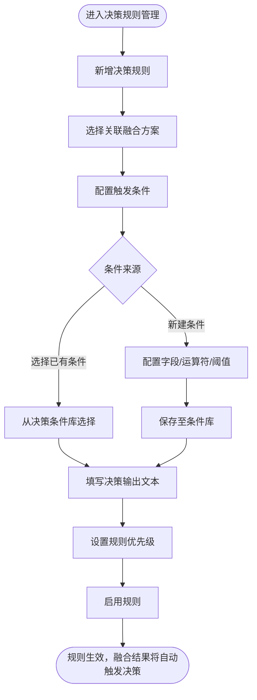
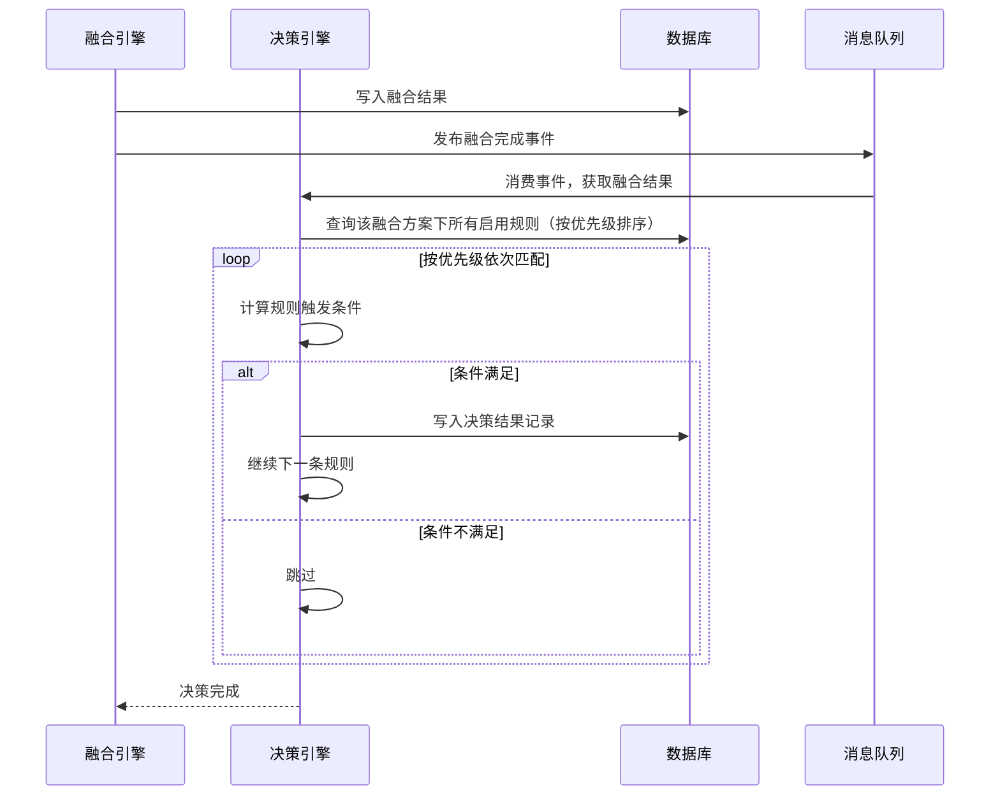
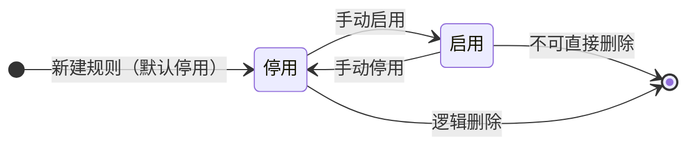
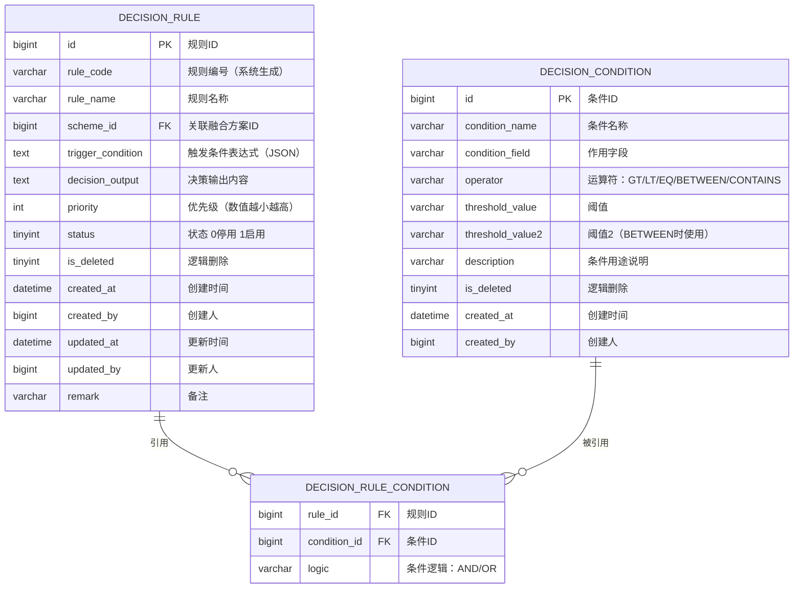

# 决策规则管理模块 产品需求文档

| 属性 | 内容 |
|------|------|
| 文档版本 | V1.0 |
| 创建日期 | 2026-05-26 |
| 所属系统 | 跨场景影像传感数据融合与决策支持系统 |
| 评审状态 | 待评审 |

---

## 一、模块概述

决策规则管理模块允许配置工程师在融合结果的基础上，定义自动化决策的触发条件与输出结论。当融合任务产生结果后，系统按优先级依次匹配决策规则，将满足条件的规则输出为决策结论，实现从数据融合到业务决策的自动化闭环。

### 功能清单

| 功能点 | 优先级 | 说明 | 涉及角色 |
|--------|--------|------|----------|
| 决策规则列表 | P0 | 分页查询，支持方案、状态筛选 | FUSION_ENG, SUPER_ADMIN |
| 新增决策规则 | P0 | 配置触发条件与决策输出 | FUSION_ENG |
| 编辑决策规则 | P0 | 修改规则配置 | FUSION_ENG |
| 启用/停用规则 | P0 | 控制规则是否生效 | FUSION_ENG |
| 删除决策规则 | P1 | 逻辑删除 | FUSION_ENG |
| 决策条件列表 | P0 | 查询可复用的条件项 | FUSION_ENG |
| 新增决策条件 | P0 | 创建可复用条件项 | FUSION_ENG |
| 编辑决策条件 | P0 | 修改条件配置 | FUSION_ENG |

---

## 二、业务流程

### 2.1 决策规则配置流程



### 2.2 决策触发执行流程



### 2.3 决策规则状态机



---

## 三、数据模型

### 3.1 ER 图



### 3.2 运算符枚举

| 枚举值 | 显示名称 | 说明 |
|--------|---------|------|
| GT | 大于 | field > threshold |
| LT | 小于 | field < threshold |
| GTE | 大于等于 | field >= threshold |
| LTE | 小于等于 | field <= threshold |
| EQ | 等于 | field == threshold |
| NEQ | 不等于 | field != threshold |
| BETWEEN | 介于 | threshold <= field <= threshold2 |
| CONTAINS | 包含 | field 包含 threshold 字符串 |

---

## 四、接口设计

### 4.1 接口清单

| 接口名称 | 方法 | 路径 | 权限标识 |
|----------|------|------|---------|
| 决策规则分页列表 | GET | `/api/decision/rules` | `decision:rule:list` |
| 新增决策规则 | POST | `/api/decision/rules` | `decision:rule:add` |
| 规则详情 | GET | `/api/decision/rules/{id}` | `decision:rule:query` |
| 编辑决策规则 | PUT | `/api/decision/rules/{id}` | `decision:rule:edit` |
| 修改规则状态 | PATCH | `/api/decision/rules/{id}/status` | `decision:rule:edit` |
| 删除决策规则 | DELETE | `/api/decision/rules/{id}` | `decision:rule:delete` |
| 决策条件分页列表 | GET | `/api/decision/conditions` | `decision:condition:list` |
| 新增决策条件 | POST | `/api/decision/conditions` | `decision:condition:add` |
| 编辑决策条件 | PUT | `/api/decision/conditions/{id}` | `decision:condition:edit` |
| 删除决策条件 | DELETE | `/api/decision/conditions/{id}` | `decision:condition:delete` |

### 4.2 接口详情

#### 新增决策规则

**说明**：创建一条决策规则

**鉴权**：需要

**权限标识**：`decision:rule:add`

```
POST /api/decision/rules
Authorization: Bearer {accessToken}
Content-Type: application/json

请求体：
{
  "ruleName": "高缺陷率预警规则",            // 必填，最长 100 字
  "schemeId": 201,                          // 必填，关联融合方案 ID
  "triggerCondition": {                     // 触发条件（JSON 条件树）
    "logic": "AND",
    "conditions": [
      { "conditionId": 1 },
      { "field": "qualityScore", "operator": "LT", "threshold": "60" }
    ]
  },
  "decisionOutput": "产品综合质量评分低于60分，建议触发人工复检流程",  // 必填
  "priority": 1,                            // 必填，1-999，数值越小越高
  "remark": "适用于高精度质检场景"
}

响应（成功）：
{ "code": 200, "message": "创建成功", "data": { "id": 401, "ruleCode": "DR20260526001" } }
```

#### 决策条件分页列表

**说明**：查询可复用的决策条件列表

**鉴权**：需要

**权限标识**：`decision:condition:list`

```
GET /api/decision/conditions?page=1&pageSize=20&keyword=&conditionField=
Authorization: Bearer {accessToken}

Query 参数：
- page            int     否  当前页
- pageSize        int     否  每页数量
- keyword         string  否  条件名称模糊搜索
- conditionField  string  否  条件字段筛选

响应：
{
  "code": 200,
  "data": {
    "total": 30,
    "page": 1,
    "pageSize": 20,
    "records": [
      {
        "id": 1,
        "conditionName": "缺陷分数低于60分",
        "conditionField": "defectScore",
        "operator": "LT",
        "operatorName": "小于",
        "thresholdValue": "60",
        "description": "用于识别高风险缺陷产品",
        "createdAt": "2026-03-01 09:00:00"
      }
    ]
  }
}
```

#### 新增决策条件

**说明**：创建一个可复用的决策条件项

**鉴权**：需要

**权限标识**：`decision:condition:add`

```
POST /api/decision/conditions
Authorization: Bearer {accessToken}
Content-Type: application/json

请求体：
{
  "conditionName": "缺陷分数低于60分",    // 必填，最长 100 字
  "conditionField": "defectScore",       // 必填，作用的融合结果字段名
  "operator": "LT",                     // 必填，运算符枚举
  "thresholdValue": "60",               // 必填，阈值
  "thresholdValue2": null,              // BETWEEN 时填写
  "description": "用于识别高风险缺陷产品"
}

响应（成功）：
{ "code": 200, "message": "创建成功", "data": { "id": 50 } }
```

---

## 五、权限设计

| 操作 | 权限标识 | 可操作角色 |
|------|---------|----------|
| 查看决策规则 | `decision:rule:list/query` | SUPER_ADMIN, FUSION_ENG, ANALYST |
| 新增/编辑决策规则 | `decision:rule:add/edit` | SUPER_ADMIN, FUSION_ENG |
| 删除决策规则 | `decision:rule:delete` | SUPER_ADMIN, FUSION_ENG |
| 查看决策条件 | `decision:condition:list` | SUPER_ADMIN, FUSION_ENG |
| 新增/编辑决策条件 | `decision:condition:add/edit` | SUPER_ADMIN, FUSION_ENG |
| 删除决策条件 | `decision:condition:delete` | SUPER_ADMIN, FUSION_ENG |

---

## 六、异常流程

| 异常场景 | 触发条件 | 处理方式 | 用户提示 |
|----------|----------|----------|----------|
| 优先级重复 | 同一融合方案下两条规则优先级相同 | 允许，按创建时间顺序作为次级排序 | 无提示（允许重复） |
| 删除被规则引用的条件 | 条件被至少 1 条启用规则引用 | 拦截 | "该条件被 N 条规则引用，无法删除" |
| 关联方案已停用 | 新增规则时选择了停用方案 | 允许创建，但规则不生效 | "所选融合方案已停用，规则创建后需方案重新启用才生效" |

---

## 七、验收标准

**AC-001 新增决策规则成功**
- Given：融合配置工程师已登录，融合方案"质检+仓储综合评估方案"已启用
- When：配置规则名称、选择融合方案、填写触发条件和决策输出，设置优先级为 1，点击保存
- Then：规则列表新增记录，默认状态为停用；手动启用后状态变为启用

**AC-002 规则启用后触发决策**
- Given：决策规则"高缺陷率预警"已启用，触发条件为 defectScore < 60
- When：融合任务执行完成，融合结果中 defectScore = 45
- Then：系统自动生成一条决策结果，决策输出内容为"产品综合质量评分低于60分，建议触发人工复检流程"

**AC-003 停用规则后不再触发**
- Given：决策规则"高缺陷率预警"被停用
- When：下一次融合结果 defectScore = 45
- Then：该条规则不被触发，不生成对应决策结果

**AC-004 删除被引用条件拦截**
- Given：条件"缺陷分数低于60分"被 3 条规则引用
- When：尝试删除该条件
- Then：提示"该条件被 3 条规则引用，无法删除"
