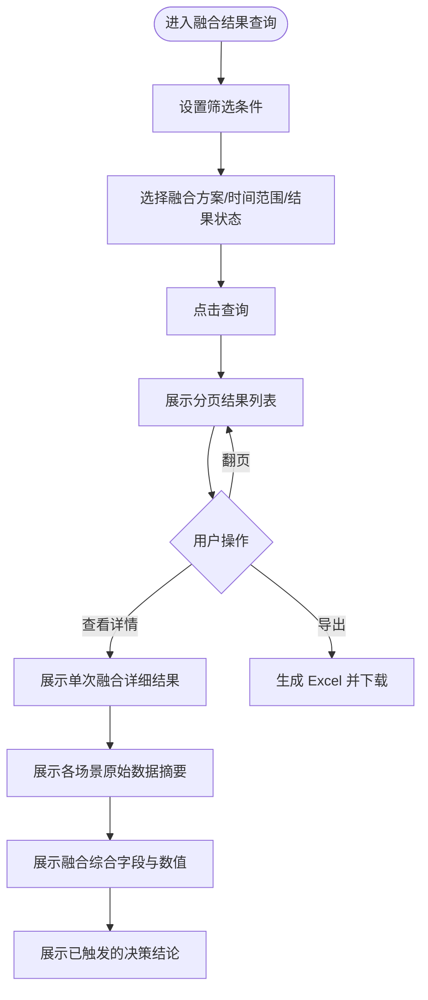
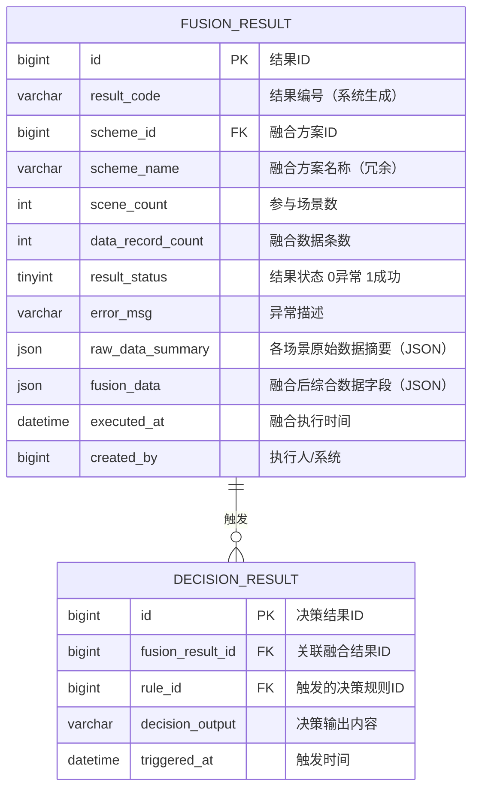

# 融合结果查询模块 产品需求文档

| 属性 | 内容 |
|------|------|
| 文档版本 | V1.0 |
| 创建日期 | 2026-05-26 |
| 所属系统 | 跨场景影像传感数据融合与决策支持系统 |
| 评审状态 | 待评审 |

---

## 一、模块概述

融合结果查询模块提供对历次融合任务执行结果的查询和详情查看能力，支持分页筛选、结果详情展示以及 Excel 导出，帮助决策分析员快速定位和分析融合数据。

### 功能清单

| 功能点 | 优先级 | 说明 | 涉及角色 |
|--------|--------|------|----------|
| 融合结果列表 | P0 | 分页查询，支持方案/时间/状态筛选 | ANALYST, FUSION_ENG, READONLY |
| 融合结果详情 | P0 | 查看单次融合的原始数据与综合结果 | ANALYST, FUSION_ENG, READONLY |
| 导出融合结果 | P1 | 导出本次融合结果为 Excel | ANALYST, FUSION_ENG |

---

## 二、业务流程

### 2.1 结果查询主流程



---

## 三、数据模型

### 3.1 ER 图



### 3.2 结果状态枚举

| 值 | 状态名 | 说明 |
|----|--------|------|
| 1 | 成功 | 融合任务正常完成 |
| 0 | 异常 | 融合过程中发生错误 |

---

## 四、接口设计

### 4.1 接口清单

| 接口名称 | 方法 | 路径 | 权限标识 |
|----------|------|------|---------|
| 融合结果分页列表 | GET | `/api/fusion/results` | `fusion:result:list` |
| 融合结果详情 | GET | `/api/fusion/results/{id}` | `fusion:result:query` |
| 导出融合结果 | GET | `/api/fusion/results/export` | `fusion:result:export` |

### 4.2 接口详情

#### 融合结果分页列表

**说明**：分页查询融合执行结果列表

**鉴权**：需要

**权限标识**：`fusion:result:list`

```
GET /api/fusion/results?page=1&pageSize=10&schemeId=&resultStatus=&startTime=&endTime=
Authorization: Bearer {accessToken}

Query 参数：
- page          int     否  当前页，默认 1
- pageSize      int     否  每页数量，默认 10，最大 100
- schemeId      long    否  融合方案 ID 筛选
- resultStatus  int     否  结果状态：0-异常 1-成功
- startTime     string  否  执行时间起始（yyyy-MM-dd HH:mm:ss）
- endTime       string  否  执行时间结束

响应：
{
  "code": 200,
  "data": {
    "total": 500,
    "page": 1,
    "pageSize": 10,
    "records": [
      {
        "id": 1001,
        "resultCode": "FR20260526001",
        "schemeName": "质检+仓储综合评估方案",
        "executedAt": "2026-05-26 09:30:00",
        "sceneCount": 2,
        "dataRecordCount": 150,
        "resultStatus": 1,
        "resultStatusName": "成功",
        "decisionCount": 2
      }
    ]
  }
}
```

#### 融合结果详情

**说明**：查看单次融合任务的完整结果

**鉴权**：需要

**权限标识**：`fusion:result:query`

```
GET /api/fusion/results/{id}
Authorization: Bearer {accessToken}

响应：
{
  "code": 200,
  "data": {
    "id": 1001,
    "resultCode": "FR20260526001",
    "schemeName": "质检+仓储综合评估方案",
    "executedAt": "2026-05-26 09:30:00",
    "sceneCount": 2,
    "dataRecordCount": 150,
    "resultStatus": 1,
    "rawDataSummary": [
      {
        "sceneType": "QUALITY",
        "sceneName": "质检产线",
        "dsName": "质检产线A-摄像头组",
        "recordCount": 80,
        "sampleFields": {
          "defectScore": 45.2,
          "qualityGrade": "C"
        }
      },
      {
        "sceneType": "STORAGE",
        "sceneName": "仓储",
        "dsName": "仓储区域B-传感器",
        "recordCount": 70,
        "sampleFields": {
          "stockLevel": 0.75,
          "storageStatus": "normal"
        }
      }
    ],
    "fusionData": {
      "defectScore": 45.2,
      "qualityScore": 52.6,
      "comprehensiveScore": 58.3,
      "riskLevel": "HIGH"
    },
    "decisions": [
      {
        "decisionResultId": 2001,
        "ruleName": "高缺陷率预警规则",
        "decisionOutput": "产品综合质量评分低于60分，建议触发人工复检流程",
        "triggeredAt": "2026-05-26 09:30:05"
      }
    ]
  }
}
```

#### 导出融合结果

**说明**：导出当前筛选条件下的融合结果列表为 Excel

**鉴权**：需要

**权限标识**：`fusion:result:export`

```
GET /api/fusion/results/export?schemeId=&resultStatus=&startTime=&endTime=
Authorization: Bearer {accessToken}

响应：
Content-Type: application/vnd.openxmlformats-officedocument.spreadsheetml.sheet
Content-Disposition: attachment; filename="fusion_results_20260526.xlsx"

导出字段：结果编号、融合方案名称、执行时间、参与场景数、数据条数、结果状态、关联决策数
```

---

## 五、权限设计

| 操作 | 权限标识 | 可操作角色 |
|------|---------|----------|
| 查看融合结果列表 | `fusion:result:list` | SUPER_ADMIN, FUSION_ENG, ANALYST, READONLY |
| 查看融合结果详情 | `fusion:result:query` | SUPER_ADMIN, FUSION_ENG, ANALYST, READONLY |
| 导出融合结果 | `fusion:result:export` | SUPER_ADMIN, FUSION_ENG, ANALYST |

---

## 六、异常流程

| 异常场景 | 触发条件 | 处理方式 | 用户提示 |
|----------|----------|----------|----------|
| 查询结果为空 | 筛选条件过严导致无数据 | 正常返回空列表 | "暂无符合条件的融合结果" |
| 导出数据量过大 | 导出记录 > 50000 条 | 后台异步生成，通知下载 | "数据量较大，将在后台生成，完成后系统通知您下载" |
| 详情加载失败 | 融合结果数据损坏 | 返回 500，展示错误提示 | "融合结果数据加载失败，请联系管理员" |

---

## 七、验收标准

**AC-001 列表筛选查询**
- Given：系统中有 200 条融合结果，其中 50 条属于方案"质检+仓储综合评估方案"
- When：选择该方案，点击查询
- Then：列表展示该方案下 50 条记录（分页显示，每页 10 条）

**AC-002 结果详情展示**
- Given：某次融合结果已成功生成，关联了 2 条决策结论
- When：点击该结果的"查看详情"
- Then：页面展示各场景原始数据摘要、融合后综合字段值、2 条决策结论内容

**AC-003 导出 Excel**
- Given：已筛选出 30 条融合结果
- When：点击"导出"
- Then：浏览器弹出 Excel 文件下载，文件包含 30 条记录，字段齐全

**AC-004 异常结果标识**
- Given：某次融合任务因数据源异常导致失败
- When：查看融合结果列表
- Then：该条记录"结果状态"列显示红色"异常"标签，详情页展示错误描述
