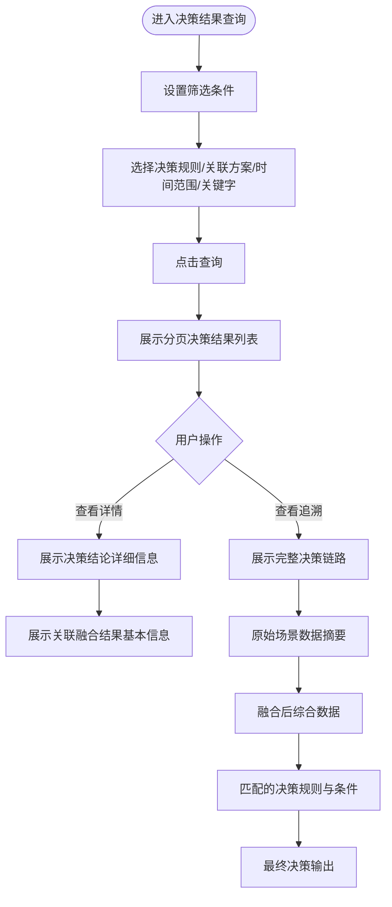
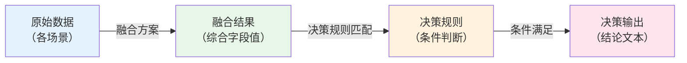
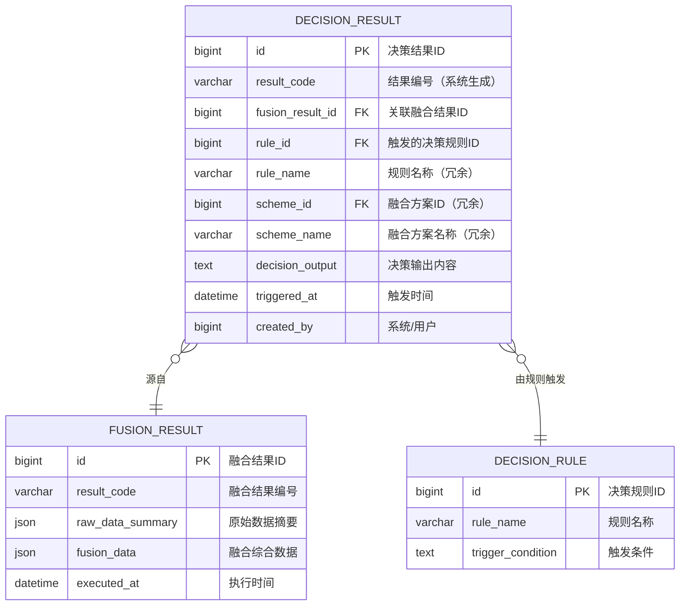

# 决策结果查询模块 产品需求文档

| 属性 | 内容 |
|------|------|
| 文档版本 | V1.0 |
| 创建日期 | 2026-05-26 |
| 所属系统 | 跨场景影像传感数据融合与决策支持系统 |
| 评审状态 | 待评审 |

---

## 一、模块概述

决策结果查询模块提供决策规则触发后生成的所有决策结论的查询能力，并支持完整的决策链路追溯（原始数据 → 融合结果 → 决策输出），帮助决策分析员审计和复盘每一次决策的依据。

### 功能清单

| 功能点 | 优先级 | 说明 | 涉及角色 |
|--------|--------|------|----------|
| 决策结果列表 | P0 | 分页查询，支持规则/方案/时间/关键字筛选 | ANALYST, FUSION_ENG |
| 决策结果详情 | P0 | 查看单条决策结果详情 | ANALYST, FUSION_ENG |
| 决策历史追溯 | P0 | 展示完整链路：原始数据→融合结果→决策输出 | ANALYST, FUSION_ENG |
| 触发频次统计 | P1 | 按方案/时间段查看决策触发频次 | ANALYST |

---

## 二、业务流程

### 2.1 决策结果查询流程



### 2.2 决策链路追溯结构



---

## 三、数据模型

### 3.1 ER 图（扩展查询视图）



---

## 四、接口设计

### 4.1 接口清单

| 接口名称 | 方法 | 路径 | 权限标识 |
|----------|------|------|---------|
| 决策结果分页列表 | GET | `/api/decision/results` | `decision:result:list` |
| 决策结果详情 | GET | `/api/decision/results/{id}` | `decision:result:query` |
| 决策链路追溯 | GET | `/api/decision/results/{id}/trace` | `decision:result:query` |
| 触发频次统计 | GET | `/api/decision/results/frequency` | `decision:result:list` |
| 导出决策结果 | GET | `/api/decision/results/export` | `decision:result:export` |

### 4.2 接口详情

#### 决策结果分页列表

**说明**：分页查询所有决策规则触发产生的决策结果

**鉴权**：需要

**权限标识**：`decision:result:list`

```
GET /api/decision/results?page=1&pageSize=10&ruleId=&schemeId=&startTime=&endTime=&keyword=
Authorization: Bearer {accessToken}

Query 参数：
- page       int     否  当前页，默认 1
- pageSize   int     否  每页数量，默认 10，最大 100
- ruleId     long    否  决策规则 ID 筛选
- schemeId   long    否  关联融合方案 ID 筛选
- startTime  string  否  触发时间起始（yyyy-MM-dd HH:mm:ss）
- endTime    string  否  触发时间结束
- keyword    string  否  决策输出内容关键字模糊搜索

响应：
{
  "code": 200,
  "data": {
    "total": 300,
    "page": 1,
    "pageSize": 10,
    "records": [
      {
        "id": 2001,
        "resultCode": "DR20260526001",
        "ruleName": "高缺陷率预警规则",
        "schemeName": "质检+仓储综合评估方案",
        "fusionResultCode": "FR20260526001",
        "decisionOutput": "产品综合质量评分低于60分，建议触发人工复检流程",
        "triggeredAt": "2026-05-26 09:30:05"
      }
    ]
  }
}
```

#### 决策链路追溯

**说明**：根据决策结果 ID，返回从原始数据到决策输出的完整追溯链路

**鉴权**：需要

**权限标识**：`decision:result:query`

```
GET /api/decision/results/{id}/trace
Authorization: Bearer {accessToken}

响应：
{
  "code": 200,
  "data": {
    "decisionResult": {
      "id": 2001,
      "resultCode": "DR20260526001",
      "ruleName": "高缺陷率预警规则",
      "decisionOutput": "产品综合质量评分低于60分，建议触发人工复检流程",
      "triggeredAt": "2026-05-26 09:30:05"
    },
    "fusionResult": {
      "id": 1001,
      "resultCode": "FR20260526001",
      "schemeName": "质检+仓储综合评估方案",
      "executedAt": "2026-05-26 09:30:00",
      "fusionData": {
        "defectScore": 45.2,
        "qualityScore": 52.6,
        "comprehensiveScore": 58.3
      }
    },
    "rawDataSummary": [
      {
        "sceneType": "QUALITY",
        "dsName": "质检产线A-摄像头组",
        "recordCount": 80,
        "keyFields": { "defectScore": 45.2, "qualityGrade": "C" }
      },
      {
        "sceneType": "STORAGE",
        "dsName": "仓储区域B-传感器",
        "recordCount": 70,
        "keyFields": { "stockLevel": 0.75 }
      }
    ],
    "ruleConditions": [
      {
        "conditionName": "缺陷分数低于60分",
        "conditionField": "defectScore",
        "operator": "LT",
        "threshold": "60",
        "actualValue": "45.2",
        "matched": true
      }
    ]
  }
}
```

#### 触发频次统计

**说明**：按融合方案或时间段查看决策触发频次

**鉴权**：需要

**权限标识**：`decision:result:list`

```
GET /api/decision/results/frequency?schemeId=&startTime=&endTime=&groupBy=day
Authorization: Bearer {accessToken}

Query 参数：
- schemeId   long    否  融合方案 ID
- startTime  string  是  统计起始时间
- endTime    string  是  统计结束时间
- groupBy    string  否  分组粒度：day/week/month，默认 day

响应：
{
  "code": 200,
  "data": {
    "totalCount": 150,
    "items": [
      { "date": "2026-05-20", "count": 18 },
      { "date": "2026-05-21", "count": 25 },
      { "date": "2026-05-22", "count": 32 }
    ]
  }
}
```

---

## 五、权限设计

| 操作 | 权限标识 | 可操作角色 |
|------|---------|----------|
| 查看决策结果列表 | `decision:result:list` | SUPER_ADMIN, FUSION_ENG, ANALYST |
| 查看决策详情/追溯 | `decision:result:query` | SUPER_ADMIN, FUSION_ENG, ANALYST |
| 导出决策结果 | `decision:result:export` | SUPER_ADMIN, FUSION_ENG, ANALYST |

---

## 六、异常流程

| 异常场景 | 触发条件 | 处理方式 | 用户提示 |
|----------|----------|----------|----------|
| 关联融合结果已被清理 | 融合结果超过保留期被归档 | 追溯页显示"融合结果已归档"，显示最后已知摘要 | "融合原始数据已归档，仅展示关键摘要" |
| 无决策结果 | 时间范围内无规则触发 | 返回空列表 | "暂无符合条件的决策结果" |

---

## 七、验收标准

**AC-001 多条件筛选查询**
- Given：系统中有 300 条决策结果
- When：选择规则"高缺陷率预警"，时间范围"2026-05-01 至 2026-05-31"，点击查询
- Then：列表展示该规则在 5 月份的所有决策结果，分页展示

**AC-002 关键字模糊搜索**
- Given：决策结果中有多条包含"复检"的输出
- When：在关键字框输入"复检"，点击查询
- Then：列表展示所有决策输出内容包含"复检"的记录

**AC-003 决策链路追溯完整性**
- Given：某条决策结果 ID 为 2001
- When：点击"追溯"查看链路
- Then：页面按"原始数据 → 融合结果 → 决策条件判断 → 决策输出"顺序展示完整链路，每一步数据均有展示

**AC-004 触发频次统计图表**
- Given：分析员选择方案"质检+仓储综合评估方案"，时间范围"本月"
- When：查看触发频次统计
- Then：展示折线图，每日触发次数准确，总计数正确
