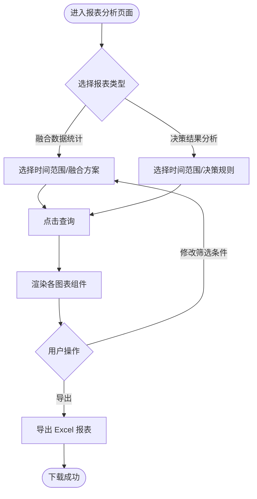

# 报表分析模块 产品需求文档

| 属性 | 内容 |
|------|------|
| 文档版本 | V1.0 |
| 创建日期 | 2026-05-26 |
| 所属系统 | 跨场景影像传感数据融合与决策支持系统 |
| 评审状态 | 待评审 |

---

## 一、模块概述

报表分析模块面向决策分析员，提供融合执行数据和决策结果数据的可视化统计分析，支持多维度图表展示和 Excel 导出，辅助管理人员掌握整体系统运行情况与决策质量。

### 功能清单

| 功能点 | 优先级 | 说明 | 涉及角色 |
|--------|--------|------|----------|
| 融合执行次数统计 | P0 | 展示指定周期内各方案执行次数 | ANALYST, FUSION_ENG, READONLY |
| 融合成功率统计 | P0 | 成功次数/总执行次数，趋势折线图 | ANALYST, FUSION_ENG, READONLY |
| 场景数据贡献比例 | P1 | 各场景数据量占比，饼图 | ANALYST |
| 融合执行量趋势 | P0 | 按日/周/月展示执行量折线图 | ANALYST, FUSION_ENG, READONLY |
| 决策触发总次数 | P0 | 指定周期内决策触发次数汇总 | ANALYST, FUSION_ENG |
| 规则触发频次排行 | P1 | 各决策规则触发频次柱状图 | ANALYST |
| 决策输出类型分布 | P1 | 决策输出分类占比饼图 | ANALYST |
| 决策时效分析 | P1 | 融合完成到决策输出的平均耗时 | ANALYST |
| 导出 Excel 报表 | P1 | 导出当前报表数据 | ANALYST, FUSION_ENG |

---

## 二、业务流程

### 2.1 报表查看流程



---

## 三、统计指标定义

### 3.1 融合数据统计指标

| 指标名称 | 计算公式 | 图表类型 | 时间粒度 |
|---------|---------|---------|---------|
| 融合执行次数 | COUNT(fusion_result) WHERE scheme_id = ? AND 时间范围 | 数字卡片 + 趋势折线图 | 日/周/月 |
| 融合成功率 | COUNT(status=1) / COUNT(*) × 100% | 百分比卡片 + 折线图 | 日/周/月 |
| 各场景数据贡献比例 | 各场景参与融合的数据记录数 / 总数据记录数 | 饼图 | 自定义时间段 |
| 融合执行量趋势 | 按时间粒度分组的执行次数 | 折线图 | 日/周/月 |

### 3.2 决策结果分析指标

| 指标名称 | 计算公式 | 图表类型 | 时间粒度 |
|---------|---------|---------|---------|
| 决策触发总次数 | COUNT(decision_result) WHERE 时间范围 | 数字卡片 | 自定义时间段 |
| 各规则触发频次排行 | COUNT(decision_result) GROUP BY rule_id ORDER BY count DESC | 柱状图 TOP10 | 自定义时间段 |
| 决策输出类型分布 | 按关键词分类聚合的决策输出条数 | 饼图 | 自定义时间段 |
| 决策时效（平均耗时） | AVG(triggered_at - fusion_executed_at) 单位：秒 | 数字卡片 + 趋势折线图 | 日/周/月 |

---

## 四、接口设计

### 4.1 接口清单

| 接口名称 | 方法 | 路径 | 权限标识 |
|----------|------|------|---------|
| 融合执行统计 | GET | `/api/stats/fusion/summary` | `stats:fusion:view` |
| 融合执行趋势 | GET | `/api/stats/fusion/trend` | `stats:fusion:view` |
| 场景数据贡献比例 | GET | `/api/stats/fusion/scene-proportion` | `stats:fusion:view` |
| 决策触发统计 | GET | `/api/stats/decision/summary` | `stats:decision:view` |
| 规则触发频次排行 | GET | `/api/stats/decision/rule-rank` | `stats:decision:view` |
| 决策时效分析 | GET | `/api/stats/decision/latency` | `stats:decision:view` |
| 导出融合统计报表 | GET | `/api/stats/fusion/export` | `stats:fusion:export` |
| 导出决策分析报表 | GET | `/api/stats/decision/export` | `stats:decision:export` |

### 4.2 接口详情

#### 融合执行统计

**说明**：获取融合执行的汇总指标

**鉴权**：需要

**权限标识**：`stats:fusion:view`

```
GET /api/stats/fusion/summary?schemeId=&startTime=&endTime=
Authorization: Bearer {accessToken}

Query 参数：
- schemeId   long    否  融合方案 ID（不填则统计全部）
- startTime  string  是  统计起始时间（yyyy-MM-dd HH:mm:ss）
- endTime    string  是  统计结束时间

响应：
{
  "code": 200,
  "data": {
    "totalCount": 1200,
    "successCount": 1150,
    "failCount": 50,
    "successRate": 95.83,
    "avgSceneCount": 2.5,
    "avgDataRecordCount": 130
  }
}
```

#### 融合执行趋势

**说明**：获取按时间粒度分组的融合执行量趋势数据

**鉴权**：需要

**权限标识**：`stats:fusion:view`

```
GET /api/stats/fusion/trend?schemeId=&startTime=&endTime=&groupBy=day
Authorization: Bearer {accessToken}

Query 参数：
- schemeId   long    否  融合方案 ID
- startTime  string  是  起始时间
- endTime    string  是  结束时间
- groupBy    string  否  分组粒度：day/week/month，默认 day

响应：
{
  "code": 200,
  "data": {
    "items": [
      { "date": "2026-05-01", "totalCount": 40, "successCount": 38, "failCount": 2 },
      { "date": "2026-05-02", "totalCount": 45, "successCount": 44, "failCount": 1 }
    ]
  }
}
```

#### 场景数据贡献比例

**说明**：获取各场景在融合任务中的数据量贡献占比

**鉴权**：需要

**权限标识**：`stats:fusion:view`

```
GET /api/stats/fusion/scene-proportion?schemeId=&startTime=&endTime=
Authorization: Bearer {accessToken}

响应：
{
  "code": 200,
  "data": {
    "items": [
      { "sceneType": "QUALITY", "sceneName": "质检产线", "recordCount": 9600, "proportion": 55.2 },
      { "sceneType": "STORAGE", "sceneName": "仓储", "recordCount": 5200, "proportion": 29.9 },
      { "sceneType": "LOGISTICS", "sceneName": "物流", "recordCount": 2600, "proportion": 14.9 }
    ]
  }
}
```

#### 规则触发频次排行

**说明**：获取各决策规则触发次数 TOP10

**鉴权**：需要

**权限标识**：`stats:decision:view`

```
GET /api/stats/decision/rule-rank?schemeId=&startTime=&endTime=&topN=10
Authorization: Bearer {accessToken}

Query 参数：
- schemeId   long    否  融合方案 ID
- startTime  string  是  起始时间
- endTime    string  是  结束时间
- topN       int     否  返回前 N 名，默认 10，最大 20

响应：
{
  "code": 200,
  "data": {
    "items": [
      { "rank": 1, "ruleId": 401, "ruleName": "高缺陷率预警规则", "triggerCount": 320 },
      { "rank": 2, "ruleId": 402, "ruleName": "库存告警规则", "triggerCount": 180 }
    ]
  }
}
```

#### 决策时效分析

**说明**：分析从融合完成到决策输出的平均时效

**鉴权**：需要

**权限标识**：`stats:decision:view`

```
GET /api/stats/decision/latency?schemeId=&startTime=&endTime=&groupBy=day
Authorization: Bearer {accessToken}

响应：
{
  "code": 200,
  "data": {
    "avgLatencySeconds": 3.8,
    "maxLatencySeconds": 12.5,
    "minLatencySeconds": 0.5,
    "items": [
      { "date": "2026-05-01", "avgLatencySeconds": 3.2 },
      { "date": "2026-05-02", "avgLatencySeconds": 4.1 }
    ]
  }
}
```

---

## 五、权限设计

| 操作 | 权限标识 | 可操作角色 |
|------|---------|----------|
| 查看融合统计报表 | `stats:fusion:view` | SUPER_ADMIN, FUSION_ENG, ANALYST, READONLY |
| 查看决策分析报表 | `stats:decision:view` | SUPER_ADMIN, FUSION_ENG, ANALYST |
| 导出融合统计报表 | `stats:fusion:export` | SUPER_ADMIN, FUSION_ENG, ANALYST |
| 导出决策分析报表 | `stats:decision:export` | SUPER_ADMIN, FUSION_ENG, ANALYST |

---

## 六、前端图表规范

| 图表 | 组件类型 | 说明 |
|------|---------|------|
| 融合执行量趋势 | 折线图（Line） | X 轴时间，Y 轴次数，双线：总次数/成功次数 |
| 融合成功率趋势 | 折线图（Line） | X 轴时间，Y 轴百分比，基准线 95% |
| 场景数据贡献占比 | 饼图（Pie） | 各场景不同颜色，显示百分比标签 |
| 规则触发频次排行 | 柱状图（Bar） | Y 轴规则名称，X 轴触发次数，降序排列 |
| 决策输出类型分布 | 饼图（Pie） | 按输出类别分类 |
| 决策时效趋势 | 折线图（Line） | X 轴时间，Y 轴秒数 |

---

## 七、异常流程

| 异常场景 | 触发条件 | 处理方式 | 用户提示 |
|----------|----------|----------|----------|
| 时间范围过大 | 时间跨度 > 1 年 | 前端校验限制 | "查询时间范围不能超过 1 年" |
| 统计数据为空 | 筛选条件下无数据 | 图表区展示空状态 | "暂无数据，请调整筛选条件" |
| 导出超时 | 数据量过大导致生成慢 | 异步任务，通知下载 | "报表正在生成，完成后将通知您下载" |

---

## 八、验收标准

**AC-001 融合成功率展示**
- Given：本月已执行 100 次融合，其中 92 次成功
- When：进入融合数据统计，选择"本月"时间范围，点击查询
- Then：融合成功率卡片显示"92%"，趋势折线图按日展示每日成功率曲线

**AC-002 场景贡献饼图**
- Given：某方案涉及"质检产线"和"仓储"两个场景，本月数据量分别为 6000 和 4000 条
- When：查看场景数据贡献比例饼图
- Then：质检产线显示 60%，仓储显示 40%，颜色区分，百分比标签正确

**AC-003 规则触发频次排行**
- Given：本月共有 5 条决策规则触发，触发次数各不相同
- When：查看规则触发频次排行柱状图
- Then：柱状图按触发次数降序排列，显示规则名称和次数，最多展示 10 条

**AC-004 决策时效展示**
- Given：本月融合到决策的平均耗时为 3.8 秒
- When：查看决策时效分析
- Then：平均时效卡片显示 3.8 秒，折线图按日展示时效趋势

**AC-005 导出 Excel**
- Given：已筛选融合统计数据
- When：点击"导出报表"
- Then：浏览器下载 Excel 文件，文件包含统计数据汇总表和趋势明细表
